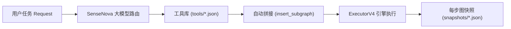

# 🤖 Vertex-Edge Agent Framework (V4.0) — Agent 架构与开发指南

Vertex-Edge Agent Framework 是一个基于**数据驱动与状态机驱动（Data-Driven & State-Machine Driven）**的企业级智能体编排系统。与传统的基于循环（While-Loop）或纯 Prompt 链条的 Agent 架构不同，本框架通过 **顶点（Vertex）存储持久状态与数据**，通过 **边（Edge）封装逻辑处理、工具调用与模型推理**。

---

## 📑 目录

1. [核心架构与设计哲学](#1-核心架构与设计哲学)
2. [顶点（Vertex）与边（Edge）模型](#2-顶点vertex与边edge模型)
3. [Agent 运行模式全景](#3-agent-运行模式全景)
4. [历史快照与版本时间旅行（Graph Snapshots）](#4-历史快照与版本时间旅行graph-snapshots)
5. [编写你的第一个 Agent 流水线](#5-编写你的第一个-agent-流水线)
6. [进阶特性：扇入屏障、自愈与沙箱工具](#6-进阶特性扇入屏障自愈与沙箱工具)
7. [HTTP 服务端与 OpenAI 兼容生态接入](#7-http-服务端与-openai-兼容生态接入)
8. [生产观测与边级性能指标（Metrics）](#8-生产观测与边级性能指标metrics)

---

## 1. 核心架构与设计哲学

传统 Agent 框架往往依赖黑盒的内部自主循环，容易出现“死循环不可控”、“中途崩溃无法断点续跑”、“调试黑盒无法精确溯源”等工程问题。

Vertex-Edge 4.0 确立了五大核心架构原则：

```
+-------------------------------------------------------------------------+
|                    FastAPI Server Gateway (Port 11434)                  |
|  - Native OpenAI Endpoints: /v1/chat/completions, /v1/models            |
|  - Session Isolation (SessionGraphManagerV4)                            |
|  - REST & Mutation APIs: Vertices, Edges, Subgraphs, Reentry, Clear     |
|  - Graph Snapshots & Time-Travel Rollback APIs                          |
|  - Visual Dashboard: /dashboard (Topology, Node Inspector)              |
+-------------------------------------------------------------------------+
                                    |
            +-----------------------+-----------------------+
            |                                               |
            v                                               v
+------------------------------------+   +------------------------------------+
|     Passive HTTP Harness Engine    |   |     Standalone / Batch Engine      |
|      (HttpHarnessExecutorV4)       |   |            (ExecutorV4)            |
|  - Request-driven (no while-loops) |   |  - Event-driven (asyncio.Event)    |
|  - Pure 2-sided handshake ranking  |   |  - Multi-level concurrency semas   |
|  - ToolEdge & LLMToolEdge yields   |   |  - Multi-source fan-in barrier     |
|  - Ingests role: "tool" sandboxes  |   |  - Worker Queue abstraction        |
|  - message.content observability   |   |  - Reflexive retry & circuit break |
+------------------------------------+   +------------------------------------+
                                    |
                                    v
+-------------------------------------------------------------------------+
|                       Data & Persistence Layer                          |
|  - VertexStoreV4 (SQLite3 engine with WAL mode and row concurrency)    |
|  - vertices: Key-indexed persistent state machine                       |
|  - edges: Declarative edge configurations and settings                  |
|  - snapshots: Full graph time-travel JSON snapshots (step_xxxx.json)   |
|  - edge_metrics: Microsecond latency, token usage, cost, error logging  |
+-------------------------------------------------------------------------+
```

1. **持久化状态机驱动**：所有 Vertex 状态均持久化存储于 SQLite（支持 WAL 高并发模式），状态演进严格且原子化。
2. **严格双向握手（Two-Sided Handshake）**：边（Edge）的执行必须满足**前驱节点为 `data ready`，且后继节点为 `todo` / `todo urgent`**，杜绝脏读与竞态条件。
3. **被动时钟脉冲（Clock-Tick Model）**：在 HTTP Harness 集成模式下，服务端内部不运行死循环，每次收到的 HTTP 请求作为一个外部脉冲推进图前进一步。
4. **确定性拓扑与动态突变共存**：流水线支持以 DAG 图为基准静态校验，也支持在运行时动态插入节点、热重连边（Edge Reconnect）与子图拼装（Subgraph Splice）。
5. **完整图历史快照（Time-Travel Snapshots）**：图的每一次演变与执行，均以完整 Graph 的 JSON 形式独立归档，支持毫秒级全图回滚。

---

## 2. 顶点（Vertex）与边（Edge）模型

### 2.1 顶点（Vertex）与状态机

顶点是数据持久化的容器。每个顶点包含：
- **`name`**：唯一标识符。
- **`content`**：载荷数据（字符串、JSON 结构体或 Markdown 文本）。
- **`state`**：生命周期状态枚举。
- **`attributes`**：功能角色标签（如 `start`, `end`, `json`, `subgraph`）。

#### 顶点状态（VertexStateV4）
| 状态 | 含义 | 说明 |
| :--- | :--- | :--- |
| `idle` | 空闲/未激活 | 初始无任务状态 |
| `todo` | 待处理 | 后续处理边就绪，等待调度 |
| `todo urgent` | 紧急待处理 | 自愈或重入调度，优先级高于普通 `todo` |
| `data ready` | 数据就绪 | 节点数据已写入完毕，允许下游边触发 |
| `reject` | 拒绝/异常 | 边执行出错时进入该状态，可触发自愈反身边 |
| `forbidden` | 熔断冻结 | 超过最大重试次数（`max_retries`）后被强制锁定 |

---

### 2.2 边（Edge）类型体系

边封装了所有的计算、模型调用与环境交互。

| 边类型类 | 标识符 | 核心功能 | 适用场景 |
| :--- | :--- | :--- | :--- |
| **`CodeEdgeV4`** | `code` | 执行本地 Python 函数或脚本 | 数据抓取、清洗、解析、格式拼接 |
| **`LLMEdgeV4`** | `llm` | 调用大语言模型（如 SenseNova、OpenAI） | 语义抽取、多意图分类、内容改写与总结 |
| **`ToolEdgeV4`** | `tool` | 声明式工具生成（生成标准 OpenAI `tool_calls`） | 外部沙箱命令执行（如 `bash` 命令、文件操作） |
| **`LLMToolEdgeV4`** | `llm_tool` | 大模型自主 Function Calling 动态工具路由 | 复杂多工具交互智能体 |
| **`ReflexiveEdgeV4`** | `reflexive` | 自环自愈边（`input_vertex == output_vertex`） | 捕获 `reject` 状态自动纠错与重试，无需重启整图 |
| **自定义子类** | `my_edge.py:MyEdge` | 脚本路径即类型：无需注册、无需改动框架 | 业务专属算子、项目私有边 |

#### 2.2.1 自定义边：写一个子类即可（零注册）

在任意脚本中继承 `EdgeV4` 并实现 `run()`，然后在图/边 JSON 里把 `type` 写成
`<相对路径>:<类名>` 即可使用（相对路径按 JSON 所在目录解析）：

```python
# my_edges.py
from framework.edges.base import EdgeResultV4, EdgeV4
from framework.vertex_v4 import VertexStateV4, VertexStoreV4

class WordCountEdge(EdgeV4):
    def __init__(self, edge_id, input_vertex, output_vertex, settings=None):
        super().__init__(edge_id, input_vertex, output_vertex, edge_type="word_count", settings=settings)

    async def run(self, session_id, store: VertexStoreV4, agent=None, auto_transition=True, **kwargs):
        ok, reason, in_v, out_v = self.check_handshake(session_id, store)
        if not ok:
            return EdgeResultV4(edge_id=self.id, success=False, skipped=True, reason=reason)
        store.apply_merge_strategy(session_id=session_id, name=self.output_vertex,
                                   incoming_content=str(len(str(in_v.content).split())))
        if auto_transition:
            store.update_vertex_state(session_id, self.output_vertex, VertexStateV4.DATA_READY.value)
        return EdgeResultV4(edge_id=self.id, success=True)
```

```json
{ "id": "e_count", "type": "my_edges.py:WordCountEdge",
  "input_vertex": "v_in", "output_vertex": "v_out", "settings": { "label": "words" } }
```

要点：
- **无需注册**：`type` 不是内置标识符时按脚本路径解析；内置类型仍走注册表。
- **构造参数按签名裁剪**：自定义 `__init__` 只声明它需要的参数即可，框架不会传入多余的
  `concurrency_limit`/`timeout` 等。
- **往返持久化**：序列化时保留你写的 `type`，并在 `settings._edge_class_spec` 记录解析后的
  绝对路径，使 SQLite / 快照恢复在任意工作目录下都能重新加载同一个类。
- **可覆盖 `from_config_dict(data, base_dir)`** 来自定义 JSON → 构造参数的映射。
- 完整可运行示例：`examples/custom_edge/`（`python3 examples/custom_edge/demo.py`）。
- 安全边界：HTTP API 只接受位于允许根目录内的脚本路径；内联 `lambda` 默认禁用。

---

## 3. Agent 运行模式全景

框架原生支持 4 种执行形态：

### 模式 1：完整并发批量调度（`ExecutorV4.run()`）
根据 DAG 拓扑分层（Tiers）与优先级，使用异步协程并发调度图至终态：
```python
from framework import GraphV4, VertexStoreV4, ExecutorV4

store = VertexStoreV4("agent.db")
executor = ExecutorV4(graph=graph, store=store, max_concurrency=4)
result = await executor.run()
print("执行结果:", result.success, "输出内容:", result.vertex_contents)
```

### 模式 2：实时事件流推送（`ExecutorV4.stream()`）
异步生成器，实时产出 `edge_started`、`edge_completed`、`edge_failed` 等事件，用于进度展示或前端 SSE 订阅：
```python
async for event in executor.stream():
    if event.event_type == "edge_completed":
        print(f"✔ 边 {event.edge_id} 执行完成")
```

### 模式 3：单步步进调试（`ExecutorV4.step()`）
每次仅调度一个就绪边执行，方便开发者进行断点式 step 调试。

### 模式 4：外部脉冲被动时钟（`HttpHarnessExecutorV4.step()`）
针对外部沙箱执行体（如 OpenCode、SWE-bench 沙箱）：
1. 客户端发送用户请求；
2. 遇到 `ToolEdgeV4` 时，服务端返回 OpenAI 标准 `tool_calls`（例如 `bash(command="ls")`），**不阻塞内部线程**；
3. 外部沙箱在安全环境执行完毕后，回传 `{"role": "tool", "content": "..."}`；
4. 服务端吸收结果并推进下一节点。

---

## 4. 历史快照与版本时间旅行（Graph Snapshots）

框架内置了 [`GraphSnapshotManagerV4`](file:///home/gekkasayu/vertex_edge_agent/framework/snapshot_v4.py)，将图的每一次变更与执行过程自动归档为独立的完整 Graph JSON。

### 4.1 快照存储结构
快照保存在本地目录 `snapshots/{session_id}/`，文件名带有零填充序列号与触发标识：
```text
snapshots/
└── my_agent_session/
    ├── step_0000_vertex_saved_v_start.json    # 顶点创建
    ├── step_0001_vertex_saved_v_process.json  # 顶点创建
    ├── step_0002_edge_saved_e_run.json        # 边定义
    ├── step_0003_execution_start.json         # 执行启动
    ├── step_0004_edge_completed_e_run.json    # 边执行完毕
    └── step_0005_execution_finished.json      # 终态快照
```

### 4.2 为什么快照以“完整 Graph 形式”保存？
每一个快照文件不仅包含当前步骤的元数据，而且是一个**完整、自包含的合法 Graph**（包含全部 Vertices、Edges、Tiers、数据与状态）。这意味着：
1. **直接可复现**：任何一个历史快照文件可以直接传给 `DiscreteGraphLoaderV4.load_from_manifest(...)` 作为新图加载。
2. **一键版本回滚（Time-Travel Rollback）**：通过 API `POST .../snapshots/{step}/restore`，数据库和内存图可秒级精准回滚到该历史时刻。

---

## 5. 编写你的第一个 Agent 流水线

以一个纯粹且高效的 **AI 新闻摘要 Agent**（参考 [`examples/hn_ai_report_v4`](file:///home/gekkasayu/vertex_edge_agent/examples/hn_ai_report_v4/)）为例：

### 拓扑结构
```text
┌──────────────┐
│   v_start    │ (入口，内容为触发信号)
└──────┬───────┘
       │ [e_fetch] (CodeEdge: 抓取最新新闻列表)
       ▼
┌──────────────┐
│  v_stories   │ (原始新闻列表 JSON)
└──────┬───────┘
       │ [e_filter] (LLMEdge: 调用模型筛选 AI 话题)
       ▼
┌──────────────┐
│ v_ai_stories │ (筛选出的候选议题)
└──────┬───────┘
       │ [e_summarize] (CodeEdge + LLM: 并发抓取社区评论并生成报告)
       ▼
┌──────────────┐
│   v_report   │ (最终 Markdown 研报)
└──────────────┘
```

### 声明式配置 (`config.json`)
```json
{
  "metadata": { "name": "AI Digest Agent" },
  "vertices": [
    { "name": "v_start", "content": "trigger", "state": "data ready", "attributes": ["start"] },
    { "name": "v_stories", "content": "", "state": "todo" },
    { "name": "v_ai_stories", "content": "", "state": "todo", "attributes": ["json"] },
    { "name": "v_report", "content": "", "state": "todo", "attributes": ["end"] }
  ],
  "edges": [
    {
      "id": "e_fetch",
      "type": "code",
      "input_vertex": "v_start",
      "output_vertex": "v_stories",
      "script": "my_agent.scripts:fetch_news"
    },
    {
      "id": "e_filter",
      "type": "llm",
      "input_vertex": "v_stories",
      "output_vertex": "v_ai_stories",
      "settings": {
        "prompt": "Filter only AI/LLM topics from this list:\n{input}",
        "model": "sensenova-6.8-flash-lite"
      }
    },
    {
      "id": "e_summarize",
      "type": "code",
      "input_vertex": "v_ai_stories",
      "output_vertex": "v_report",
      "script": "my_agent.scripts:summarize_and_report"
    }
  ]
}
```

### 运行流水线
```python
import asyncio
from framework import DiscreteGraphLoaderV4, VertexStoreV4, ExecutorV4

async def main():
    store = VertexStoreV4("agent_data.db")
    graph = DiscreteGraphLoaderV4.load_from_manifest("config.json")
    DiscreteGraphLoaderV4.populate_store(graph, store)

    executor = ExecutorV4(graph=graph, store=store, snapshot_dir="snapshots")
    result = await executor.run()
    
    print("生成报告:\n", result.vertex_contents.get("v_report"))

asyncio.run(main())
```

---

## 6. 进阶特性：扇入屏障、自愈与沙箱工具

### 6.1 扇入汇聚屏障（Fan-In Barrier）
当多条边汇入同一个顶点时，框架提供原子同步屏障与合并策略：
- `MergeStrategyV4.JSON_MERGE`：将多个上游返回的 JSON 字典合并为一个字典。
- `MergeStrategyV4.LIST_APPEND`：聚合为列表。
- `MergeStrategyV4.OVERWRITE`：后写覆盖。

### 6.2 异常自愈（Reflexive Self-Healing）
当上游网络抖动导致边失败时，下游节点状态会进入 `reject`。通过挂载 `ReflexiveEdgeV4`，可以在不重启流水线的前提下原地修复状态：
```python
from framework.edge_v4 import ReflexiveEdgeV4

# 当 v_raw 处于 reject 状态时触发回退逻辑，修复后重设为 todo urgent
healing_edge = ReflexiveEdgeV4(
    edge_id="e_heal",
    vertex_name="v_raw",
    trigger_state="reject",
    target_state="todo urgent",
    script="my_agent.recovery:load_fallback_data",
    max_retries=3,
)
graph.add_edge(healing_edge)
```

---

## 7. HTTP 服务端与 OpenAI 兼容生态接入

### 启动服务端
```bash
# 启动统一服务，绑定端口 11434（与 Ollama 默认端口相同）
python3 -m framework.server_v4 --port 11434 --db agent_data.db --snapshot-dir snapshots
```

> 🔒 **安全默认值**：服务默认只监听 `127.0.0.1`。绑定非回环地址时必须提供 API Key
> （`--api-key` 或环境变量 `VEA_API_KEY`），否则启动即报错退出。配置 Key 后，所有
> `/api/*` 与 `/v1/*` 接口都要求 `X-API-Key: <key>` 或 `Authorization: Bearer <key>`；
> `/dashboard` 保持免鉴权以便页面加载，浏览器会提示输入一次 Key 并保存在
> `localStorage.vea_api_key`。CORS 默认关闭（可用 `--cors-origin` 显式开启）。
>
> 客户端提交的 manifest 路径被限制在仓库根目录内（可用 `--manifest-base-dir` 覆盖），
> `vea_manifest_path` 请求字段已移除；内联 `lambda` 脚本默认禁用，仅可信本地配置可通过
> `settings.allow_inline_script = true` 显式开启，HTTP API 永远不允许。
>
> 客户端提交的边脚本路径（`"type": "my_edge.py:MyEdge"`）只能从仓库根目录与
> `VEA_SCRIPT_ROOTS`（`os.pathsep` 分隔）加载；部署时建议用 `--script-root DIR`（可重复）
> 替换该集合，使服务只加载你自己的边目录。`GET /api/edge-types` 会返回当前可用类型，
> 仪表盘的类型输入框即由此自动填充（支持手写脚本路径）。
>
> **两套运行器，按 manifest 版本选择**：V4 用 `vea-run-v4 <config.json>`（等价于
> `python -m framework.run_v4` / `python examples/run_v4.py`），代码内调用用
> `framework.run_from_manifest(path, session_id=...)`（一次完成加载 + 写入 SQLite + 执行）；
> 旧版 `examples/run.py` 仍是 **V1** 运行器且未改动。两者都会拒绝对方栈的 manifest，
> 并在错误信息里指向正确的运行器。
>
> 自定义边统一用 `script.py:ClassName` 一种写法，**没有类型白名单**：
> `framework/edges/cli.py` 的 `--type` 也不再限制取值（`--type my_edge.py:MyEdge` 直接可用），
> `is_dynamic_edge_type()` 只按"含 `:` 或以 `.py` 结尾"判断是否走脚本加载，
> 所以新增自定义边永远不需要改任何框架文件。
>
> 核心引擎不依赖 Web 栈：`create_v4_server`、`SessionGraphManagerV4`、
> `SSEExecutorV4`、`ToolCallEcho` 均改为惰性解析（PEP 562 `__getattr__`），
> `import framework` 在未安装 FastAPI 的环境中可用；仅当访问这些符号时才加载 FastAPI。
>
> 单条边的 CLI 运行器（`python -m framework.edges.cli`）flag ↔ `--config` JSON key：
> `--id`↔`"id"`（`--edge-id` 为弃用别名，仍可用）、`--input`/`--output`↔
> `"input_vertex"`/`"output_vertex"`、`--type`↔`"type"`、`--script`↔`"script"`、
> `--model`↔`"model"`、`--settings`↔`"settings"`。后四个是**运行器**参数——
> `--session`↔`"session"`（`"session_id"` 为弃用别名）、`--db`↔`"db"`、
> `--seed`↔`"seed"`（`--seed-input`/`"seed_input"` 为弃用别名）、`--mock`↔`"mock"`、
> `--dir`↔`"dir"`——由 CLI 自己
> 消费（建库、种子、路径解析），不传给 `EdgeV4.from_config`，因此只出现在单条边的
> `--config` 里，不出现在图 manifest 中。
>
> 会话键全栈统一为 `"session"`：单条边 `--config`、图 manifest（`vea-run-v4` 读的那个）
> 都是 `"session"`，`"session_id"` 仅作为弃用别名保留。存储层内部字段名（`VertexStoreV4`、
> `EdgeRecordV4`）与 HTTP 请求体仍叫 `session_id`，那是另一层，未改。

### 常用 REST API
| 接口 | 方法 | 说明 |
| :--- | :--- | :--- |
| `/v1/chat/completions` | `POST` | OpenAI 原生兼容对话与 Agent 执行接口 |
| `/v1/models` | `GET` | 列出所有可用会话与图模型 |
| `/api/sessions/{id}/run` | `POST` | 触发会话图全量执行 |
| `/api/sessions/{id}/graph/vertices` | `POST` | 在线热添加或修改顶点 |
| `/api/sessions/{id}/graph/edges` | `POST` | 在线热添加或修改边 |
| `/api/sessions/{id}/snapshots` | `GET` | 获取该会话全部历史完整 Graph 快照列表 |
| `/api/sessions/{id}/snapshots/{step}` | `GET` | 读取指定历史步骤的完整 Graph JSON |
| `/api/sessions/{id}/snapshots/{step}/restore` | `POST` | **一键回滚还原到指定历史快照** |
| `/api/tool-catalog` | `GET` | 查询已注册的动态工具子图列表与元数据 |
| `/api/edge-types` | `GET` | 列出可用边类型（含自定义注册类型），供仪表盘与客户端填充 |
| `/api/tool-catalog/{tool_id}` | `GET` | 查询指定工具子图的完整 Manifest 定义 |
| `/api/sessions/{id}/route-and-run` | `POST` | **动态意图路由、自动缝合子图并执行工作流** |
| `/dashboard` | `GET` | 可视化拓扑 DAG 与数据库检查器前端控制台 |

---

## 8. 生产观测与边级性能指标（Metrics）

每条边在执行完成后，均会自动向 SQLite `edge_metrics` 表写入纳秒级精度的高保真性能数据：
- **`execution_time_ms`**：边单次真实耗时（毫秒）。
- **`prompt_tokens` / `completion_tokens`**：大模型消耗 Token 数。
- **`cost_usd`**：预估成本。
- **`success` / `error`**：执行成功状态与错误堆栈。

在代码中一键获取聚合分析：
```python
summary = store.get_edge_metrics_summary(session_id="my_session")
print(f"总执行数: {summary['total_executions']}, 错误率: {summary['error_rate'] * 100}%")
for edge_id, stats in summary["by_edge"].items():
    print(f"Edge {edge_id}: 平均耗时 {stats['avg_execution_time_ms']} ms")
```

---

## 9. 动态工具子图库与智能意图路由（Dynamic Tool Library & Intent Router）

### 9.1 架构原理
通过将通用业务能力封装为**离散工具子图（Tool Subgraph Manifests）**，配合大模型意图路由（SenseNova 6.8 Flash Lite），实现按需将特定子图热插拔拼接入主工作流中：



### 9.2 工具库配置目录 (`examples/dynamic_tool_library/tools/`)
- `code_analyzer.json`：代码语法审查、危险 `eval()` 检查与架构建议。
- `finance_calculator.json`：营收、成本提取与利润率财务分析。
- `data_extractor.json`：非结构化文本联系人、邮箱提取与 Markdown 表格生成。

### 9.3 快速调用示例

#### 方式 1：Python 脚本一键运行
```bash
python3 examples/dynamic_tool_library/demo.py
```

#### 方式 2：REST API 智能路由与执行
```bash
curl -s -X POST http://127.0.0.1:11434/api/sessions/my_session/route-and-run \
  -H "Content-Type: application/json" \
  -d '{"task": "def calc(): eval(\"1+1\")", "use_llm": true}' | jq .
```

#### 方式 3：OpenAI 兼容对话协议热路由
```bash
curl -s -X POST http://127.0.0.1:11434/v1/chat/completions \
  -H "Content-Type: application/json" \
  -d '{
    "model": "dynamic-router",
    "messages": [{"role": "user", "content": "Quarterly revenues were 5000000 and cost 3000000."}],
    "vea_dynamic_route": true
  }' | jq .
```
