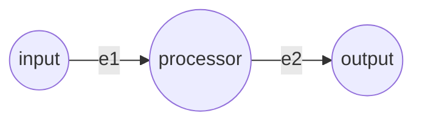
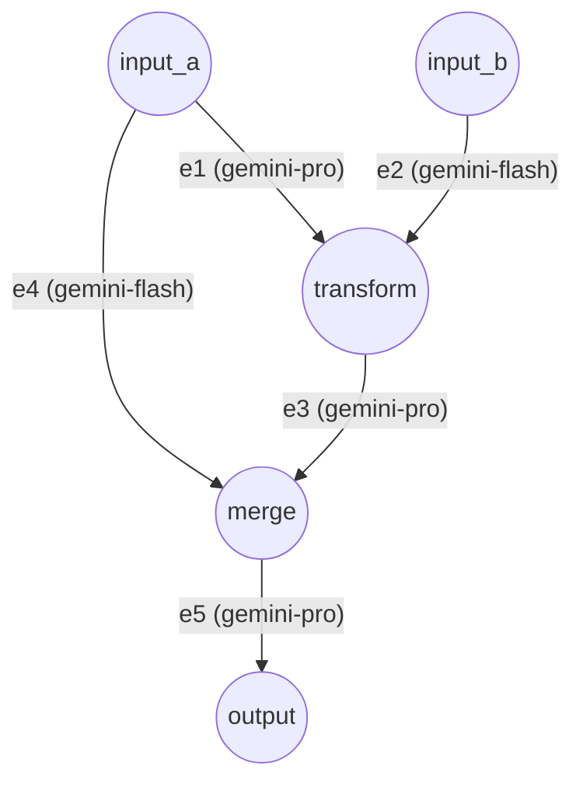

# ==========================================
# File: README.md
# ==========================================

```markdown
# Vertex-Edge Agent Framework (顶点-边 智能体框架)

一个**非交互式**、数据驱动、高度可扩展的 DAG（有向无环图）执行引擎，专为编排和调度 AI Agent 生产级流水线而设计。

## 核心架构 (Unified Architecture)

框架采用了高度统一的 **Actor / Message-Passing (消息传递)** 模型。Vertex（节点）和 Edge（边）之间没有任何零散的方法调用，所有的交互全部通过单一的信号管道 `handle_edge_signal` 完成。

```
┌──────────┐    ┌───────────────────────────────────────────────┐    ┌──────────┐
│ Vertex A │───▶│                     Edge 1                    │───▶│ Vertex B │
│ (Source) │    │ Guard -> PreProcess -> Compute -> PostProcess │    │ (Sink)   │
└──────────┘    └───────────────────────────────────────────────┘    └──────────┘
```

### 1. Edge: 统一的 5 阶段流水线 (5-Stage Pipeline)
`Edge` 不再区分为普通边或条件边，而是统一为一个标准的 5 阶段流水线：
1. **Guard (门限拦截)**: 调用 `evaluate_condition` 进行前置校验（支持 JSON 声明式规则或外部 Python 脚本）。若不满足条件，直接产生 `ABORTED` 信号，触发向下的雪崩级分支剪枝，避免死锁。
2. **Pre-Process (预处理)**: 触发 `pre_process` 钩子处理原始数据。
3. **Compute (计算)**: 如果配置了 Prompt 和 Model，则通过 LLM (PI Agent) 计算；若未配置，则化身为透明的 Pass-through edge 直接透传数据。
4. **Post-Process (后处理)**: 触发 `post_process` 钩子进行解析或格式化。
5. **Deliver (交付)**: 向目标 Vertex 发送 `COMPLETED` 信号并写入结果。

### 2. Vertex: 统一的 3 阶段容器 (3-Stage Container)
`Vertex` 作为一个纯粹的黑盒状态机容器，分为三个生命周期：
1. **Ingest (摄入)**: 当收到边的 `COMPLETED` 信号时，触发 `on_receive` 拦截器/钩子。
2. **Settle (沉淀/屏障)**: 采用动态结算屏障（Settlement Barrier Check）。实时统计 `COMPLETED` 与 `ABORTED` 信号。若所有入边皆有定论，只要有一条成功则进入 `READY`，若全军覆没则进入 `ABORTED`。
3. **Fuse (融合)**: 结算完成后，引擎触发 `prepare_outputs()` (即 `on_ready` 钩子)，将零散的数据融合为出边所需的状态。

## JSON 配置规范 (Configuration Schema)

图的拓扑结构与执行规则完全由 JSON 驱动，支持声明式的阈值控制、脚本挂载与大模型配置：

```jsonc
{
  "metadata": { "name": "...", "description": "..." },
  "vertices": [
    {
      "id": "v1",
      "settings": { /* 任意配置字典 */ },
      "script": "path/to/vertex_script.py",      // 可选：挂载外部扩展脚本
      "initial_data": [                          // 可选：初始注入数据
        { "data_id": "text", "tags": ["en"], "value": "Hello" }
      ]
    }
  ],
  "edges": [
    {
      "id": "e1",
      "source": "v1",
      "destination": "v2",
      "data_id": "text",
      "tags": ["en"],
      "prompt": "Summarize this:",
      "model": "gemini-pro",
      "settings": {
        "threshold": 80,                         // 可选：Guard 门限配置（声明式）
        "operator": ">="
      },
      "script": "path/to/edge_script.py"         // 可选：挂载外部扩展脚本
    }
  ]
}
```

## 外部扩展脚本 (External Scripts)

通过配置 `script` 字段，可以将普通节点与边瞬间升级为具备复杂逻辑的组件，无需修改底层框架源码。

### Vertex Scripts (节点脚本)

```python
def on_receive(data, data_id, tags, settings):
    """【Ingest 阶段】数据到达时触发。可转换数据，或抛出异常以拒绝接收该数据。"""
    if not valid(data):
        raise ValueError("rejected")
    return data.upper()

def on_ready(all_data, settings):
    """【Fuse 阶段】节点就绪，即将触发下游出边前调用。用于将多个输入融合为最终输出。"""
    return {("output_id", ("tag",)): merged_value}
```

### Edge Scripts (边脚本)

```python
def guard(data, settings):
    """【Guard 阶段】条件门限，返回 False 则剪枝当前分支。也叫 evaluate_condition。"""
    return data.get("score", 0) >= 80

def pre_process(data, settings):
    """【Pre-process 阶段】在进入 LLM 之前转换数据。"""
    return f"【请分析以下内容】\n{data}"

def post_process(data, settings):
    """【Post-process 阶段】解析 LLM 的输出。"""
    return data.strip()
```

## 运行方式 (Usage)

```python
import asyncio
from framework import Graph, Executor, MockPIAgent

async def main():
    # 1. 解析 DAG 图配置
    graph = Graph.from_json("config.json")
    # 2. 注入真实或 Mock 的 Agent，配置并发度并启动引擎
    result = await Executor(graph, MockPIAgent(), max_concurrency=8).run()
    # 3. 打印执行摘要
    print(result.summary())

asyncio.run(main())
```

## 示例 (Examples)

```bash
# 简单的线性流水线
python examples/run.py examples/simple/config.json

# 复杂的 DAG（支持扇出 Fan-out、扇入 Fan-in、外部脚本）
python examples/run.py examples/complex/config.json

# 动态分支路由与条件剪枝 (Guard & Routing)
python examples/run.py examples/conditional_routing/config.json

# 面向对象的高级用法 (自定义子类重载)
python examples/run.py examples/custom_classes/config.json
```
*每个示例文件夹均包含专门的 `README.md` 教程。*

## 单元测试 (Tests)

```bash
pip install pytest pytest-asyncio
python -m pytest tests/ -v
```

当前包含 **72 个全覆盖测试**，涵盖：状态机、统一信号传递 (EdgeSignal)、标签排序、并发信号量、动态路由剪枝 (Diamond Routing)、死锁预防、脚本钩子拦截、图循环检测、超时与错误抛出。

```


# ==========================================
# File: ROADMAP.md
# ==========================================

```markdown
# Vertex-Edge Agent Framework: Development Roadmap

## ✅ v1.0: Core Architecture (Completed)
- **Event-Driven DAG Engine**: Non-interactive JSON-driven execution.
- **Unified 5-Stage Edge Pipeline**: Guard -> Pre-Process -> Compute -> Post-Process -> Deliver.
- **Unified Message Passing**: Edge-Vertex communication consolidated into `handle_edge_signal` using `EdgeSignal`.
- **Dynamic Branching & Pruning**: Deadlock-free conditional routing using Edge Guards and Cascading Aborts.
- **Extensibility**: Native subclassing and script hooks (`on_receive`, `on_ready`, `pre_process`, `post_process`).
- **Concurrency**: Semaphore-bounded asynchronous execution.

## 🚀 v2.0: Application-Ready (Next Steps)
1. **Retry Mechanism & Exponential Backoff**: Add resilience to LLM API rate limits and network instability.
2. **State Persistence & Checkpointing**: Enable pausing workflows, saving state snapshots, and Human-in-the-Loop (HITL) interventions.
3. **Real-Time Event Streaming**: Provide async generators for real-time observability, enabling SSE (Server-Sent Events) or WebSockets for frontend clients.
4. **Stateful Loops & Cycles**: Evolve from a strict DAG to support stateful loops and self-correction cycles with bounded iteration limits and state resets.

## 🌌 v3.0: Enterprise-Grade (Future Vision)
1. **Nested Sub-Graphs**: Allow vertices to encapsulate entire independent graphs for scalable multi-agent teamwork.
2. **Global Memory & Context Management**: Implement a decoupled `MemoryStore` for long-term/short-term context, preventing token window bloat across sequential steps.
3. **Telemetry & Tracing**: Integrate OpenTelemetry/LangSmith for granular tracking of token usage, API costs, and edge latency.
4. **Distributed Execution**: Decouple `Executor` from `Graph` via message queues (e.g., Redis, RabbitMQ) to allow multi-node worker clusters for heavy workloads.

```


# ==========================================
# File: memo.md
# ==========================================

```markdown
# Project Memo

## 2026-08-27
- Applied dynamic subclass support for Vertex and Edge in graph.py via inspect module.
- Conducted architectural review of the framework, identifying polling vs event-driven issues, error propagation flaws, and input tracking mechanisms.
- Executed full framework refactoring resolving polling vs event-driven issues (now uses asyncio.wait), error propagation flaws (mark_edge_failed), and input tracking (completed_incoming_edges sets). All 62 pytest cases pass. Posted v1.1 to Moonchan.
- Merged `GateEdge` logic into `Edge` to create a unified 5-stage Edge pipeline (Guard -> Pre-Process -> Compute -> Post-Process -> Deliver).
- Merged vertex and edge communication methods (`get`, `set`, `mark_edge_failed`, `mark_edge_aborted`) into a single `handle_edge_signal` method using `EdgeSignal` enum (Message-Passing architecture).
- Updated all tests (now 72/72 passing) and translated all README documentation to Chinese.

```


# ==========================================
# File: pyproject.toml
# ==========================================

```toml
[tool.pytest.ini_options]
asyncio_mode = "auto"

```


# ==========================================
# File: update_tests.py
# ==========================================

```python
import re

with open('tests/test_vertex.py', 'r') as f:
    content = f.read()

# Replace .get(data_id, tags)
content = re.sub(
    r'\.get\("([^"]+)"(?:,\s*(\[[^\]]+\]))?\)',
    lambda m: f'.handle_edge_signal("", EdgeSignal.READ, data_id="{m.group(1)}"' + (f', tags={m.group(2)}' if m.group(2) else '') + ')',
    content
)

# Replace .set(data, data_id, tags, edge_id)
# There are variations. Let's do it carefully.
content = re.sub(
    r'\.set\("([^"]+)",\s*"([^"]+)"(?:,\s*(\[[^\]]+\]))?(?:,\s*edge_id="([^"]+)")?\)',
    lambda m: f'.handle_edge_signal("{m.group(4) or ""}", EdgeSignal.COMPLETED, payload="{m.group(1)}", data_id="{m.group(2)}"' + (f', tags={m.group(3)}' if m.group(3) else '') + ')',
    content
)

with open('tests/test_vertex.py', 'w') as f:
    f.write(content)


```


# ==========================================
# File: tests/__init__.py
# ==========================================

```python
# tests package

```


# ==========================================
# File: tests/conftest.py
# ==========================================

```python
"""Shared pytest fixtures for vertex-edge-agent tests."""

import asyncio
import json
import os
import sys
import tempfile
from typing import Dict

import pytest

# Ensure the project root is importable
sys.path.insert(0, os.path.join(os.path.dirname(__file__), ".."))

from framework import Vertex, Edge, Graph, Executor, MockPIAgent
from framework.vertex import VertexState


# ------------------------------------------------------------------
# Fixtures: vertices
# ------------------------------------------------------------------
@pytest.fixture
def source_vertex():
    """A source vertex with initial data."""
    return Vertex(
        vertex_id="src",
        settings={"type": "source"},
        initial_data=[
            {"data_id": "text", "tags": ["en"], "value": "Hello world"},
        ],
    )


@pytest.fixture
def empty_vertex():
    """A bare vertex with no data or settings."""
    return Vertex(vertex_id="empty")


@pytest.fixture
def sink_vertex():
    """A sink vertex (no outgoing edges)."""
    return Vertex(vertex_id="sink", settings={"type": "sink"})


# ------------------------------------------------------------------
# Fixtures: mock agent
# ------------------------------------------------------------------
@pytest.fixture
def mock_agent():
    return MockPIAgent()


@pytest.fixture
def echo_agent():
    """Agent that returns data unchanged."""
    return MockPIAgent(response_fn=lambda d, p, m, s: d)


@pytest.fixture
def upper_agent():
    """Agent that uppercases string data."""
    return MockPIAgent(
        response_fn=lambda d, p, m, s: d.upper() if isinstance(d, str) else d
    )


# ------------------------------------------------------------------
# Fixtures: graph configs
# ------------------------------------------------------------------
@pytest.fixture
def linear_config() -> Dict:
    """Minimal linear graph: A → B → C."""
    return {
        "metadata": {"name": "linear"},
        "vertices": [
            {
                "id": "A",
                "initial_data": [
                    {"data_id": "x", "tags": [], "value": "hello"},
                ],
            },
            {"id": "B"},
            {"id": "C"},
        ],
        "edges": [
            {
                "id": "e1",
                "source": "A",
                "destination": "B",
                "data_id": "x",
                "tags": [],
                "prompt": "process",
                "model": "mock",
            },
            {
                "id": "e2",
                "source": "B",
                "destination": "C",
                "data_id": "x",
                "tags": [],
                "prompt": "finalize",
                "model": "mock",
            },
        ],
    }


@pytest.fixture
def diamond_config() -> Dict:
    """Diamond graph: A → B, A → C, B → D, C → D."""
    return {
        "metadata": {"name": "diamond"},
        "vertices": [
            {
                "id": "A",
                "initial_data": [
                    {"data_id": "v", "tags": ["t1"], "value": "start"},
                    {"data_id": "v", "tags": ["t2"], "value": "start"},
                ],
            },
            {"id": "B"},
            {"id": "C"},
            {"id": "D"},
        ],
        "edges": [
            {
                "id": "ab",
                "source": "A",
                "destination": "B",
                "data_id": "v",
                "tags": ["t1"],
                "prompt": "branch-1",
                "model": "mock",
            },
            {
                "id": "ac",
                "source": "A",
                "destination": "C",
                "data_id": "v",
                "tags": ["t2"],
                "prompt": "branch-2",
                "model": "mock",
            },
            {
                "id": "bd",
                "source": "B",
                "destination": "D",
                "data_id": "v",
                "tags": ["t1"],
                "prompt": "merge-1",
                "model": "mock",
            },
            {
                "id": "cd",
                "source": "C",
                "destination": "D",
                "data_id": "v",
                "tags": ["t2"],
                "prompt": "merge-2",
                "model": "mock",
            },
        ],
    }


@pytest.fixture
def cycle_config() -> Dict:
    """Invalid graph with a cycle: A → B → A."""
    return {
        "vertices": [{"id": "A"}, {"id": "B"}],
        "edges": [
            {
                "id": "e1",
                "source": "A",
                "destination": "B",
                "data_id": "x",
                "prompt": "",
                "model": "m",
            },
            {
                "id": "e2",
                "source": "B",
                "destination": "A",
                "data_id": "x",
                "prompt": "",
                "model": "m",
            },
        ],
    }


@pytest.fixture
def tmp_json(tmp_path):
    """Factory that writes a config dict to a temp JSON file and returns the path."""
    def _write(config: Dict) -> str:
        path = str(tmp_path / "graph.json")
        with open(path, "w") as f:
            json.dump(config, f)
        return path
    return _write

```


# ==========================================
# File: tests/test_edge.py
# ==========================================

```python
"""Tests for framework.edge."""

import asyncio
import os
import sys

import pytest

sys.path.insert(0, os.path.join(os.path.dirname(__file__), ".."))

from framework.edge import Edge
from framework.vertex import Vertex, DataRejectedError, EdgeSignal
from framework.pi_agent import MockPIAgent


# ── construction ─────────────────────────────────────────────────
class TestEdgeConstruction:
    def test_defaults(self):
        e = Edge("e1", "src", "dst")
        assert e.id == "e1"
        assert e.source_id == "src"
        assert e.destination_id == "dst"
        assert e.data_id == "default"
        assert e.tags == []
        assert e.completed is False
        assert e.error is None

    def test_custom_fields(self):
        e = Edge("e2", "a", "b", data_id="msg", tags=["t1", "t2"],
                 prompt="do it", model="gpt-4", settings={"k": "v"})
        assert e.data_id == "msg"
        assert e.tags == ["t1", "t2"]
        assert e.prompt == "do it"
        assert e.model == "gpt-4"
        assert e.settings == {"k": "v"}


# ── execution ────────────────────────────────────────────────────
class TestEdgeExecution:
    @pytest.mark.asyncio
    async def test_basic_execute(self, mock_agent):
        src = Vertex("src", initial_data=[{"data_id": "d", "tags": [], "value": "hi"}])
        dst = Vertex("dst")
        dst.required_input_count = 1
        dst.incoming_edges = ["e1"]

        e = Edge("e1", "src", "dst", data_id="d", prompt="process", model="mock")
        result = await e.execute(src, dst, mock_agent)

        assert e.completed
        assert result is not None
        assert await dst.handle_edge_signal("", EdgeSignal.READ, data_id="d") is not None

    @pytest.mark.asyncio
    async def test_none_data_propagates(self, mock_agent):
        """Edge should still work when source returns None."""
        src = Vertex("src")
        dst = Vertex("dst")
        dst.required_input_count = 1
        dst.incoming_edges = ["e"]

        e = Edge("e", "src", "dst", data_id="missing")
        result = await e.execute(src, dst, mock_agent)
        assert e.completed

    @pytest.mark.asyncio
    async def test_execute_with_dict_data(self, mock_agent):
        src = Vertex("src", initial_data=[
            {"data_id": "j", "tags": [], "value": {"key": "val"}}
        ])
        dst = Vertex("dst")
        dst.required_input_count = 1
        dst.incoming_edges = ["e"]

        e = Edge("e", "src", "dst", data_id="j", prompt="p", model="m")
        result = await e.execute(src, dst, mock_agent)
        assert e.completed
        assert isinstance(result, dict)

    @pytest.mark.asyncio
    async def test_execute_failure_sets_error(self):
        """When the agent raises, the edge should record the error."""
        def boom(d, p, m, s):
            raise RuntimeError("agent error")

        src = Vertex("src", initial_data=[{"data_id": "d", "value": "x"}])
        dst = Vertex("dst")
        agent = MockPIAgent(response_fn=boom)
        e = Edge("e", "src", "dst", data_id="d", prompt="trigger")

        with pytest.raises(RuntimeError, match="agent error"):
            await e.execute(src, dst, agent)

        assert not e.completed
        assert "agent error" in e.error


# ── script hooks ─────────────────────────────────────────────────
class TestEdgeScripts:
    @pytest.mark.asyncio
    async def test_pre_post_process(self, echo_agent, tmp_path):
        script = tmp_path / "wrap.py"
        script.write_text(
            "def pre_process(data, settings):\n"
            "    return f'PRE:{data}'\n"
            "\n"
            "def post_process(data, settings):\n"
            "    return f'{data}:POST'\n"
        )
        from framework.script_loader import load_script

        src = Vertex("src", initial_data=[{"data_id": "d", "value": "x"}])
        dst = Vertex("dst")
        dst.required_input_count = 1
        dst.incoming_edges = ["e"]

        e = Edge("e", "src", "dst", data_id="d")
        e.set_script_module(load_script(str(script)))

        result = await e.execute(src, dst, echo_agent)
        # echo_agent returns data unchanged, so result = post_process(pre_process("x"))
        assert result == "PRE:x:POST"
        assert await dst.handle_edge_signal("", EdgeSignal.READ, data_id="d") == "PRE:x:POST"


# ── reset ────────────────────────────────────────────────────────
class TestEdgeReset:
    def test_reset_clears_state(self):
        e = Edge("e", "a", "b")
        e.completed = True
        e.result = "something"
        e.error = "err"
        e.reset()
        assert not e.completed
        assert e.result is None
        assert e.error is None

```


# ==========================================
# File: tests/test_executor.py
# ==========================================

```python
"""Tests for framework.executor."""

import asyncio
import os
import sys

import pytest

sys.path.insert(0, os.path.join(os.path.dirname(__file__), ".."))

from framework import Graph, Executor, MockPIAgent
from framework.vertex import VertexState


# ── linear execution ─────────────────────────────────────────────
class TestLinearExecution:
    @pytest.mark.asyncio
    async def test_linear_succeeds(self, linear_config):
        g = Graph.from_dict(linear_config)
        result = await Executor(g, MockPIAgent(), timeout=10).run()

        assert result.success
        assert len(result.errors) == 0
        assert g.vertices["A"].state == VertexState.DONE
        assert g.vertices["B"].state == VertexState.DONE
        assert g.vertices["C"].state == VertexState.DONE

    @pytest.mark.asyncio
    async def test_edge_results_populated(self, linear_config):
        g = Graph.from_dict(linear_config)
        result = await Executor(g, MockPIAgent(), timeout=10).run()

        assert "e1" in result.edge_results
        assert "e2" in result.edge_results

    @pytest.mark.asyncio
    async def test_data_flows_through(self, linear_config):
        g = Graph.from_dict(linear_config)
        agent = MockPIAgent(response_fn=lambda d, p, m, s: f"[{d}]")
        result = await Executor(g, agent, timeout=10).run()

        # A had "hello", e1 wraps it → "[hello]", e2 wraps that → "[[hello]]"
        c_data = result.vertex_results["C"]["data"]
        assert any("[[hello]]" in str(v) for v in c_data.values())


# ── diamond execution ────────────────────────────────────────────
class TestDiamondExecution:
    @pytest.mark.asyncio
    async def test_diamond_succeeds(self, diamond_config):
        g = Graph.from_dict(diamond_config)
        result = await Executor(g, MockPIAgent(), timeout=10).run()
        assert result.success

    @pytest.mark.asyncio
    async def test_fan_in_vertex_gets_both_inputs(self, diamond_config):
        g = Graph.from_dict(diamond_config)
        result = await Executor(g, MockPIAgent(), timeout=10).run()

        d_data = result.vertex_results["D"]["data"]
        assert len(d_data) >= 2  # received from both B and C


# ── concurrency ──────────────────────────────────────────────────
class TestConcurrency:
    @pytest.mark.asyncio
    async def test_max_concurrency_1(self, diamond_config):
        """Serial execution (concurrency=1) should still succeed."""
        g = Graph.from_dict(diamond_config)
        result = await Executor(g, MockPIAgent(), max_concurrency=1, timeout=10).run()
        assert result.success

    @pytest.mark.asyncio
    async def test_wide_fanout(self):
        """10-way fanout from a single source."""
        config = {
            "vertices": [
                {"id": "src", "initial_data": [{"data_id": "d", "tags": [str(i)], "value": f"v{i}"} for i in range(10)]},
            ] + [{"id": f"dst{i}"} for i in range(10)],
            "edges": [
                {"id": f"e{i}", "source": "src", "destination": f"dst{i}",
                 "data_id": "d", "tags": [str(i)], "prompt": "go", "model": "m"}
                for i in range(10)
            ],
        }
        g = Graph.from_dict(config)
        result = await Executor(g, MockPIAgent(), max_concurrency=5, timeout=10).run()
        assert result.success
        assert len(result.edge_results) == 10


# ── timeout ──────────────────────────────────────────────────────
class TestTimeout:
    @pytest.mark.asyncio
    async def test_timeout_fires(self):
        """An agent that sleeps should trigger timeout."""
        async def slow_process(data, prompt, model, settings):
            await asyncio.sleep(10)
            return data

        class SlowAgent(MockPIAgent):
            async def process(self, data, prompt, model, settings=None):
                return await slow_process(data, prompt, model, settings)

        config = {
            "vertices": [
                {"id": "A", "initial_data": [{"data_id": "d", "value": "x"}]},
                {"id": "B"},
            ],
            "edges": [
                {"id": "e", "source": "A", "destination": "B",
                 "data_id": "d", "prompt": "", "model": "m"},
            ],
        }
        g = Graph.from_dict(config)
        result = await Executor(g, SlowAgent(), timeout=0.5).run()

        assert not result.success
        assert any("timed out" in e.lower() for e in result.errors)


# ── error handling ───────────────────────────────────────────────
class TestErrorHandling:
    @pytest.mark.asyncio
    async def test_agent_error_recorded(self):
        def fail_agent(d, p, m, s):
            raise RuntimeError("boom")

        config = {
            "vertices": [
                {"id": "A", "initial_data": [{"data_id": "d", "value": "x"}]},
                {"id": "B"},
            ],
            "edges": [
                {"id": "e", "source": "A", "destination": "B",
                 "data_id": "d", "prompt": "", "model": "m"},
            ],
        }
        g = Graph.from_dict(config)
        result = await Executor(g, MockPIAgent(response_fn=fail_agent), timeout=10).run()

        assert not result.success
        assert any("boom" in e for e in result.errors)
        assert g.vertices["A"].state == VertexState.ERROR


# ── result object ────────────────────────────────────────────────
class TestExecutionResult:
    @pytest.mark.asyncio
    async def test_summary_contains_info(self, linear_config):
        g = Graph.from_dict(linear_config)
        result = await Executor(g, MockPIAgent(), timeout=10).run()
        s = result.summary()
        assert "SUCCESS" in s
        assert "e1" in s
        assert "e2" in s

    @pytest.mark.asyncio
    async def test_execution_time_positive(self, linear_config):
        g = Graph.from_dict(linear_config)
        result = await Executor(g, MockPIAgent(), timeout=10).run()
        assert result.execution_time > 0

```


# ==========================================
# File: tests/test_gate_edge.py
# ==========================================

```python
"""Tests for Edge and conditional dynamic routing / abort handling."""

import asyncio
import os
import sys
import pytest

sys.path.insert(0, os.path.join(os.path.dirname(__file__), ".."))

from framework import Vertex, VertexState, Edge, Graph, Executor, MockPIAgent
from framework.vertex import EdgeSignal


# ── Edge Condition Evaluation ──────────────────────────────
class TestEdgeCondition:
    def test_default_truthiness(self):
        gate = Edge("g1", "v1", "v2")
        assert gate.evaluate_condition("hello", {}) is True
        assert gate.evaluate_condition("", {}) is True
        assert gate.evaluate_condition(1, {}) is True
        assert gate.evaluate_condition(0, {}) is True
        assert gate.evaluate_condition([], {}) is True
        assert gate.evaluate_condition([1], {}) is True

    def test_threshold_operators(self):
        gate = Edge("g1", "v1", "v2", settings={"threshold": 80, "operator": ">="})
        assert gate.evaluate_condition(80, gate.settings) is True
        assert gate.evaluate_condition(95, gate.settings) is True
        assert gate.evaluate_condition(79, gate.settings) is False

        gate_lt = Edge("g2", "v1", "v2", settings={"threshold": 50, "operator": "<"})
        assert gate_lt.evaluate_condition(49, gate_lt.settings) is True
        assert gate_lt.evaluate_condition(50, gate_lt.settings) is False

        gate_eq = Edge("g3", "v1", "v2", settings={"threshold": "apple", "operator": "=="})
        assert gate_eq.evaluate_condition("apple", gate_eq.settings) is True
        assert gate_eq.evaluate_condition("banana", gate_eq.settings) is False

        gate_contains = Edge("g4", "v1", "v2", settings={"threshold": "draw", "operator": "contains"})
        assert gate_contains.evaluate_condition("please draw a cat", gate_contains.settings) is True
        assert gate_contains.evaluate_condition("write a poem", gate_contains.settings) is False

    def test_threshold_with_dict_field(self):
        gate = Edge("g1", "v1", "v2", settings={"field": "score", "threshold": 60, "operator": ">="})
        assert gate.evaluate_condition({"score": 75, "name": "Alice"}, gate.settings) is True
        assert gate.evaluate_condition({"score": 50, "name": "Bob"}, gate.settings) is False
        assert gate.evaluate_condition({"other": 100}, gate.settings) is False

    def test_dictionary_match(self):
        gate = Edge("g1", "v1", "v2", settings={"match": {"intent": "image", "vip": True}})
        assert gate.evaluate_condition({"intent": "image", "vip": True, "prompt": "cat"}, gate.settings) is True
        assert gate.evaluate_condition({"intent": "image", "vip": False}, gate.settings) is False
        assert gate.evaluate_condition({"intent": "text", "vip": True}, gate.settings) is False

    def test_subclass_override(self):
        class CustomGate(Edge):
            def condition(self, data, settings):
                return isinstance(data, str) and data.startswith("ALLOW")

        gate = CustomGate("g1", "v1", "v2")
        assert gate.evaluate_condition("ALLOW: test", {}) is True
        assert gate.evaluate_condition("DENY: test", {}) is False


# ── Edge Execution Unit Tests ──────────────────────────────
class TestEdgeExecution:
    @pytest.mark.asyncio
    async def test_gate_edge_passes_data(self):
        v1 = Vertex("v1", initial_data=[{"data_id": "score", "value": 90}])
        v2 = Vertex("v2")
        v2.incoming_edges = ["g1"]

        gate = Edge("g1", "v1", "v2", data_id="score", settings={"threshold": 80, "operator": ">="})
        agent = MockPIAgent()

        result = await gate.execute(v1, v2, agent)
        assert result == 90
        assert gate.completed is True
        assert gate.aborted is False
        assert v2.state == VertexState.READY
        assert await v2.handle_edge_signal("", EdgeSignal.READ, data_id="score") == 90

    @pytest.mark.asyncio
    async def test_gate_edge_aborts_on_condition_false(self):
        v1 = Vertex("v1", initial_data=[{"data_id": "score", "value": 50}])
        v2 = Vertex("v2")
        v2.incoming_edges = ["g1"]

        gate = Edge("g1", "v1", "v2", data_id="score", settings={"threshold": 80, "operator": ">="})
        agent = MockPIAgent()

        result = await gate.execute(v1, v2, agent)
        assert result is None
        assert gate.completed is False
        assert gate.aborted is True
        assert "not satisfied" in gate.abort_reason
        assert v2.state == VertexState.ABORTED
        assert "g1" in v2.aborted_incoming_edges


# ── Diamond Dynamic Routing & Non-blocking Join ────────────────
class TestConditionalDiamondRouting:
    @pytest.mark.asyncio
    async def test_diamond_single_active_branch_settles_join_node(self):
        """
        Topology:
                 /-- [Gate: score >= 80] --> HighBranch -- [Edge] --\\
          Source                                                      --> Sink
                 \\-- [Gate: score < 80]  --> LowBranch  -- [Edge] --/
        """
        config = {
            "vertices": [
                {
                    "id": "Source",
                    "initial_data": [{"data_id": "score", "value": 95}],
                },
                {"id": "HighBranch"},
                {"id": "LowBranch"},
                {"id": "Sink"},
            ],
            "edges": [
                {
                    "id": "g_high",
                    "type": "gate",
                    "source": "Source",
                    "destination": "HighBranch",
                    "data_id": "score",
                    "settings": {"threshold": 80, "operator": ">="},
                },
                {
                    "id": "g_low",
                    "type": "gate",
                    "source": "Source",
                    "destination": "LowBranch",
                    "data_id": "score",
                    "settings": {"threshold": 80, "operator": "<"},
                },
                {
                    "id": "e_high",
                    "source": "HighBranch",
                    "destination": "Sink",
                    "data_id": "score",
                    "prompt": "high score",
                },
                {
                    "id": "e_low",
                    "source": "LowBranch",
                    "destination": "Sink",
                    "data_id": "score",
                    "prompt": "low score",
                },
            ],
        }

        g = Graph.from_dict(config)
        agent = MockPIAgent(response_fn=lambda d, p, m, s: f"PROCESSED:{p}:{d}")
        executor = Executor(g, agent, timeout=5)
        result = await executor.run()

        assert result.success
        assert len(result.errors) == 0

        # State verifications
        assert g.vertices["Source"].state == VertexState.DONE
        assert g.vertices["HighBranch"].state == VertexState.DONE
        assert g.vertices["LowBranch"].state == VertexState.ABORTED
        assert g.vertices["Sink"].state == VertexState.DONE

        # Edge states
        assert g.edges["g_high"].completed is True
        assert g.edges["g_low"].aborted is True
        assert g.edges["e_low"].aborted is True
        assert g.edges["e_high"].completed is True

        # Data in Sink
        sink_data = await g.vertices["Sink"].handle_edge_signal("", EdgeSignal.READ, data_id="score")
        assert "PROCESSED:high score:95" in sink_data

    @pytest.mark.asyncio
    async def test_all_branches_aborted_cascades_to_sink(self):
        """When all gates abort, sink aborts cleanly with 0 errors and no deadlocks."""
        config = {
            "vertices": [
                {
                    "id": "Source",
                    "initial_data": [{"data_id": "val", "value": 10}],
                },
                {"id": "BranchA"},
                {"id": "BranchB"},
                {"id": "Sink"},
            ],
            "edges": [
                {
                    "id": "g_a",
                    "type": "gate",
                    "source": "Source",
                    "destination": "BranchA",
                    "data_id": "val",
                    "settings": {"threshold": 100, "operator": ">"},
                },
                {
                    "id": "g_b",
                    "type": "gate",
                    "source": "Source",
                    "destination": "BranchB",
                    "data_id": "val",
                    "settings": {"threshold": 200, "operator": ">"},
                },
                {
                    "id": "e_a",
                    "source": "BranchA",
                    "destination": "Sink",
                    "data_id": "val",
                },
                {
                    "id": "e_b",
                    "source": "BranchB",
                    "destination": "Sink",
                    "data_id": "val",
                },
            ],
        }

        g = Graph.from_dict(config)
        result = await Executor(g, MockPIAgent(), timeout=5).run()

        assert result.success
        assert len(result.errors) == 0
        assert g.vertices["Source"].state == VertexState.DONE
        assert g.vertices["BranchA"].state == VertexState.ABORTED
        assert g.vertices["BranchB"].state == VertexState.ABORTED
        assert g.vertices["Sink"].state == VertexState.ABORTED

    @pytest.mark.asyncio
    async def test_deep_cascading_abort(self):
        """A -> Gate(False) -> B -> C -> D -> E all cascade abort."""
        config = {
            "vertices": [
                {"id": "A", "initial_data": [{"data_id": "d", "value": "no"}]},
                {"id": "B"},
                {"id": "C"},
                {"id": "D"},
                {"id": "E"},
            ],
            "edges": [
                {"id": "g1", "type": "gate", "source": "A", "destination": "B", "data_id": "d", "settings": {"threshold": "yes", "operator": "=="}},
                {"id": "e1", "source": "B", "destination": "C", "data_id": "d"},
                {"id": "e2", "source": "C", "destination": "D", "data_id": "d"},
                {"id": "e3", "source": "D", "destination": "E", "data_id": "d"},
            ],
        }

        g = Graph.from_dict(config)
        result = await Executor(g, MockPIAgent(), timeout=5).run()

        assert result.success
        assert g.vertices["A"].state == VertexState.DONE
        assert g.vertices["B"].state == VertexState.ABORTED
        assert g.vertices["C"].state == VertexState.ABORTED
        assert g.vertices["D"].state == VertexState.ABORTED
        assert g.vertices["E"].state == VertexState.ABORTED

```


# ==========================================
# File: tests/test_graph.py
# ==========================================

```python
"""Tests for framework.graph."""

import json
import os
import sys

import pytest

sys.path.insert(0, os.path.join(os.path.dirname(__file__), ".."))

from framework.graph import Graph


# ── loading ──────────────────────────────────────────────────────
class TestGraphLoading:
    def test_from_dict_linear(self, linear_config):
        g = Graph.from_dict(linear_config)
        assert len(g.vertices) == 3
        assert len(g.edges) == 2

    def test_from_dict_diamond(self, diamond_config):
        g = Graph.from_dict(diamond_config)
        assert len(g.vertices) == 4
        assert len(g.edges) == 4

    def test_from_json_file(self, linear_config, tmp_json):
        path = tmp_json(linear_config)
        g = Graph.from_json(path)
        assert len(g.vertices) == 3

    def test_metadata(self, linear_config):
        g = Graph.from_dict(linear_config)
        assert g.metadata["name"] == "linear"

    def test_edge_registration(self, linear_config):
        g = Graph.from_dict(linear_config)
        assert "e1" in g.vertices["A"].outgoing_edges
        assert "e1" in g.vertices["B"].incoming_edges


# ── validation ───────────────────────────────────────────────────
class TestGraphValidation:
    def test_cycle_rejected(self, cycle_config):
        with pytest.raises(ValueError, match="cycle"):
            Graph.from_dict(cycle_config)

    def test_missing_source_vertex(self):
        config = {
            "vertices": [{"id": "B"}],
            "edges": [
                {"id": "e", "source": "MISSING", "destination": "B",
                 "data_id": "x", "prompt": "", "model": "m"},
            ],
        }
        with pytest.raises(ValueError, match="source"):
            Graph.from_dict(config)

    def test_missing_dest_vertex(self):
        config = {
            "vertices": [{"id": "A"}],
            "edges": [
                {"id": "e", "source": "A", "destination": "MISSING",
                 "data_id": "x", "prompt": "", "model": "m"},
            ],
        }
        with pytest.raises(ValueError, match="destination"):
            Graph.from_dict(config)

    def test_valid_dag_passes(self, diamond_config):
        # Should not raise
        g = Graph.from_dict(diamond_config)
        assert g is not None


# ── queries ──────────────────────────────────────────────────────
class TestGraphQueries:
    def test_source_vertices(self, linear_config):
        g = Graph.from_dict(linear_config)
        sources = g.get_source_vertices()
        assert len(sources) == 1
        assert sources[0].id == "A"

    def test_sink_vertices(self, linear_config):
        g = Graph.from_dict(linear_config)
        sinks = g.get_sink_vertices()
        assert len(sinks) == 1
        assert sinks[0].id == "C"

    def test_diamond_sources_and_sinks(self, diamond_config):
        g = Graph.from_dict(diamond_config)
        assert len(g.get_source_vertices()) == 1  # A
        assert len(g.get_sink_vertices()) == 1     # D

    def test_outgoing_edges(self, diamond_config):
        g = Graph.from_dict(diamond_config)
        out_a = g.get_outgoing_edges("A")
        assert len(out_a) == 2

    def test_incoming_edges(self, diamond_config):
        g = Graph.from_dict(diamond_config)
        in_d = g.get_incoming_edges("D")
        assert len(in_d) == 2

    def test_required_input_count(self, diamond_config):
        g = Graph.from_dict(diamond_config)
        assert g.vertices["D"].required_input_count == 2
        assert g.vertices["A"].required_input_count == 0


# ── scripts ──────────────────────────────────────────────────────
class TestGraphScripts:
    def test_vertex_script_loaded(self, tmp_path):
        script = tmp_path / "vs.py"
        script.write_text("def on_receive(d, i, t, s): return d\n")

        config = {
            "vertices": [{"id": "A", "script": str(script)}],
            "edges": [],
        }
        g = Graph.from_dict(config)
        assert g.vertices["A"]._script_module is not None

    def test_edge_script_loaded(self, tmp_path):
        script = tmp_path / "es.py"
        script.write_text("def pre_process(d, s): return d\n")

        config = {
            "vertices": [{"id": "A"}, {"id": "B"}],
            "edges": [
                {"id": "e", "source": "A", "destination": "B",
                 "data_id": "x", "prompt": "", "model": "m",
                 "script": str(script)},
            ],
        }
        g = Graph.from_dict(config)
        assert g.edges["e"]._script_module is not None

    def test_missing_script_does_not_crash(self):
        config = {
            "vertices": [{"id": "A", "script": "/nonexistent/path.py"}],
            "edges": [],
        }
        # Script load fails gracefully (logs error, vertex has no module)
        g = Graph.from_dict(config)
        assert g.vertices["A"]._script_module is None

```


# ==========================================
# File: tests/test_integration.py
# ==========================================

```python
"""Integration tests - full end-to-end pipeline tests.

Tests the framework with external scripts, complex DAGs,
and real JSON config files.
"""

import asyncio
import json
import os
import sys

import pytest

sys.path.insert(0, os.path.join(os.path.dirname(__file__), ".."))

from framework import Graph, Executor, MockPIAgent
from framework.vertex import VertexState, DataRejectedError


# ── simple example ───────────────────────────────────────────────
class TestSimpleExample:
    """Test the simple linear pipeline from examples/simple/config.json."""

    @pytest.mark.asyncio
    async def test_simple_pipeline(self):
        config_path = os.path.join(
            os.path.dirname(__file__), "..", "examples", "simple", "config.json"
        )
        if not os.path.exists(config_path):
            pytest.skip("simple example config not found")

        g = Graph.from_json(config_path)
        result = await Executor(g, MockPIAgent(), timeout=10).run()

        assert result.success
        assert "e1" in result.edge_results
        assert "e2" in result.edge_results
        assert g.vertices["input"].state == VertexState.DONE
        assert g.vertices["processor"].state == VertexState.DONE
        assert g.vertices["output"].state == VertexState.DONE


# ── complex example ──────────────────────────────────────────────
class TestComplexExample:
    """Test the complex DAG from examples/complex/config.json."""

    @pytest.mark.asyncio
    async def test_complex_pipeline(self):
        config_path = os.path.join(
            os.path.dirname(__file__), "..", "examples", "complex", "config.json"
        )
        if not os.path.exists(config_path):
            pytest.skip("complex example config not found")

        g = Graph.from_json(config_path)
        agent = MockPIAgent(
            response_fn=lambda d, p, m, s: f"[{m}] {d}" if isinstance(d, str) else d
        )
        result = await Executor(g, agent, timeout=15).run()

        assert result.success
        assert len(result.edge_results) == 5
        assert g.vertices["output"].state == VertexState.DONE

    @pytest.mark.asyncio
    async def test_complex_scripts_run(self):
        config_path = os.path.join(
            os.path.dirname(__file__), "..", "examples", "complex", "config.json"
        )
        if not os.path.exists(config_path):
            pytest.skip("complex example config not found")

        g = Graph.from_json(config_path)
        # The uppercase handler should uppercase data on receive
        assert g.vertices["transform"]._script_module is not None
        assert g.vertices["merge"]._script_module is not None


# ── script-heavy pipeline ────────────────────────────────────────
class TestScriptPipeline:
    """Test a pipeline that exercises all script hooks."""

    @pytest.mark.asyncio
    async def test_full_script_lifecycle(self, tmp_path):
        # Vertex script: transforms and consolidates
        v_script = tmp_path / "v_hook.py"
        v_script.write_text(
            "def on_receive(data, data_id, tags, settings):\n"
            "    return data.strip() if isinstance(data, str) else data\n"
            "\n"
            "def on_ready(all_data, settings):\n"
            "    vals = [str(v) for v in all_data.values()]\n"
            "    return {('out', ('final',)): ' + '.join(vals)}\n"
        )

        # Edge script: wraps
        e_script = tmp_path / "e_hook.py"
        e_script.write_text(
            "def pre_process(data, settings):\n"
            "    return f'<{data}>'\n"
            "\n"
            "def post_process(data, settings):\n"
            "    return f'({data})'\n"
        )

        config = {
            "vertices": [
                {"id": "A", "initial_data": [{"data_id": "d", "tags": [], "value": " hello "}]},
                {"id": "B", "script": str(v_script)},
                {"id": "C"},
            ],
            "edges": [
                {"id": "e1", "source": "A", "destination": "B",
                 "data_id": "d", "prompt": "p", "model": "m"},
                {"id": "e2", "source": "B", "destination": "C",
                 "data_id": "out", "tags": ["final"],
                 "prompt": "p", "model": "m",
                 "script": str(e_script)},
            ],
        }

        g = Graph.from_dict(config)
        echo = MockPIAgent(response_fn=lambda d, p, m, s: d)
        result = await Executor(g, echo, timeout=10).run()

        assert result.success
        # B received " hello " → on_receive strips → "hello"
        # B.on_ready merges → out:final = "hello"
        # e2: pre_process("<hello>") → echo → post_process("(<hello>)")
        c_data = result.vertex_results["C"]["data"]
        assert any("(<hello>)" in str(v) for v in c_data.values())


# ── rejection pipeline ───────────────────────────────────────────
class TestRejectionPipeline:
    """Test that data rejection in a vertex stops the pipeline gracefully."""

    @pytest.mark.asyncio
    async def test_rejection_causes_error(self, tmp_path):
        reject_script = tmp_path / "reject.py"
        reject_script.write_text(
            "def on_receive(data, data_id, tags, settings):\n"
            "    if isinstance(data, str) and 'bad' in data:\n"
            "        raise ValueError('contains bad word')\n"
            "    return data\n"
        )

        config = {
            "vertices": [
                {"id": "A", "initial_data": [{"data_id": "d", "value": "bad data"}]},
                {"id": "B", "script": str(reject_script)},
            ],
            "edges": [
                {"id": "e", "source": "A", "destination": "B",
                 "data_id": "d", "prompt": "", "model": "m"},
            ],
        }

        g = Graph.from_dict(config)
        echo = MockPIAgent(response_fn=lambda d, p, m, s: d)
        result = await Executor(g, echo, timeout=10).run()

        assert not result.success
        assert any("bad word" in e for e in result.errors)


# ── multi-source fan-in ──────────────────────────────────────────
class TestMultiSourceFanIn:
    @pytest.mark.asyncio
    async def test_three_sources_one_sink(self):
        config = {
            "vertices": [
                {"id": "s1", "initial_data": [{"data_id": "d", "tags": ["1"], "value": "one"}]},
                {"id": "s2", "initial_data": [{"data_id": "d", "tags": ["2"], "value": "two"}]},
                {"id": "s3", "initial_data": [{"data_id": "d", "tags": ["3"], "value": "three"}]},
                {"id": "sink"},
            ],
            "edges": [
                {"id": "e1", "source": "s1", "destination": "sink",
                 "data_id": "d", "tags": ["1"], "prompt": "", "model": "m"},
                {"id": "e2", "source": "s2", "destination": "sink",
                 "data_id": "d", "tags": ["2"], "prompt": "", "model": "m"},
                {"id": "e3", "source": "s3", "destination": "sink",
                 "data_id": "d", "tags": ["3"], "prompt": "", "model": "m"},
            ],
        }

        g = Graph.from_dict(config)
        result = await Executor(g, MockPIAgent(), timeout=10).run()

        assert result.success
        sink_data = result.vertex_results["sink"]["data"]
        assert len(sink_data) == 3


# ── deeply chained pipeline ──────────────────────────────────────
class TestDeepChain:
    @pytest.mark.asyncio
    async def test_10_vertex_chain(self):
        """Chain of 10 vertices, each transforming data."""
        n = 10
        config = {
            "vertices": [
                {"id": "v0", "initial_data": [{"data_id": "d", "value": "start"}]},
            ] + [{"id": f"v{i}"} for i in range(1, n)],
            "edges": [
                {"id": f"e{i}", "source": f"v{i}", "destination": f"v{i+1}",
                 "data_id": "d", "prompt": f"step-{i}", "model": "m"}
                for i in range(n - 1)
            ],
        }

        g = Graph.from_dict(config)
        counter = {"n": 0}

        def counting_fn(d, p, m, s):
            counter["n"] += 1
            return f"({d})"

        result = await Executor(g, MockPIAgent(response_fn=counting_fn), timeout=10).run()

        assert result.success
        assert counter["n"] == n - 1  # 9 edges

        # Final vertex should have deeply nested result
        last_data = result.vertex_results[f"v{n-1}"]["data"]
        val = list(last_data.values())[0]
        assert val.count("(") == n - 1

```


# ==========================================
# File: tests/test_vertex.py
# ==========================================

```python
"""Tests for framework.vertex."""

import asyncio
import os
import sys
import tempfile

import pytest

sys.path.insert(0, os.path.join(os.path.dirname(__file__), ".."))

from framework.vertex import Vertex, VertexState, DataRejectedError, EdgeSignal


# ── state machine ────────────────────────────────────────────────
class TestVertexState:
    def test_initial_state_idle(self, empty_vertex):
        assert empty_vertex.state == VertexState.IDLE

    def test_state_transition(self, empty_vertex):
        empty_vertex.state = VertexState.READY
        assert empty_vertex.state == VertexState.READY

    def test_reset(self, empty_vertex):
        empty_vertex.state = VertexState.DONE
        empty_vertex.reset()
        assert empty_vertex.state == VertexState.IDLE

    def test_all_states_reachable(self, empty_vertex):
        for st in VertexState:
            empty_vertex.state = st
            assert empty_vertex.state == st


# ── initial data ─────────────────────────────────────────────────
class TestVertexInitialData:
    def test_initial_data_loaded(self, source_vertex):
        loop = asyncio.get_event_loop()
        data = loop.run_until_complete(source_vertex.handle_edge_signal("", EdgeSignal.READ, data_id="text", tags=["en"]))
        assert data == "Hello world"

    def test_missing_key_returns_none(self, source_vertex):
        loop = asyncio.get_event_loop()
        data = loop.run_until_complete(source_vertex.handle_edge_signal("", EdgeSignal.READ, data_id="missing"))
        assert data is None


# ── get / set ────────────────────────────────────────────────────
class TestVertexGetSet:
    @pytest.mark.asyncio
    async def test_set_and_get(self, empty_vertex):
        await empty_vertex.handle_edge_signal("", EdgeSignal.COMPLETED, payload="value1", data_id="key1", tags=["tag_a"])
        result = await empty_vertex.handle_edge_signal("", EdgeSignal.READ, data_id="key1", tags=["tag_a"])
        assert result == "value1"

    @pytest.mark.asyncio
    async def test_overwrite(self, empty_vertex):
        await empty_vertex.handle_edge_signal("", EdgeSignal.COMPLETED, payload="old", data_id="k")
        await empty_vertex.handle_edge_signal("", EdgeSignal.COMPLETED, payload="new", data_id="k")
        assert await empty_vertex.handle_edge_signal("", EdgeSignal.READ, data_id="k") == "new"

    @pytest.mark.asyncio
    async def test_tag_order_irrelevant(self, empty_vertex):
        await empty_vertex.handle_edge_signal("", EdgeSignal.COMPLETED, payload="data", data_id="id", tags=["b", "a"])
        result = await empty_vertex.handle_edge_signal("", EdgeSignal.READ, data_id="id", tags=["a", "b"])
        assert result == "data"

    @pytest.mark.asyncio
    async def test_get_all_data(self, empty_vertex):
        await empty_vertex.handle_edge_signal("", EdgeSignal.COMPLETED, payload="v1", data_id="k1", tags=["t"])
        await empty_vertex.handle_edge_signal("", EdgeSignal.COMPLETED, payload="v2", data_id="k2", tags=["t"])
        all_data = await empty_vertex.get_all_data()
        assert len(all_data) == 2


# ── readiness semaphore ──────────────────────────────────────────
class TestVertexReadiness:
    @pytest.mark.asyncio
    async def test_becomes_ready_after_all_inputs(self):
        v = Vertex("v1")
        v.required_input_count = 2
        v.incoming_edges = ["e1", "e2"]

        await v.handle_edge_signal("e1", EdgeSignal.COMPLETED, payload="a", data_id="d1")
        assert v.state == VertexState.IDLE  # only 1 of 2

        await v.handle_edge_signal("e2", EdgeSignal.COMPLETED, payload="b", data_id="d2")
        assert v.state == VertexState.READY  # 2 of 2

    @pytest.mark.asyncio
    async def test_source_vertex_has_no_required_inputs(self, source_vertex):
        assert source_vertex.required_input_count == 0
        assert source_vertex.is_source()


# ── external script hooks ────────────────────────────────────────
class TestVertexScript:
    @pytest.mark.asyncio
    async def test_on_receive_transforms(self, empty_vertex, tmp_path):
        script = tmp_path / "upper.py"
        script.write_text(
            "def on_receive(data, data_id, tags, settings):\n"
            "    return data.upper() if isinstance(data, str) else data\n"
        )
        from framework.script_loader import load_script
        empty_vertex.set_script_module(load_script(str(script)))

        await empty_vertex.handle_edge_signal("", EdgeSignal.COMPLETED, payload="hello", data_id="k")
        assert await empty_vertex.handle_edge_signal("", EdgeSignal.READ, data_id="k") == "HELLO"

    @pytest.mark.asyncio
    async def test_on_receive_rejects(self, empty_vertex, tmp_path):
        script = tmp_path / "reject.py"
        script.write_text(
            "def on_receive(data, data_id, tags, settings):\n"
            "    raise ValueError('rejected')\n"
        )
        from framework.script_loader import load_script
        empty_vertex.set_script_module(load_script(str(script)))

        with pytest.raises(DataRejectedError, match="rejected"):
            await empty_vertex.handle_edge_signal("", EdgeSignal.COMPLETED, payload="anything", data_id="k")

    @pytest.mark.asyncio
    async def test_on_ready_hook(self, empty_vertex, tmp_path):
        script = tmp_path / "ready.py"
        script.write_text(
            "def on_ready(all_data, settings):\n"
            "    return {('out', ('merged',)): 'merged-data'}\n"
        )
        from framework.script_loader import load_script
        empty_vertex.set_script_module(load_script(str(script)))

        await empty_vertex.handle_edge_signal("", EdgeSignal.COMPLETED, payload="raw", data_id="in")
        await empty_vertex.prepare_outputs()

        assert await empty_vertex.handle_edge_signal("", EdgeSignal.READ, data_id="out", tags=["merged"]) == "merged-data"


# ── helpers ──────────────────────────────────────────────────────
class TestVertexHelpers:
    def test_is_source(self, source_vertex):
        assert source_vertex.is_source()

    def test_is_sink(self, sink_vertex):
        assert sink_vertex.is_sink()

    def test_repr(self, source_vertex):
        r = repr(source_vertex)
        assert "src" in r
        assert "idle" in r

```


# ==========================================
# File: framework/__init__.py
# ==========================================

```python
"""Vertex-Edge Agent Framework - Non-interactive graph execution engine."""

from .vertex import Vertex, VertexState, DataRejectedError
from .edge import Edge
from .graph import Graph
from .executor import Executor, ExecutionResult
from .pi_agent import PIAgent, MockPIAgent, ExternalPIAgent
from .script_loader import load_script

__all__ = [
    'Vertex', 'VertexState', 'DataRejectedError',
    'Edge',
    'Graph',
    'Executor', 'ExecutionResult',
    'PIAgent', 'MockPIAgent', 'ExternalPIAgent',
    'load_script',
]

__version__ = "1.0.0"

```


# ==========================================
# File: framework/edge.py
# ==========================================

```python
"""Edge module - Connection between vertices in the graph.

An Edge represents a 5-stage pipeline: Guard -> Pre-process -> Compute -> Post-process -> Deliver.
It communicates with vertices via the unified ``handle_edge_signal`` method using ``EdgeSignal``.
"""

import logging
from typing import Any, Dict, List, Optional
from .vertex import VertexState, EdgeSignal

logger = logging.getLogger("vertex_edge_agent.edge")


class Edge:
    """Directed edge connecting a source vertex to a destination vertex.

    Attributes:
        id:              Unique edge identifier.
        source_id:       Source vertex ID.
        destination_id:  Destination vertex ID.
        data_id:         Data key used for reading and writing data.
        tags:            Tag list used for reading and writing data.
        prompt:          Prompt sent to the PI Agent.
        model:           Model identifier for the PI Agent.
        settings:        Arbitrary settings dict passed to agent & scripts.
        script_path:     Optional path to an external Python script.
    """

    def __init__(
        self,
        edge_id: str,
        source_id: str,
        destination_id: str,
        data_id: str = "default",
        tags: Optional[List[str]] = None,
        prompt: str = "",
        model: str = "default",
        settings: Optional[Dict] = None,
        script_path: Optional[str] = None,
    ):
        self.id = edge_id
        self.source_id = source_id
        self.destination_id = destination_id
        self.data_id = data_id
        self.tags = tags or []
        self.prompt = prompt
        self.model = model
        self.settings = settings or {}
        self.script_path = script_path
        self._script_module = None

        # Execution state
        self.completed: bool = False
        self.aborted: bool = False
        self.abort_reason: Optional[str] = None
        self.result: Any = None
        self.error: Optional[str] = None

        logger.info(
            "[Edge:%s] Created %s -> %s | data_id=%s tags=%s model=%s",
            self.id, source_id, destination_id, data_id, self.tags, model,
        )

    def set_script_module(self, module):
        """Attach a loaded external script module."""
        self._script_module = module
        logger.debug("[Edge:%s] Script module attached: %s", self.id, module)

    def evaluate_condition(self, data: Any, settings: Dict) -> bool:
        """Evaluate whether the guard condition is satisfied."""
        # 1. Custom method on subclass or instance
        if hasattr(self, "condition") and callable(getattr(self, "condition")):
            return bool(self.condition(data, settings))

        # 2. Script module hook
        if self._script_module:
            for hook in ("evaluate_condition", "condition", "on_gate", "guard"):
                if hasattr(self._script_module, hook) and callable(getattr(self._script_module, hook)):
                    return bool(getattr(self._script_module, hook)(data, settings))

        # 3. Declarative settings
        if not settings:
            return True  # Default to True if no settings (no guard)

        if "condition" in settings and callable(settings["condition"]):
            return bool(settings["condition"](data))

        if "match" in settings and isinstance(settings["match"], dict) and isinstance(data, dict):
            return all(data.get(k) == v for k, v in settings["match"].items())

        if "threshold" in settings:
            threshold = settings["threshold"]
            op = str(settings.get("operator", "==")).lower()
            val = data
            if isinstance(data, dict) and "field" in settings:
                val = data.get(settings["field"])

            try:
                if op in (">", "gt"):
                    return val > threshold
                elif op in (">=", "gte", "ge"):
                    return val >= threshold
                elif op in ("<", "lt"):
                    return val < threshold
                elif op in ("<=", "lte", "le"):
                    return val <= threshold
                elif op in ("==", "eq"):
                    return val == threshold
                elif op in ("!=", "ne"):
                    return val != threshold
                elif op == "in":
                    return val in threshold
                elif op == "contains":
                    return threshold in val
            except Exception as exc:
                logger.warning("[Edge:%s] Threshold comparison failed: %s", self.id, exc)
                return False

        return True  # If settings exist but no guard condition is specified, pass

    async def execute(self, source_vertex, dest_vertex, pi_agent) -> Any:
        """Execute the edge pipeline.

        Steps:
            1. Guard (`evaluate_condition`) -> If false, Abort.
            2. Pre-process (via script hook)
            3. Compute (LLM process OR transparent pass-through)
            4. Post-process (via script hook)
            5. Deliver to destination vertex.

        Returns the final result written to the destination vertex.
        """
        logger.info(
            "[Edge:%s] EXECUTE  %s -[%s:%s]-> %s",
            self.id, self.source_id, self.data_id, self.tags, self.destination_id,
        )

        try:
            # 0 — Check source vertex abort state
            if hasattr(source_vertex, "state") and source_vertex.state == VertexState.ABORTED:
                self.aborted = True
                self.abort_reason = f"Upstream source vertex '{self.source_id}' is ABORTED"
                logger.info("[Edge:%s] Source '%s' is ABORTED -> Aborting edge and notifying '%s'", self.id, self.source_id, self.destination_id)
                await dest_vertex.handle_edge_signal(self.id, EdgeSignal.ABORTED, payload=self.abort_reason)
                return None

            # 1 — Read from source
            data = await source_vertex.handle_edge_signal(self.id, EdgeSignal.READ, data_id=self.data_id, tags=self.tags)
            logger.debug("[Edge:%s] Source data: %s", self.id, repr(data)[:200])

            # 1.5 — Guard (evaluate condition)
            if not self.evaluate_condition(data, self.settings):
                self.aborted = True
                self.abort_reason = f"Guard condition not satisfied on edge '{self.id}'"
                logger.info(
                    "[Edge:%s] Guard condition NOT satisfied -> ABORTING (dest: '%s')",
                    self.id, self.destination_id,
                )
                await dest_vertex.handle_edge_signal(self.id, EdgeSignal.ABORTED, payload=self.abort_reason)
                return None

            # 2 — Pre-process
            if hasattr(self, "pre_process") and callable(getattr(self, "pre_process")):
                data = self.pre_process(data, self.settings)
                logger.debug("[Edge:%s] After self.pre_process: %s", self.id, repr(data)[:200])
            elif self._script_module and hasattr(self._script_module, "pre_process"):
                data = self._script_module.pre_process(data, self.settings)
                logger.debug("[Edge:%s] After module pre_process: %s", self.id, repr(data)[:200])

            # 3 — Compute (PI Agent or Pass-through)
            if self.prompt or (self.model and self.model != "default"):
                result = await pi_agent.process(
                    data=data,
                    prompt=self.prompt,
                    model=self.model,
                    settings=self.settings,
                )
                logger.debug("[Edge:%s] PI Agent result: %s", self.id, repr(result)[:200])
            else:
                result = data
                logger.debug("[Edge:%s] Pass-through result: %s", self.id, repr(result)[:200])

            # 4 — Post-process
            if hasattr(self, "post_process") and callable(getattr(self, "post_process")):
                result = self.post_process(result, self.settings)
                logger.debug("[Edge:%s] After self.post_process: %s", self.id, repr(result)[:200])
            elif self._script_module and hasattr(self._script_module, "post_process"):
                result = self._script_module.post_process(result, self.settings)
                logger.debug("[Edge:%s] After module post_process: %s", self.id, repr(result)[:200])

            # 5 — Write to destination
            await dest_vertex.handle_edge_signal(self.id, EdgeSignal.COMPLETED, payload=result, data_id=self.data_id, tags=self.tags)
            logger.info(
                "[Edge:%s] Delivered to '%s' | key=(%s, %s)",
                self.id, self.destination_id, self.data_id, self.tags,
            )

            self.completed = True
            self.result = result
            return result

        except Exception as exc:
            self.error = str(exc)
            logger.error("[Edge:%s] FAILED: %s", self.id, exc, exc_info=True)
            # Propagate error to destination vertex to prevent deadlocks
            await dest_vertex.handle_edge_signal(self.id, EdgeSignal.FAILED, payload=str(exc))
            raise

    def reset(self):
        """Reset edge state for re-execution."""
        self.completed = False
        self.aborted = False
        self.abort_reason = None
        self.result = None
        self.error = None

    def __repr__(self):
        status = "✓" if self.completed else ("⊘" if self.aborted else ("✗" if self.error else "·"))
        return f"{self.__class__.__name__}({self.id} {self.source_id}->{self.destination_id} [{status}])"


```


# ==========================================
# File: framework/executor.py
# ==========================================

```python
"""Executor module - Runs the computation graph with concurrency control.

The executor repeatedly scans for READY vertices, fires their outgoing
edges concurrently (bounded by a semaphore), and advances vertex states
until the entire graph is DONE or a deadlock / timeout is detected.
"""

import asyncio
import logging
import time
from typing import Any, Dict, List, Optional

from .vertex import Vertex, VertexState, EdgeSignal
from .edge import Edge
from .graph import Graph
from .pi_agent import PIAgent, MockPIAgent

logger = logging.getLogger("vertex_edge_agent.executor")


class ExecutionResult:
    """Collects the outcome of a graph execution."""

    def __init__(self):
        self.success: bool = False
        self.vertex_results: Dict[str, Dict] = {}
        self.edge_results: Dict[str, Any] = {}
        self.errors: List[str] = []
        self.execution_time: float = 0.0

    def __repr__(self):
        status = "SUCCESS" if self.success else "FAILED"
        return (
            f"ExecutionResult({status}, V={len(self.vertex_results)}, "
            f"E={len(self.edge_results)}, errors={len(self.errors)}, "
            f"time={self.execution_time:.3f}s)"
        )

    def summary(self) -> str:
        """Human-readable summary."""
        lines = [
            "=" * 60,
            f"  Execution Result: {'SUCCESS ✓' if self.success else 'FAILED ✗'}",
            f"  Time: {self.execution_time:.3f}s",
            f"  Vertices processed: {len(self.vertex_results)}",
            f"  Edges completed: {len(self.edge_results)}",
            f"  Errors: {len(self.errors)}",
            "=" * 60,
        ]
        if self.errors:
            lines.append("  ERRORS:")
            for err in self.errors:
                lines.append(f"    • {err}")
        lines.append("")
        lines.append("  VERTEX STATES:")
        for vid, info in self.vertex_results.items():
            state = info.get("state", "?")
            data_keys = list(info.get("data", {}).keys())
            abort_str = f" (aborted: {info.get('abort_reason')})" if state == "aborted" else ""
            err_str = f" (error: {info.get('error')})" if state == "error" else ""
            lines.append(f"    [{vid}]  state={state}{abort_str}{err_str}  keys={data_keys}")
        lines.append("")
        lines.append("  EDGE RESULTS:")
        for eid, val in self.edge_results.items():
            lines.append(f"    [{eid}]  {repr(val)[:100]}")
        lines.append("=" * 60)
        return "\n".join(lines)


class Executor:
    """Async executor that drives the graph to completion.

    Args:
        graph:            The Graph to execute.
        pi_agent:         PI Agent instance (defaults to MockPIAgent).
        max_concurrency:  Max concurrent edge executions.
        scan_interval:    Seconds between ready-vertex scans.
        timeout:          Overall execution timeout in seconds.
    """

    def __init__(
        self,
        graph: Graph,
        pi_agent: Optional[PIAgent] = None,
        max_concurrency: int = 10,
        scan_interval: float = 0.05,
        timeout: Optional[float] = None,
    ):
        self.graph = graph
        self.pi_agent = pi_agent or MockPIAgent()
        self.max_concurrency = max_concurrency
        self.scan_interval = scan_interval
        self.timeout = timeout or 300.0
        self._semaphore = asyncio.Semaphore(max_concurrency)
        self._result = ExecutionResult()

    # ------------------------------------------------------------------
    # Public API
    # ------------------------------------------------------------------
    async def run(self) -> ExecutionResult:
        """Execute the graph and return an ``ExecutionResult``."""
        t0 = time.monotonic()

        logger.info("=" * 60)
        logger.info("[Executor] ▶ Starting graph execution")
        logger.info("[Executor]   graph=%s", self.graph)
        logger.info("[Executor]   concurrency=%d  timeout=%ss", self.max_concurrency, self.timeout)
        logger.info("=" * 60)

        try:
            self._init_sources()
            await asyncio.wait_for(self._loop(), timeout=self.timeout)
            self._result.success = (
                len(self._result.errors) == 0
                and all(v.state in (VertexState.DONE, VertexState.ABORTED) for v in self.graph.vertices.values())
            )
        except asyncio.TimeoutError:
            msg = f"Execution timed out after {self.timeout}s"
            logger.error("[Executor] %s", msg)
            self._result.errors.append(msg)
        except Exception as exc:
            logger.error("[Executor] Fatal: %s", exc, exc_info=True)
            self._result.errors.append(str(exc))

        self._result.execution_time = time.monotonic() - t0
        await self._collect_results()

        logger.info("=" * 60)
        logger.info("[Executor] ■ Finished: %s", self._result)
        logger.info("=" * 60)

        return self._result

    # ------------------------------------------------------------------
    # Internal
    # ------------------------------------------------------------------
    def _init_sources(self):
        """Mark source vertices (no incoming edges) as READY."""
        for v in self.graph.get_source_vertices():
            v.state = VertexState.READY
            logger.info("[Executor] Source vertex '%s' → READY", v.id)

    async def _loop(self):
        """Event-driven main loop."""
        iteration = 0

        async def wait_and_process(vertex: Vertex):
            if vertex.state not in (VertexState.READY, VertexState.PROCESSING, VertexState.DONE, VertexState.ABORTED, VertexState.ERROR):
                await vertex.wait_ready()
            
            if vertex.state == VertexState.READY:
                vertex.state = VertexState.PROCESSING
                await self._process_vertex(vertex)
            elif vertex.state == VertexState.ABORTED:
                await self._abort_vertex(vertex)

        # Create a task for each vertex
        pending = {
            asyncio.create_task(wait_and_process(v), name=f"task_{v.id}")
            for v in self.graph.vertices.values()
        }

        while pending:
            iteration += 1
            logger.debug("[Executor] ── event wait #%d ──", iteration)

            # Wait for at least one task to complete, or timeout to check for deadlocks
            done, pending = await asyncio.wait(
                pending,
                timeout=self.scan_interval,
                return_when=asyncio.FIRST_COMPLETED,
            )

            # Handle exceptions from done tasks
            for task in done:
                exc = task.exception()
                if exc:
                    logger.error("[Executor] Task failed: %s", exc)

            # 1. Terminal check
            states = {v.state for v in self.graph.vertices.values()}
            if states <= {VertexState.DONE, VertexState.ABORTED, VertexState.ERROR}:
                logger.info("[Executor] All vertices settled, exiting loop")
                break

            # 2. Deadlock detection
            # If no tasks completed in this interval AND no vertex is READY or PROCESSING,
            # then nothing is happening and nothing will happen (deadlock).
            if not done and VertexState.READY not in states and VertexState.PROCESSING not in states:
                self._log_state_dump()
                msg = "Deadlock – no READY/PROCESSING vertices but graph not settled"
                logger.error("[Executor] %s", msg)
                self._result.errors.append(msg)
                
                # Cancel remaining tasks
                for t in pending:
                    t.cancel()
                break

    async def _abort_vertex(self, vertex: Vertex):
        """Cascade abort to all outgoing edges of an aborted vertex."""
        logger.info("[Executor] Vertex '%s' aborted → cascading to outgoing edges", vertex.id)
        outgoing = self.graph.get_outgoing_edges(vertex.id)
        for edge in outgoing:
            edge.aborted = True
            edge.abort_reason = f"Upstream vertex '{vertex.id}' was aborted"
            self._result.edge_results[edge.id] = f"<ABORTED: {edge.abort_reason}>"
            dst = self.graph.vertices[edge.destination_id]
            await dst.handle_edge_signal(edge.id, EdgeSignal.ABORTED, payload=edge.abort_reason)

    async def _process_vertex(self, vertex: Vertex):
        """Fire all outgoing edges of *vertex*."""
        logger.info("[Executor] Processing vertex '%s'", vertex.id)

        outgoing = self.graph.get_outgoing_edges(vertex.id)
        if not outgoing:
            vertex.state = VertexState.DONE
            logger.info("[Executor] Vertex '%s' is a sink → DONE", vertex.id)
            return

        # Run on_ready hook to consolidate data for outgoing reads
        try:
            await vertex.prepare_outputs()
        except Exception as exc:
            vertex.state = VertexState.ERROR
            vertex.error_message = f"prepare_outputs failed: {exc}"
            self._result.errors.append(f"Vertex '{vertex.id}': {exc}")
            return

        # Fire edges concurrently
        edge_tasks = [
            asyncio.create_task(self._fire_edge(e), name=f"edge_{e.id}")
            for e in outgoing
        ]
        results = await asyncio.gather(*edge_tasks, return_exceptions=True)

        ok = True
        for edge, res in zip(outgoing, results):
            if isinstance(res, Exception):
                logger.error("[Executor] Edge '%s' error: %s", edge.id, res)
                self._result.errors.append(f"Edge '{edge.id}': {res}")
                ok = False

        if ok:
            vertex.state = VertexState.DONE
            logger.info("[Executor] Vertex '%s' → DONE", vertex.id)
        else:
            vertex.state = VertexState.ERROR
            vertex.error_message = "One or more outgoing edges failed"
            logger.error("[Executor] Vertex '%s' → ERROR", vertex.id)

    async def _fire_edge(self, edge: Edge) -> Any:
        """Execute one edge, bounded by the concurrency semaphore."""
        async with self._semaphore:
            src = self.graph.vertices[edge.source_id]
            dst = self.graph.vertices[edge.destination_id]
            result = await edge.execute(src, dst, self.pi_agent)
            if edge.aborted:
                self._result.edge_results[edge.id] = f"<ABORTED: {edge.abort_reason}>"
            else:
                self._result.edge_results[edge.id] = result
            return result

    async def _collect_results(self):
        """Snapshot every vertex's final state and data."""
        for v in self.graph.vertices.values():
            data = await v.get_all_data()
            self._result.vertex_results[v.id] = {
                "state": v.state.value,
                "data": {
                    f"{k[0]}:{','.join(k[1])}": val for k, val in data.items()
                },
                "error": v.error_message,
                "abort_reason": v.abort_reason,
            }
        for edge in self.graph.edges.values():
            if edge.id not in self._result.edge_results:
                if edge.aborted:
                    self._result.edge_results[edge.id] = f"<ABORTED: {edge.abort_reason}>"
                elif edge.error:
                    self._result.edge_results[edge.id] = f"<FAILED: {edge.error}>"

    def _log_state_dump(self):
        """Dump the state of every vertex for debugging."""
        logger.warning("[Executor] ── state dump ──")
        for v in self.graph.vertices.values():
            logger.warning(
                "  [%s] state=%s  in=%d/%d  out=%s",
                v.id, v.state.value,
                v._received_input_count, v.required_input_count,
                v.outgoing_edges,
            )

```


# ==========================================
# File: framework/graph.py
# ==========================================

```python
"""Graph module - Load and manage the computation graph from JSON.

A Graph is a DAG of Vertex nodes connected by Edge arrows.  It is loaded
from a JSON configuration and validated for referential integrity and
acyclicity before execution.
"""

import json
import logging
import os
import inspect
from typing import Any, Dict, List, Optional

from .vertex import Vertex
from .edge import Edge
from .script_loader import load_script

logger = logging.getLogger("vertex_edge_agent.graph")


class Graph:
    """DAG of vertices and edges loaded from JSON configuration.

    JSON schema::

        {
          "metadata": { ... },
          "vertices": [
            {
              "id": "v1",
              "settings": {},
              "script": "path/to/script.py",   // optional
              "initial_data": [                 // optional
                {"data_id": "text", "tags": ["en"], "value": "hello"}
              ]
            }
          ],
          "edges": [
            {
              "id": "e1",
              "source": "v1",
              "destination": "v2",
              "data_id": "text",
              "tags": ["en"],
              "prompt": "Summarise this:",
              "model": "gemini-pro",
              "settings": {},
              "script": "path/to/edge_script.py"  // optional
            }
          ]
        }
    """

    def __init__(self):
        self.vertices: Dict[str, Vertex] = {}
        self.edges: Dict[str, Edge] = {}
        self.metadata: Dict[str, Any] = {}

    # ------------------------------------------------------------------
    # Construction
    # ------------------------------------------------------------------
    @classmethod
    def from_json(cls, json_path: str) -> "Graph":
        """Load graph from a JSON file."""
        logger.info("[Graph] Loading from %s", json_path)
        with open(json_path, "r") as fh:
            config = json.load(fh)
        # resolve script paths relative to the JSON file
        base_dir = os.path.dirname(os.path.abspath(json_path))
        return cls.from_dict(config, base_dir=base_dir)

    @classmethod
    def from_dict(cls, config: Dict, base_dir: Optional[str] = None) -> "Graph":
        """Build a graph from a configuration dict."""
        graph = cls()
        graph.metadata = config.get("metadata", {})
        base_dir = base_dir or os.getcwd()

        # --- vertices ---
        for vc in config.get("vertices", []):
            script = vc.get("script")
            if script and not os.path.isabs(script):
                script = os.path.join(base_dir, script)

            vertex_cls = Vertex
            script_module = None
            if script:
                try:
                    script_module = load_script(script)
                    for name, obj in inspect.getmembers(script_module, inspect.isclass):
                        if issubclass(obj, Vertex) and obj is not Vertex:
                            vertex_cls = obj
                            break
                except Exception as exc:
                    logger.error(
                        "[Graph] Script load failed for vertex '%s': %s", vc["id"], exc
                    )

            vertex = vertex_cls(
                vertex_id=vc["id"],
                settings=vc.get("settings", {}),
                script_path=script,
                initial_data=vc.get("initial_data"),
            )

            if script_module:
                vertex.set_script_module(script_module)

            graph.vertices[vertex.id] = vertex

        # --- edges ---
        for ec in config.get("edges", []):
            script = ec.get("script")
            if script and not os.path.isabs(script):
                script = os.path.join(base_dir, script)

            edge_type = str(ec.get("type", ec.get("edge_type", ""))).lower()
            edge_cls = Edge
            script_module = None
            if script:
                try:
                    script_module = load_script(script)
                    for name, obj in inspect.getmembers(script_module, inspect.isclass):
                        if issubclass(obj, Edge) and obj is not Edge:
                            edge_cls = obj
                            break
                except Exception as exc:
                    logger.error(
                        "[Graph] Script load failed for edge '%s': %s", ec["id"], exc
                    )

            edge = edge_cls(
                edge_id=ec["id"],
                source_id=ec["source"],
                destination_id=ec["destination"],
                data_id=ec.get("data_id", "default"),
                tags=ec.get("tags", []),
                prompt=ec.get("prompt", ""),
                model=ec.get("model", "default"),
                settings=ec.get("settings", {}),
                script_path=script,
            )

            if script_module:
                edge.set_script_module(script_module)

            graph.edges[edge.id] = edge

            # register on vertices
            if edge.source_id in graph.vertices:
                graph.vertices[edge.source_id].outgoing_edges.append(edge.id)
            else:
                logger.error(
                    "[Graph] Edge '%s' references unknown source '%s'",
                    edge.id, edge.source_id,
                )

            if edge.destination_id in graph.vertices:
                dest = graph.vertices[edge.destination_id]
                dest.incoming_edges.append(edge.id)
                dest.required_input_count = len(dest.incoming_edges)
            else:
                logger.error(
                    "[Graph] Edge '%s' references unknown destination '%s'",
                    edge.id, edge.destination_id,
                )

        graph.validate()
        logger.info(
            "[Graph] Loaded %d vertices, %d edges",
            len(graph.vertices), len(graph.edges),
        )
        return graph

    # ------------------------------------------------------------------
    # Validation
    # ------------------------------------------------------------------
    def validate(self):
        """Validate referential integrity and acyclicity."""
        errors: List[str] = []

        for edge in self.edges.values():
            if edge.source_id not in self.vertices:
                errors.append(
                    f"Edge '{edge.id}': source '{edge.source_id}' not found"
                )
            if edge.destination_id not in self.vertices:
                errors.append(
                    f"Edge '{edge.id}': destination '{edge.destination_id}' not found"
                )

        # cycle detection (DFS)
        visited: set = set()
        stack: set = set()

        def _dfs(vid: str) -> bool:
            visited.add(vid)
            stack.add(vid)
            for eid in self.vertices[vid].outgoing_edges:
                nxt = self.edges[eid].destination_id
                if nxt not in self.vertices:
                    continue  # skip missing vertices (caught above)
                if nxt not in visited:
                    if _dfs(nxt):
                        return True
                elif nxt in stack:
                    return True
            stack.discard(vid)
            return False

        for vid in self.vertices:
            if vid not in visited:
                if _dfs(vid):
                    errors.append("Graph contains a cycle (must be a DAG)")
                    break

        if errors:
            for e in errors:
                logger.error("[Graph] Validation: %s", e)
            raise ValueError(f"Graph validation failed: {'; '.join(errors)}")

        logger.info("[Graph] Validation passed ✓")

    # ------------------------------------------------------------------
    # Queries
    # ------------------------------------------------------------------
    def get_source_vertices(self) -> List[Vertex]:
        """Vertices with no incoming edges (entry points)."""
        return [v for v in self.vertices.values() if v.is_source()]

    def get_sink_vertices(self) -> List[Vertex]:
        """Vertices with no outgoing edges (exit points)."""
        return [v for v in self.vertices.values() if v.is_sink()]

    def get_outgoing_edges(self, vertex_id: str) -> List[Edge]:
        return [self.edges[eid] for eid in self.vertices[vertex_id].outgoing_edges]

    def get_incoming_edges(self, vertex_id: str) -> List[Edge]:
        return [self.edges[eid] for eid in self.vertices[vertex_id].incoming_edges]

    def __repr__(self):
        return f"Graph(V={len(self.vertices)}, E={len(self.edges)})"

```


# ==========================================
# File: framework/pi_agent.py
# ==========================================

```python
"""PI Agent module - Interface for AI / LLM processing.

Provides an abstract base class ``PIAgent`` and two concrete implementations:

* ``MockPIAgent``      – deterministic, for testing
* ``ExternalPIAgent``  – delegates to an installed ``pi_agent`` package
"""

import abc
import json
import logging
from typing import Any, Callable, Dict, Optional

logger = logging.getLogger("vertex_edge_agent.pi_agent")


class PIAgent(abc.ABC):
    """Abstract base class for PI Agent integration."""

    @abc.abstractmethod
    async def process(
        self,
        data: Any,
        prompt: str,
        model: str,
        settings: Optional[Dict] = None,
    ) -> Any:
        """Process *data* through the AI agent.

        Args:
            data:     Input data (string, dict, or any JSON-serialisable value).
            prompt:   The instruction / prompt.
            model:    Model identifier (e.g. ``"gemini-pro"``).
            settings: Extra settings forwarded to the agent.

        Returns:
            Processed result (string or JSON-serialisable value).
        """


class MockPIAgent(PIAgent):
    """Deterministic mock agent for testing.

    By default it echoes data back with model metadata.  Supply a custom
    *response_fn(data, prompt, model, settings) -> result* to override.
    """

    def __init__(self, response_fn: Optional[Callable] = None):
        self._response_fn = response_fn

    async def process(
        self,
        data: Any,
        prompt: str,
        model: str,
        settings: Optional[Dict] = None,
    ) -> Any:
        logger.info("[MockPIAgent] model=%s", model)
        logger.debug("[MockPIAgent] data=%s", repr(data)[:200])
        logger.debug("[MockPIAgent] prompt=%s", prompt[:200] if prompt else "")

        if self._response_fn:
            result = self._response_fn(data, prompt, model, settings)
        else:
            # Default echo with metadata
            if isinstance(data, str):
                result = f"[{model}] {data}"
            elif isinstance(data, dict):
                result = {
                    "_processed": True,
                    "_model": model,
                    "_prompt": prompt,
                    "input": data,
                    "output": f"Processed: {json.dumps(data, default=str)}",
                }
            else:
                result = f"[{model}] {repr(data)}"

        logger.debug("[MockPIAgent] result=%s", repr(result)[:200])
        return result


class ExternalPIAgent(PIAgent):
    """Delegates to an installed ``pi_agent`` Python package.

    Install via ``pip install pi-agent`` (or equivalent).
    """

    async def process(
        self,
        data: Any,
        prompt: str,
        model: str,
        settings: Optional[Dict] = None,
    ) -> Any:
        logger.info("[ExternalPIAgent] model=%s", model)
        try:
            import pi_agent as pa  # type: ignore[import-untyped]

            result = await pa.run(
                data=data, prompt=prompt, model=model, **(settings or {})
            )
            return result
        except ImportError:
            logger.error(
                "[ExternalPIAgent] 'pi_agent' package not installed. "
                "Use MockPIAgent for testing or install the package."
            )
            raise

```


# ==========================================
# File: framework/script_loader.py
# ==========================================

```python
"""Script loader module - Dynamic loading of external Python scripts.

Vertex scripts may export:
    on_receive(data, data_id, tags, settings) -> data   (may raise to reject)
    on_ready(all_data, settings) -> {(data_id, (tags,)): value}

Edge scripts may export:
    pre_process(data, settings) -> data
    post_process(data, settings) -> data
"""

import importlib.util
import logging
import os
from typing import Optional

logger = logging.getLogger("vertex_edge_agent.script_loader")


def load_script(script_path: str, script_name: Optional[str] = None):
    """Load a Python script as a module.

    Args:
        script_path:  Absolute or relative path to the ``.py`` file.
        script_name:  Module name (defaults to the filename stem).

    Returns:
        The loaded module object.

    Raises:
        FileNotFoundError: Script does not exist.
        ImportError:       Script cannot be loaded / executed.
    """
    script_path = os.path.abspath(script_path)

    if not os.path.exists(script_path):
        raise FileNotFoundError(f"Script not found: {script_path}")

    if script_name is None:
        script_name = os.path.splitext(os.path.basename(script_path))[0]

    logger.info("[ScriptLoader] Loading '%s' from %s", script_name, script_path)

    try:
        spec = importlib.util.spec_from_file_location(script_name, script_path)
        if spec is None or spec.loader is None:
            raise ImportError(f"Cannot create module spec from {script_path}")

        module = importlib.util.module_from_spec(spec)
        spec.loader.exec_module(module)

        # Log exported callables
        callables = [
            n for n in dir(module)
            if callable(getattr(module, n)) and not n.startswith("_")
        ]
        logger.debug("[ScriptLoader] '%s' exports: %s", script_name, callables)

        return module

    except Exception as exc:
        logger.error("[ScriptLoader] Failed to load %s: %s", script_path, exc)
        raise

```


# ==========================================
# File: framework/vertex.py
# ==========================================

```python
"""Vertex module - Node in the computation graph.

A Vertex stores data keyed by (data_id, tags) tuples, has a state machine
for lifecycle management, and supports external Python scripts for data
handling, validation, and rejection.
"""

import asyncio
import enum
import logging
from typing import Any, Dict, List, Optional, Tuple

logger = logging.getLogger("vertex_edge_agent.vertex")


class VertexState(enum.Enum):
    """States for vertex lifecycle."""
    IDLE = "idle"                # Waiting for inputs
    READY = "ready"              # All inputs received, ready to process
    PROCESSING = "processing"    # Outgoing edges being fired
    DONE = "done"                # All processing complete
    ABORTED = "aborted"          # Pruned or all inputs aborted
    ERROR = "error"              # Error occurred


class EdgeSignal(str, enum.Enum):
    """Signals exchanged between Edge and Vertex."""
    READ = "read"
    COMPLETED = "completed"
    ABORTED = "aborted"
    FAILED = "failed"


class DataRejectedError(Exception):
    """Raised when a vertex rejects incoming data via its script."""
    pass


class Vertex:
    """A vertex (node) in the computation graph.

    Stores data keyed by (data_id, tags) tuples.
    Has a state machine for lifecycle management.
    Supports external scripts for data handling/validation/rejection.

    Methods:
        handle_edge_signal(edge_id, signal, payload, data_id, tags) -> data/bool
        prepare_outputs()  -- runs on_ready hook before outgoing edges fire
    """

    def __init__(
        self,
        vertex_id: str,
        settings: Optional[Dict] = None,
        script_path: Optional[str] = None,
        initial_data: Optional[List[Dict]] = None,
    ):
        self.id = vertex_id
        self.settings = settings or {}
        self.script_path = script_path
        self._script_module = None

        # Data store: key = (data_id, tuple(sorted_tags)) -> value
        self._data_store: Dict[Tuple[str, Tuple[str, ...]], Any] = {}
        self._lock = asyncio.Lock()

        # State management
        self._state = VertexState.IDLE
        self._ready_event = asyncio.Event()

        # Edge tracking
        self.incoming_edges: List[str] = []   # edge IDs
        self.outgoing_edges: List[str] = []   # edge IDs
        self.required_input_count: int = 0
        self.completed_incoming_edges: set = set()
        self.aborted_incoming_edges: set = set()
        self._received_input_count: int = 0

        # Error / Abort info
        self.error_message: Optional[str] = None
        self.abort_reason: Optional[str] = None

        # Load initial data
        if initial_data:
            for item in initial_data:
                key = self._make_key(
                    item.get("data_id", "default"),
                    item.get("tags", []),
                )
                self._data_store[key] = item.get("value")
                logger.debug(
                    "[Vertex:%s] Loaded initial data: key=%s, value=%s",
                    self.id, key, repr(item.get("value"))[:120],
                )

        logger.info(
            "[Vertex:%s] Created | settings=%s | script=%s | initial_keys=%s",
            self.id, self.settings, self.script_path, list(self._data_store.keys()),
        )

    # ------------------------------------------------------------------
    # Key helpers
    # ------------------------------------------------------------------
    @staticmethod
    def _make_key(
        data_id: str, tags: Optional[List[str]] = None
    ) -> Tuple[str, Tuple[str, ...]]:
        """Create a canonical key from data_id and tags."""
        return (data_id, tuple(sorted(tags or [])))

    # ------------------------------------------------------------------
    # State property
    # ------------------------------------------------------------------
    @property
    def state(self) -> VertexState:
        return self._state

    @state.setter
    def state(self, new_state: VertexState):
        old = self._state
        self._state = new_state
        logger.info("[Vertex:%s] %s -> %s", self.id, old.value, new_state.value)
        if new_state in (VertexState.READY, VertexState.ABORTED, VertexState.ERROR):
            self._ready_event.set()
        else:
            self._ready_event.clear()

    # ------------------------------------------------------------------
    # Script
    # ------------------------------------------------------------------
    def set_script_module(self, module):
        """Attach a loaded external script module."""
        self._script_module = module
        logger.debug("[Vertex:%s] Script module attached: %s", self.id, module)

    # ------------------------------------------------------------------
    # Data access & Edge signaling
    # ------------------------------------------------------------------
    async def handle_edge_signal(
        self,
        edge_id: str,
        signal: EdgeSignal,
        payload: Any = None,
        data_id: str = "default",
        tags: Optional[List[str]] = None,
    ) -> Any:
        """Unified method for all edge-to-vertex and vertex-to-edge communication."""
        if signal == EdgeSignal.READ:
            key = self._make_key(data_id, tags)
            async with self._lock:
                data = self._data_store.get(key)
            logger.debug("[Vertex:%s] READ by edge '%s' %s -> %s", self.id, edge_id, key, repr(data)[:120])
            return data

        elif signal == EdgeSignal.FAILED:
            async with self._lock:
                self.error_message = f"Upstream edge {edge_id} failed: {payload}"
                self.state = VertexState.ERROR
                logger.error("[Vertex:%s] Failed due to upstream edge '%s'", self.id, edge_id)

        elif signal == EdgeSignal.ABORTED:
            async with self._lock:
                self.aborted_incoming_edges.add(edge_id)
                total = len(self.incoming_edges) if self.incoming_edges else self.required_input_count
                logger.info(
                    "[Vertex:%s] Incoming edge '%s' aborted (completed: %d, aborted: %d, total: %d)",
                    self.id, edge_id,
                    len(self.completed_incoming_edges),
                    len(self.aborted_incoming_edges),
                    total,
                )

                total_settled = len(self.completed_incoming_edges) + len(self.aborted_incoming_edges)
                if total > 0 and total_settled >= total:
                    if len(self.completed_incoming_edges) > 0:
                        self.state = VertexState.READY
                    else:
                        self.abort_reason = payload or f"All {total} incoming edges aborted"
                        self.state = VertexState.ABORTED

        elif signal == EdgeSignal.COMPLETED:
            data = payload
            key = self._make_key(data_id, tags)
            logger.debug("[Vertex:%s] COMPLETED %s <- %s", self.id, key, repr(data)[:120])

            # --- run vertex script on_receive hook ---
            if hasattr(self, "on_receive") and callable(getattr(self, "on_receive")):
                try:
                    data = self.on_receive(data, data_id, tags or [], self.settings)
                    logger.debug("[Vertex:%s] self.on_receive returned: %s", self.id, repr(data)[:120])
                except Exception as exc:
                    logger.warning("[Vertex:%s] self.on_receive REJECTED data: %s", self.id, exc)
                    raise DataRejectedError(f"Vertex '{self.id}' rejected data: {exc}") from exc
            elif self._script_module and hasattr(self._script_module, "on_receive"):
                try:
                    data = self._script_module.on_receive(
                        data, data_id, tags or [], self.settings
                    )
                    logger.debug(
                        "[Vertex:%s] on_receive returned: %s", self.id, repr(data)[:120]
                    )
                except Exception as exc:
                    logger.warning(
                        "[Vertex:%s] on_receive REJECTED data: %s", self.id, exc
                    )
                    raise DataRejectedError(
                        f"Vertex '{self.id}' rejected data: {exc}"
                    ) from exc

            async with self._lock:
                self._data_store[key] = data
                if edge_id:
                    self.completed_incoming_edges.add(edge_id)
                else:
                    self._received_input_count += 1
                
                total = len(self.incoming_edges) if self.incoming_edges else self.required_input_count
                logger.info(
                    "[Vertex:%s] Input received (completed: %d, aborted: %d, total: %d)",
                    self.id, len(self.completed_incoming_edges), len(self.aborted_incoming_edges), total
                )
                
                # Check readiness based on incoming edge settlement
                is_ready = False
                if self.incoming_edges:
                    total_settled = len(self.completed_incoming_edges) + len(self.aborted_incoming_edges)
                    is_ready = total_settled >= len(self.incoming_edges) and len(self.completed_incoming_edges) > 0
                elif self.required_input_count > 0:
                    is_ready = self._received_input_count >= self.required_input_count

                if is_ready:
                    self.state = VertexState.READY
            return True

    async def get_all_data(self) -> Dict[Tuple[str, Tuple[str, ...]], Any]:
        """Return a copy of the entire data store."""
        async with self._lock:
            return dict(self._data_store)

    async def prepare_outputs(self):
        """Run the script's ``on_ready`` hook to consolidate data.

        Called by the executor right before outgoing edges fire.
        The hook receives all stored data and the vertex settings, and
        should return a dict of ``{(data_id, (tags,...)): value}`` that
        will be merged into the data store.
        """
        if hasattr(self, "on_ready") and callable(getattr(self, "on_ready")):
            logger.debug("[Vertex:%s] Running self.on_ready hook", self.id)
            all_data = dict(self._data_store)
            try:
                outputs = self.on_ready(all_data, self.settings)
                if outputs and isinstance(outputs, dict):
                    async with self._lock:
                        for key, value in outputs.items():
                            if isinstance(key, tuple) and len(key) == 2:
                                data_id = key[0]
                                raw_tags = key[1]
                                tags = (
                                    list(raw_tags)
                                    if isinstance(raw_tags, (tuple, list))
                                    else [raw_tags]
                                )
                                store_key = self._make_key(data_id, tags)
                            else:
                                store_key = self._make_key(str(key))
                            self._data_store[store_key] = value
                            logger.debug(
                                "[Vertex:%s] self.on_ready set %s = %s",
                                self.id, store_key, repr(value)[:120],
                            )
            except Exception as exc:
                logger.error("[Vertex:%s] self.on_ready hook failed: %s", self.id, exc, exc_info=True)
                raise
        elif self._script_module and hasattr(self._script_module, "on_ready"):
            logger.debug("[Vertex:%s] Running module on_ready hook", self.id)
            all_data = dict(self._data_store)
            try:
                outputs = self._script_module.on_ready(all_data, self.settings)
                if outputs and isinstance(outputs, dict):
                    async with self._lock:
                        for key, value in outputs.items():
                            if isinstance(key, tuple) and len(key) == 2:
                                data_id = key[0]
                                raw_tags = key[1]
                                tags = (
                                    list(raw_tags)
                                    if isinstance(raw_tags, (tuple, list))
                                    else [raw_tags]
                                )
                                store_key = self._make_key(data_id, tags)
                            else:
                                store_key = self._make_key(str(key))
                                value = value
                            self._data_store[store_key] = value
                            logger.debug(
                                "[Vertex:%s] on_ready set %s = %s",
                                self.id, store_key, repr(value)[:120],
                            )
            except Exception as exc:
                logger.error(
                    "[Vertex:%s] on_ready hook failed: %s", self.id, exc, exc_info=True
                )
                raise

    # ------------------------------------------------------------------
    # Helpers
    # ------------------------------------------------------------------
    async def wait_ready(self, timeout: Optional[float] = None):
        """Block until the vertex reaches READY state."""
        await asyncio.wait_for(self._ready_event.wait(), timeout=timeout)

    def is_source(self) -> bool:
        """True if this vertex has no incoming edges."""
        return len(self.incoming_edges) == 0

    def is_sink(self) -> bool:
        """True if this vertex has no outgoing edges."""
        return len(self.outgoing_edges) == 0

    def reset(self):
        """Reset vertex to initial state (for re-runs)."""
        self._state = VertexState.IDLE
        self._ready_event.clear()
        self.completed_incoming_edges.clear()
        self.aborted_incoming_edges.clear()
        self._received_input_count = 0
        self.error_message = None
        self.abort_reason = None
        logger.debug("[Vertex:%s] Reset to IDLE", self.id)

    def __repr__(self):
        return (
            f"Vertex(id={self.id!r}, state={self._state.value}, "
            f"in={len(self.incoming_edges)}, out={len(self.outgoing_edges)})"
        )

```


# ==========================================
# File: examples/README.md
# ==========================================

```markdown
# 框架运行示例 (Examples)

本目录包含了四个独立的示例流水线，用于展示 `vertex-edge-agent` 框架从基础概念到生产级高级应用的各项核心能力。

所有的示例均享有统一的启动方式。你可以通过根目录的 `run.py` 直接运行对应的配置文件：

```bash
# 语法
python examples/run.py examples/<示例目录>/config.json
```

### 示例总览 (Examples Overview)

| 示例名称 (Directory) | 核心特点与展示能力 (Key Features) | 主要做了什么 (What it does) |
| :--- | :--- | :--- |
| **`simple/`** | 基础流水线<br>*(Linear Pipeline)* | 演示了最基本的 **输入 -> 处理 -> 输出** 的 3 个节点串行。展示了最简单的 `Vertex` 状态流转和 `Edge` 处理。 |
| **`complex/`** | 复杂图拓扑与钩子<br>*(DAG & Script Hooks)* | 演示了多路并发的图计算。包含 **Fan-out** (单节点数据拆分多路) 和 **Fan-in** (多路数据汇合等待依赖)。同时演示了如何使用基础的模块级钩子(Module Hooks)对数据进行前置/后置清洗。 |
| **`conditional_routing/`** | 动态分支路由与条件剪枝<br>*(Conditional Routing)* | 演示了基于 `Edge` 的门限拦截 (Guard) 能力。实现基于阈值的意图分类，动态切断错误分支并触发雪崩取消 (Cascading Abort)，在不产生死锁的情况下完成条件并发。 |
| **`custom_classes/`** | 动态面向对象子类<br>*(Native Subclassing)* | 抛弃了传统的模块钩子，展示了更强大的 **OOP 架构**。演示框架如何利用 `inspect` 模块动态识别并实例化你在外部脚本中写的 `Vertex` 和 `Edge` 子类，从而优雅地实现数据验证和处理逻辑注入。 |
| **`real_llm/`** | 接驳真实大模型接口<br>*(Real API Integration)* | 演示如何通过覆写 `Edge` 子类完全架空框架自带的 Mock 测试体系。直接使用 `urllib` + `asyncio.to_thread` 向真正的外部云端 API (如 `opencode.ai`) 发起异步的 HTTP POST 请求并提取真实的大模型回复。 |

> **提示：** 每个示例文件夹内均有单独的 `README.md`，内附有该示例专属的 Mermaid 网络拓扑结构图及详细的代码说明，欢迎进入对应的子目录深入查阅！

```


# ==========================================
# File: examples/run.py
# ==========================================

```python
#!/usr/bin/env python3
"""Run a vertex-edge framework example pipeline.

Usage:
    python examples/run.py <path_to_config.json>
"""

import asyncio
import logging
import os
import sys

# Allow running from the project root
sys.path.insert(0, os.path.abspath(os.path.join(os.path.dirname(__file__), "..")))

from framework import Graph, Executor, MockPIAgent

def setup_logging():
    logging.basicConfig(
        level=logging.DEBUG,
        format="%(asctime)s  %(levelname)-7s  %(name)s  %(message)s",
        datefmt="%H:%M:%S",
    )

async def main():
    if len(sys.argv) < 2:
        print(f"Usage: python {sys.argv[0]} <path_to_config.json>")
        sys.exit(1)

    config_path = sys.argv[1]
    if not os.path.exists(config_path):
        print(f"Error: Config file not found: {config_path}")
        sys.exit(1)

    setup_logging()
    logger = logging.getLogger("example_runner")

    logger.info("Loading graph from %s", config_path)
    graph = Graph.from_json(config_path)

    # Use MockPIAgent — replace with ExternalPIAgent() when pi_agent is installed
    agent = MockPIAgent()
    executor = Executor(graph, pi_agent=agent, max_concurrency=4, timeout=30)

    result = await executor.run()
    print("\n" + result.summary())
    return result

if __name__ == "__main__":
    asyncio.run(main())

```


# ==========================================
# File: examples/simple/README.md
# ==========================================

```markdown
# 基础流水线示例 (Simple Pipeline)

本示例展示了一个最基础的 3 节点线性流水线，旨在演示 Vertex-Edge 框架的最基础运行机制。

## 拓扑结构 (Architecture)



- **input**: 数据源节点，在初始化时被注入了初始数据。
- **processor**: 中间处理节点。
- **output**: 接收最终数据的端点 (Sink) 节点。
- **e1 & e2**: 标准边 (Edge)，通过大模型 (PI Agent) 对流经的数据进行处理。

## 运行方式 (Execution)

使用统一运行脚本，指向本目录的 `config.json`：

```bash
python examples/run.py examples/simple/config.json
```

## 数据流转过程 (Flow of Data)

1. `input` 节点由于没有入边，初始化即自动进入 `READY`（就绪）状态。
2. 调度器 (Executor) 激活出边 `e1`，并从数据源提取字符串。
3. Mock 版的 PI Agent 模拟大模型处理，为字符串添加前缀 `[gemini-pro]`。
4. 处理结果被写入 `processor` 节点，并由统一的信号传递机制触发其状态转为 `READY`。
5. 出边 `e2` 被激活，大模型处理并添加前缀 `[gemini-flash]`。
6. 最终数据送达 `output` 节点，整个计算图进入结算状态并全部变为 `DONE`。

```


# ==========================================
# File: examples/simple/config.json
# ==========================================

```json
{
  "metadata": {
    "name": "Simple Pipeline",
    "description": "Linear 3-vertex pipeline: input → processor → output"
  },
  "vertices": [
    {
      "id": "input",
      "settings": {"type": "source"},
      "initial_data": [
        {
          "data_id": "text",
          "tags": ["en"],
          "value": "Hello, this is a test message for the vertex-edge agent framework."
        }
      ]
    },
    {
      "id": "processor",
      "settings": {"type": "transform"}
    },
    {
      "id": "output",
      "settings": {"type": "sink"}
    }
  ],
  "edges": [
    {
      "id": "e1",
      "source": "input",
      "destination": "processor",
      "data_id": "text",
      "tags": ["en"],
      "prompt": "Summarize the following text in one sentence:",
      "model": "gemini-pro",
      "settings": {}
    },
    {
      "id": "e2",
      "source": "processor",
      "destination": "output",
      "data_id": "text",
      "tags": ["en"],
      "prompt": "Translate the following to French:",
      "model": "gemini-flash",
      "settings": {}
    }
  ]
}

```


# ==========================================
# File: examples/custom_classes/README.md
# ==========================================

```markdown
# 动态面向对象子类示例 (Native Subclassing)

本示例展示了该框架真正的面向对象 (OOP) 威力。它并没有使用传统的外部模块级钩子（如挂载 `.py` 文件里的 `on_receive` 函数），而是直接在外部脚本中定义了 `Vertex` 和 `Edge` 的原生子类，由框架动态加载并实例化。

## 运行原理 (How it works)

1. 在 `config.json` 中，我们为 `filter_node` 和 `e_smart` 配置了 `"script": "my_nodes.py"`。
2. 框架会利用 Python 原生的 `inspect` 模块自动扫描 `my_nodes.py`，智能识别出其中继承自 `Vertex` 和 `Edge` 的子类。
3. 框架会原生构造 `SafeFilterVertex` 和 `PrefixEdge` 实例，并将 JSON 配置直接透传给它们的 `__init__` 构造函数。
4. 子类可以直接定义或重写生命周期方法（例如在节点里定义原生方法 `on_receive()`，在边里重载 `pre_process()` 和 `post_process()`），这些类方法会完美融入 Executor 的事件循环机制。

## 运行示例 (Execution)

使用统一运行脚本，指向本目录的 `config.json`：

```bash
python examples/run.py examples/custom_classes/config.json
```

```


# ==========================================
# File: examples/custom_classes/config.json
# ==========================================

```json
{
  "metadata": {
    "name": "Custom Subclasses",
    "description": "Demonstrates native Vertex and Edge subclasses loaded dynamically"
  },
  "vertices": [
    {
      "id": "source_node",
      "settings": {"type": "source"},
      "initial_data": [
        {"data_id": "text", "value": "Initial raw data."}
      ]
    },
    {
      "id": "filter_node",
      "script": "my_nodes.py",
      "settings": {"strict_mode": true}
    },
    {
      "id": "sink_node",
      "settings": {"type": "sink"}
    }
  ],
  "edges": [
    {
      "id": "e_smart",
      "source": "source_node",
      "destination": "filter_node",
      "script": "my_nodes.py",
      "prompt": "Analyze this data:",
      "settings": {"prefix_tag": "[SMART]"}
    },
    {
      "id": "e_normal",
      "source": "filter_node",
      "destination": "sink_node",
      "prompt": "Finalize.",
      "settings": {}
    }
  ]
}

```


# ==========================================
# File: examples/custom_classes/my_nodes.py
# ==========================================

```python
from framework.vertex import Vertex
from framework.edge import Edge
import logging

logger = logging.getLogger("custom_nodes")

class SafeFilterVertex(Vertex):
    def __init__(self, *args, **kwargs):
        super().__init__(*args, **kwargs)
        self.is_strict = self.settings.get("strict_mode", False)
        logger.info(f"[{self.id}] Initialized with strict_mode={self.is_strict}")

    def on_receive(self, data, data_id, tags, settings):
        logger.info(f"[{self.id}] Custom on_receive() intercepted data: {data}")
        
        # Example validation logic
        if self.is_strict and "forbidden" in str(data).lower():
            raise ValueError("Strict mode blocks 'forbidden' keyword!")
            
        modified_data = f"{data} [VERIFIED]"
        return modified_data


class PrefixEdge(Edge):
    def __init__(self, *args, **kwargs):
        super().__init__(*args, **kwargs)
        self.prefix = self.settings.get("prefix_tag", "[EDGE]")

    def pre_process(self, data, settings):
        """Intercepts data BEFORE sending to the PI Agent (Model)"""
        logger.info(f"[Edge:{self.id}] pre_process adding prefix.")
        return f"{self.prefix} {data}"

    def post_process(self, result, settings):
        """Cleans up data AFTER receiving from the PI Agent (Model)"""
        logger.info(f"[Edge:{self.id}] post_process cleaning result.")
        return str(result).upper()

```


# ==========================================
# File: examples/real_llm/README.md
# ==========================================

```markdown
# 接驳真实大模型接口示例 (Real LLM Endpoint)

本示例展示了如何通过覆写 `Edge` 的子类，完全架空框架自带的测试用 `MockPIAgent`，从而直接向真实的外部大模型服务商发起请求。

不同于普通的 `pre_process`（修改 Prompt）或 `post_process`（修改返回结果），`RealLLMEdge` 彻底重构了内部的工作流。它通过内置的 `urllib` 库配合 `asyncio.to_thread` 向兼容 OpenAI 的端点（例如 `https://opencode.ai/zen/v1/chat/completions`）发起真实的 HTTP POST 异步网络请求，请求所使用的模型由 `config.json` 动态指定。

## 运行原理 (How it works)

1. 在 `config.json` 中，边 `e_real_llm` 被配置为使用外部扩展 `"script": "llm_edge.py"`。
2. 框架加载 `llm_edge.py` 并在构建图时，自动用 `RealLLMEdge` 子类替换默认的 `Edge` 类。
3. 当调度器 (Executor) 激活这条边时，不仅不会使用自带的 PI Agent，反而会执行我们在子类中重写的定制化调用逻辑。
4. 这个调用逻辑包括：从上游 Vertex 读取数据、拼接 JSON 请求体、发起非阻塞式 HTTP 请求、解析并提取大模型的回复、并通过 `handle_edge_signal` 完整写入到下游目标 Vertex。

## 运行示例 (Execution)

使用统一运行脚本，指向本目录的 `config.json`：

```bash
python examples/run.py examples/real_llm/config.json
```

```


# ==========================================
# File: examples/real_llm/config.json
# ==========================================

```json
{
  "metadata": {
    "name": "Real LLM Edge Pipeline",
    "description": "Demonstrates overriding Edge.execute() to directly hit an OpenAI-compatible endpoint."
  },
  "vertices": [
    {
      "id": "user_input",
      "settings": {"type": "source"},
      "initial_data": [
        {
          "data_id": "text",
          "value": "请写一首关于人工智能的简短俳句。"
        }
      ]
    },
    {
      "id": "llm_output",
      "settings": {"type": "sink"}
    }
  ],
  "edges": [
    {
      "id": "e_real_llm",
      "source": "user_input",
      "destination": "llm_output",
      "data_id": "text",
      "script": "llm_edge.py",
      "prompt": "You are a creative poet.",
      "model": "hy3-free"
    }
  ]
}

```


# ==========================================
# File: examples/real_llm/llm_edge.py
# ==========================================

```python
import json
import urllib.request
import asyncio
import logging
from framework.edge import Edge
from framework.vertex import EdgeSignal

logger = logging.getLogger("llm_edge")

class RealLLMEdge(Edge):
    async def execute(self, source_vertex, dest_vertex, pi_agent):
        """Override execute to bypass the mock pi_agent and hit a real LLM."""
        logger.info(f"[RealLLMEdge:{self.id}] Intercepted execution to hit opencode.ai API")
        try:
            # 1. Read source data
            data = await source_vertex.handle_edge_signal(self.id, EdgeSignal.READ, data_id=self.data_id, tags=self.tags)
            if data is None:
                raise ValueError(f"No data received from source vertex '{self.source_id}'.")

            # 2. Build the request
            url = "https://opencode.ai/zen/v1/chat/completions"
            headers = {
                "Content-Type": "application/json",
                "Authorization": "Bearer public",
                "User-Agent": "Mozilla/5.0 (Windows NT 10.0; Win64; x64) AppleWebKit/537.36"
            }
            
            # Use the model specified in the edge configuration, default to hy3-free
            target_model = self.model if self.model and self.model != "default" else "hy3-free"
            
            payload = {
                "model": target_model,
                "messages": [
                    {"role": "system", "content": self.prompt},
                    {"role": "user", "content": str(data)}
                ]
            }

            req = urllib.request.Request(
                url, 
                data=json.dumps(payload).encode('utf-8'), 
                headers=headers, 
                method="POST"
            )

            # 3. Call the API asynchronously
            def fetch():
                with urllib.request.urlopen(req) as response:
                    return json.loads(response.read().decode('utf-8'))

            logger.info(f"[RealLLMEdge:{self.id}] Calling {url} with model {target_model}...")
            response_data = await asyncio.to_thread(fetch)
            
            # 4. Parse the result
            result = response_data['choices'][0]['message']['content']
            logger.info(f"[RealLLMEdge:{self.id}] Received response: {repr(result)[:50]}...")

            # 5. Write to destination
            await dest_vertex.handle_edge_signal(self.id, EdgeSignal.COMPLETED, payload=result, data_id=self.data_id, tags=self.tags)
            self.completed = True
            self.result = result
            return result

        except Exception as exc:
            self.error = str(exc)
            logger.error(f"[RealLLMEdge:{self.id}] FAILED: {exc}", exc_info=True)
            # Propagate error to destination vertex to prevent deadlocks
            await dest_vertex.handle_edge_signal(self.id, EdgeSignal.FAILED, payload=str(exc))
            raise

```


# ==========================================
# File: examples/complex/README.md
# ==========================================

```markdown
# 复杂图拓扑与钩子示例 (Complex DAG & Hooks)

本示例展示了一个高阶的有向无环图 (DAG)，涵盖了并发扇出 (Fan-out)、扇入/汇聚 (Fan-in)、以及外部扩展脚本的无缝集成。

## 拓扑结构 (Architecture)



## 核心能力展示 (Key Features Showcased)

1. **多数据源 (Multiple Sources)**: `input_a` 和 `input_b` 作为双核驱动，同时并发提供初始数据。
2. **并发扇出 (Fan-out)**: `input_a` 将它的数据同时派发给两条出边 (`e1` 和 `e4`)，展示了数据的完美并行复制与计算。
3. **扇入汇聚/依赖同步 (Fan-in / Synchronization)**: `merge` 节点配置了依赖限制，它必须同时收到来自 `e3` 和 `e4` 的数据。在两条分支全部到达之前，它会安静地停留在 `IDLE` 状态，完美展示了无需锁机制的并发同步 (通过 EdgeSignal 屏障实现)。
4. **外部脚本钩子 (Script Hooks)**:
   - `transform` 节点外挂了 `uppercase_handler.py` 脚本，在接收数据 (on_receive) 时对大写进行拦截和转换。
   - `e3` 边外挂了 `prefix_handler.py` 脚本，演示了在 LLM 处理前后如何清洗和解析数据 (pre_process & post_process)。

## 运行方式 (Execution)

使用统一运行脚本，指向本目录的 `config.json`：

```bash
python examples/run.py examples/complex/config.json
```

```


# ==========================================
# File: examples/complex/config.json
# ==========================================

```json
{
  "metadata": {
    "name": "Complex DAG Pipeline",
    "description": "Multi-path DAG with fan-out, fan-in, external scripts, and concurrent processing"
  },
  "vertices": [
    {
      "id": "input_a",
      "settings": {"type": "source", "label": "Primary Input"},
      "initial_data": [
        {
          "data_id": "text",
          "tags": ["raw"],
          "value": "The quick brown fox jumps over the lazy dog. AI is transforming every industry."
        },
        {
          "data_id": "text",
          "tags": ["original"],
          "value": "The quick brown fox jumps over the lazy dog. AI is transforming every industry."
        }
      ]
    },
    {
      "id": "input_b",
      "settings": {"type": "source", "label": "Context Input"},
      "initial_data": [
        {
          "data_id": "text",
          "tags": ["context"],
          "value": "Focus on technology and innovation themes."
        }
      ]
    },
    {
      "id": "transform",
      "settings": {"type": "process"},
      "script": "../scripts/uppercase_handler.py"
    },
    {
      "id": "merge",
      "settings": {"type": "merge"},
      "script": "../scripts/validator.py"
    },
    {
      "id": "output",
      "settings": {"type": "sink"}
    }
  ],
  "edges": [
    {
      "id": "e1",
      "source": "input_a",
      "destination": "transform",
      "data_id": "text",
      "tags": ["raw"],
      "prompt": "Analyze the following text for key themes:",
      "model": "gemini-pro"
    },
    {
      "id": "e2",
      "source": "input_b",
      "destination": "transform",
      "data_id": "text",
      "tags": ["context"],
      "prompt": "Extract relevant context from:",
      "model": "gemini-flash"
    },
    {
      "id": "e3",
      "source": "transform",
      "destination": "merge",
      "data_id": "result",
      "tags": ["analysis"],
      "prompt": "Combine analysis results into a coherent summary:",
      "model": "gemini-pro",
      "script": "../scripts/prefix_handler.py",
      "settings": {"prefix": "[ANALYZED]", "suffix": "[/ANALYZED]"}
    },
    {
      "id": "e4",
      "source": "input_a",
      "destination": "merge",
      "data_id": "text",
      "tags": ["original"],
      "prompt": "Format the original text for reference:",
      "model": "gemini-flash"
    },
    {
      "id": "e5",
      "source": "merge",
      "destination": "output",
      "data_id": "final",
      "tags": ["report"],
      "prompt": "Generate a final report combining all inputs:",
      "model": "gemini-pro"
    }
  ]
}

```


# ==========================================
# File: examples/scripts/prefix_handler.py
# ==========================================

```python
"""Edge script: prefix / suffix handler.

Hooks:
    pre_process   – prepends ``settings["prefix"]`` to string data
    post_process  – appends ``settings["suffix"]``  to string data
"""


def pre_process(data, settings):
    """Add a configurable prefix before PI Agent processing."""
    prefix = settings.get("prefix", "[PRE]")
    if isinstance(data, str):
        return f"{prefix} {data}"
    return data


def post_process(data, settings):
    """Add a configurable suffix after PI Agent processing."""
    suffix = settings.get("suffix", "[POST]")
    if isinstance(data, str):
        return f"{data} {suffix}"
    return data

```


# ==========================================
# File: examples/scripts/uppercase_handler.py
# ==========================================

```python
"""Vertex script: uppercase handler.

Hooks:
    on_receive  – uppercases string data on arrival
    on_ready    – merges all stored data into a single (result, (analysis,)) key
"""


def on_receive(data, data_id, tags, settings):
    """Convert incoming string data to uppercase."""
    if isinstance(data, str):
        return data.upper()
    return data


def on_ready(all_data, settings):
    """Consolidate all received data into a single output key.

    Returns a dict of ``{(data_id, (tags,)): value}`` that will be
    merged into the vertex's data store before outgoing edges fire.
    """
    parts = []
    for key in sorted(all_data.keys()):
        val = all_data[key]
        if isinstance(val, str):
            parts.append(val)
        else:
            parts.append(str(val))

    combined = " | ".join(parts) if parts else ""
    return {("result", ("analysis",)): combined}

```


# ==========================================
# File: examples/scripts/validator.py
# ==========================================

```python
"""Vertex script: data validator.

Hooks:
    on_receive  – rejects strings shorter than 3 characters
    on_ready    – merges all received data into (final, (report,))
"""


def on_receive(data, data_id, tags, settings):
    """Validate incoming data; reject if too short."""
    min_len = settings.get("min_length", 3)
    if isinstance(data, str) and len(data) < min_len:
        raise ValueError(
            f"Data too short ({len(data)} chars, minimum {min_len})"
        )
    return data


def on_ready(all_data, settings):
    """Merge all inputs into a single report output."""
    parts = []
    for key in sorted(all_data.keys()):
        label = f"{key[0]}:{','.join(key[1])}"
        parts.append(f"[{label}] {all_data[key]}")

    combined = "\n".join(parts) if parts else ""
    return {("final", ("report",)): combined}

```


# ==========================================
# File: examples/conditional_routing/README.md
# ==========================================

```markdown
# 动态分支路由与条件剪枝 (Conditional Routing)

本示例展示了如何利用框架内置的 Edge Guard (门限拦截) 能力，实现基于条件的数据分发、分支剪枝 (Branch Pruning) 和雪崩取消机制 (Cascading Abort)。

## 拓扑结构 (Topology)

```
                   /-- [Edge 拦截条件: intent == image] --> ImageProcessingVertex --\\
UserPromptVertex                                                                     --> ResponseCollectorVertex
                   \\-- [Edge 拦截条件: intent == code]  --> CodeProcessingVertex  --/
```

## 运行原理 (How It Works)

1. **Edge 的门卫拦截 (Guard)**:
   `gate_to_image` 和 `gate_to_code` 边会在提取到数据后，通过内置的 `evaluate_condition` 对比 `settings.match`，判断数据是否符合自己的放行条件。
2. **条件激活与剪枝 (Conditional Activation & Abort)**:
   - 对于输入数据 `intent: "code_generation"`，`gate_to_image` 边的条件不满足，立刻产生 `ABORTED` 信号，从而切断了该分支。
   - 与此同时，`gate_to_code` 边条件满足，充当透明管道 (Pass-through edge) 将数据透传给 `CodeProcessingVertex`。
3. **无死锁的并发合并 (Deadlock-Free Downstream Synchronization)**:
   - `ImageProcessingVertex` 在收到 `ABORTED` 信号后，由于没有任何有效输入，其自身也变为 `ABORTED` 状态，并继续将取消信号向下游的 `image_to_sink` 边传递（这就是雪崩取消）。
   - `ResponseCollectorVertex`（端点节点）会通过内部的结算屏障，监控所有入边的定论。当它发现 `image_to_sink` 被取消，而 `code_to_sink` 成功抵达时，结算条件满足（所有分支皆有结果且至少有一个成功），于是立刻进入 `READY` 并最终完成图的执行。完美避免了因为某个分支不执行而导致的全局死锁！

## 运行示例 (Run Example)

```bash
python examples/run.py examples/conditional_routing/config.json
```

```


# ==========================================
# File: examples/conditional_routing/config.json
# ==========================================

```json
{
  "metadata": {
    "name": "Conditional Routing / Intent Classifier Example",
    "description": "Demonstrates Edge guard dynamic branching: routes drawing requests to ImageVertex and code requests to CodeVertex, converging into SinkVertex without deadlock."
  },
  "vertices": [
    {
      "id": "UserPromptVertex",
      "initial_data": [
        {
          "data_id": "request",
          "tags": ["user"],
          "value": {
            "intent": "code_generation",
            "prompt": "Write a Python quicksort algorithm"
          }
        }
      ]
    },
    {
      "id": "ImageProcessingVertex"
    },
    {
      "id": "CodeProcessingVertex"
    },
    {
      "id": "ResponseCollectorVertex"
    }
  ],
  "edges": [
    {
      "id": "gate_to_image",
      "type": "gate",
      "source": "UserPromptVertex",
      "destination": "ImageProcessingVertex",
      "data_id": "request",
      "tags": ["user"],
      "settings": {
        "match": {
          "intent": "image_generation"
        }
      }
    },
    {
      "id": "gate_to_code",
      "type": "gate",
      "source": "UserPromptVertex",
      "destination": "CodeProcessingVertex",
      "data_id": "request",
      "tags": ["user"],
      "settings": {
        "match": {
          "intent": "code_generation"
        }
      }
    },
    {
      "id": "image_to_sink",
      "source": "ImageProcessingVertex",
      "destination": "ResponseCollectorVertex",
      "data_id": "request",
      "tags": ["user"],
      "prompt": "Generate image dalle prompt for: ",
      "model": "image-model"
    },
    {
      "id": "code_to_sink",
      "source": "CodeProcessingVertex",
      "destination": "ResponseCollectorVertex",
      "data_id": "request",
      "tags": ["user"],
      "prompt": "Write high performance clean code: ",
      "model": "code-model"
    }
  ]
}

```
