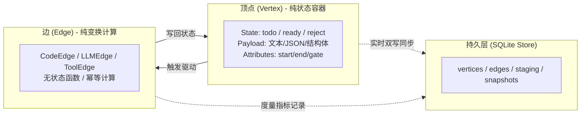
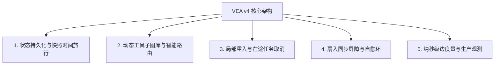

# Vertex-Edge-Agent (VEA v4) 完整架构设计与技术全景指南

> **“顶点存状态，边存计算；图即状态机，执行即流动。”**  
> *(Vertex as State, Edge as Computation; Graph as State Machine, Execution as Flow)*

---

## 1. 项目定位与背景痛点

在构建面向生产的复杂大模型智能体（LLM Agents）时，现有的流行方案（如 LangChain、AutoGen、CrewAI 或裸写 ReAct Prompt 循环）面临以下关键难题：
- **黑盒隐式状态**：状态潜藏于对话上下文窗口或 Python 闭包变量中，过程不可检视、难以精准落盘保存。
- **级联失效与状态污染**：中间步骤（如网络超时、工具解析错误）出错时，由于缺乏拓扑隔离，往往必须将整个 Agent 任务推倒重来。
- **缺乏微观度量**：难以精确追踪每一个决策步骤、工具调用耗时（毫秒）、实际花费的 Token 量及预估成本（USD）。
- **拓扑调度混乱**：无法优雅表达多路分支并发、扇入屏障（Fan-In Barrier）同步、单节点局部重入与自愈恢复。

**Vertex-Edge-Agent (VEA v4)** 正是为彻底解决这些工程痛点而设计的一套**“图原生状态机与异步调度框架”**。



---

## 2. 四大核心抽象

| 核心抽象 | 实现类 | 核心职责与关键能力 |
| :--- | :--- | :--- |
| **顶点 (Vertex)** | `framework.vertex_v4.VertexV4` | **纯数据与状态载体**。无执行逻辑，维护数据载荷（Content）、严格状态机生命周期（`idle` $\to$ `todo` / `todo urgent` $\to$ `running` $\to$ `data ready` / `reject` / `error`）以及语义属性标签（`start`、`end`、`gate`、`fan-in`、`json`、`streaming` 等）。 |
| **边 (Edge)** | `framework.edge_v4.EdgeV4` | **纯计算与流转逻辑**。<br/>• `CodeEdgeV4`：执行原生 Python 转换或工具脚本；<br/>• `LLMEdgeV4` / `SenseNovaEdgeV4`：大模型语义生成、结构化抽取与推理；<br/>• `ToolEdgeV4` / `LLMToolEdgeV4`：函数调用与工具驱动；<br/>• `ReflexiveEdgeV4`：异常自愈与原地状态回跳。 |
| **图 (Graph)** | `framework.graph_v4.GraphV4` | **拓扑拓扑关系与约束管理**。基于 **Kahn 拓扑排序** 实现严格的 DAG 有向无环检测；动态计算拓扑分层（Tier）；支持离散声明式 JSON Manifest 导入与动态子图拼接。 |
| **调度引擎** | `framework.executor_v4.ExecutorV4` | **异步事件驱动调度器**。利用 `asyncio.Semaphore` 精确控制并发；提供扇入同步屏障与数据合并策略；支持单节点热重入（Reentry）与级联在途任务取消。 |

---

## 3. 五大高阶生产级机制



### 3.1 全生命周期图快照与时间旅行（Graph Snapshots & Time Travel）
- 内置快照管理器 `GraphSnapshotManagerV4`。
- 在每一次顶点更新、边完成、工作流启动或结束时，自动落盘生成高保真图快照（如 `step_0003_edge_completed_*.json`）。
- **快照本身即合法图 Manifest**：支持通过 `POST /api/sessions/{id}/snapshots/{step}/restore` 一键回滚还原到指定历史快照，调试与审计具备绝对确定性。

### 3.2 动态工具子图库与智能意图路由（Dynamic Tool Library & Intent Router）
- 将通用业务能力封装为离散的子图 Manifest（位于 `examples/dynamic_tool_library/tools/*.json`）。
- 运行时结合 **SenseNova 6.8 Flash Lite** 进行零样本意图推理（Zero-Shot Intent Classification）并进行本地白名单校验。
- 通过 `GraphV4.insert_subgraph` 自动进行**命名空间隔离**、**边界穿透边（Bridge Edges）生成**与 **DAG 拓扑重新校验**。

### 3.3 单节点局部重入与在途任务取消（Reentry & In-Flight Cancellation）
- 当上游某节点输入数据需要动态修正时，调用 `POST /reenter` 注入新数据。
- 系统使用 BFS 算法精准遍历下游所有受影响的节点并重置状态，同时**实时取消正在执行中的下游异步任务**，避免陈旧结果脏写。

### 3.4 扇入同步屏障与自愈环（Fan-In Barrier & Reflexive Edge）
- **汇聚屏障**：多条边流入同一个节点时，自动等待所有前置边全部就绪，并按 `JSON_MERGE`、`LIST_APPEND`、`OVERWRITE` 策略原子合并数据。
- **异常自愈**：当下游执行异常使节点进入 `reject` 状态时，挂载的 `ReflexiveEdgeV4` 自动拦截并执行原地降级/重试逻辑。

### 3.5 纳秒级微观性能度量（Edge Metrics）
- 底层 SQLite `edge_metrics` 表实时记录每条边的执行轨迹：
  - `execution_time_ms`：单次毫秒级真实耗时；
  - `prompt_tokens` / `completion_tokens`：模型消耗 Token 数；
  - `cost_usd`：预估成本；
  - `error` / 堆栈：异常状态审计。

---

## 4. 服务端模块化架构 (`framework.server`)

服务端经过系统解耦，核心模块分布如下：

```text
framework/
├── server_v4.py                 # 统一门面（~50 行）：保留向后兼容导出与 CLI 启动器
└── server/                      # 模块化服务端子系统
    ├── __init__.py              # 模块统一导出
    ├── app.py                   # FastAPI 应用装配工厂 (create_v4_server) 与 CLI
    ├── manager.py               # 会话隔离与 SQLite 同步管理器 (SessionGraphManagerV4)
    ├── schemas.py               # Pydantic v2 请求与响应校验模型
    ├── security.py              # 路径穿越安全限制
    ├── helpers.py               # 控制台模板加载与工具库目录扫描
    └── routes/                  # 细粒度业务路由
        ├── dashboard.py         # 可视化控制台静态资源托管 (/, /dashboard)
        ├── db.py                # 底层数据库统计、顶点、暂存区检查接口 (/api/db/*)
        ├── graph.py             # 拓扑在线 CRUD、重入与子图热插拔接口 (/api/sessions/*/graph/*)
        ├── snapshots.py         # 历史快照清单、读取与一键回滚接口 (/api/sessions/*/snapshots/*)
        ├── execution.py         # 异步执行与实时 SSE 事件流广播 (/run, /events, /api/sse/execute)
        ├── tools.py             # 动态工具库目录与一键路由执行 (/api/tool-catalog, /route-and-run)
        └── openai.py            # OpenAI 兼容模型列表、对话生成与流式输出 (/v1/chat/completions)
```

---

## 5. 多模接入方式与快速上手

### 5.1 Python SDK 编程式调用
```python
from framework import DiscreteGraphLoaderV4, VertexStoreV4, ExecutorV4

store = VertexStoreV4("workflow.db")
graph = DiscreteGraphLoaderV4.load_from_manifest("my_agent_config.json")
executor = ExecutorV4(graph=graph, store=store)

result = await executor.run()
print("执行结果:", result.vertex_contents)
```

### 5.2 启动独立服务端
```bash
# 启动统一服务，绑定端口 11434（与 Ollama 端口相同）
python3 -m framework.server_v4 --port 11434 --db agent.db --snapshot-dir snapshots
```

### 5.3 动态工具路由与执行
```bash
curl -s -X POST http://127.0.0.1:11434/api/sessions/demo/route-and-run \
  -H "Content-Type: application/json" \
  -d '{"task": "def calculate_tax(gross): eval(\"gross * 0.2\")", "use_llm": true}' | jq .
```

### 5.4 OpenAI 原生协议集成
可无缝挂接在 **NextChat、ChatBox、OpenWebUI、LangChain、LlamaIndex** 等生态前端：
```bash
curl -s -X POST http://127.0.0.1:11434/v1/chat/completions \
  -H "Content-Type: application/json" \
  -d '{
    "model": "dynamic-router",
    "messages": [{"role": "user", "content": "Company revenue was 5000000 and cost was 3200000"}],
    "vea_dynamic_route": true
  }' | jq .
```

### 5.5 交互式 Web 控制台 (Dashboard)
浏览器直接访问 `http://localhost:11434/dashboard`，即可实时查看 DAG 拓扑图、交互式调试节点状态、查看暂存区数据和历史快照。

---

## 6. 质量保障与自动化测试体系

框架保持 100% 测试通过率：
```text
======================= 560 passed in 153.92s ========================
```
涵盖：
- **Layer 1**：`VertexStoreV4` 数据库与状态持久化
- **Layer 2**：`EdgeV4` 各种计算边与重试逻辑
- **Layer 3**：`GraphV4` 拓扑校验、分层计算与子图缝合
- **Layer 4**：`ExecutorV4` 并发调度、扇入屏障与事件流
- **Layer 5**：`server_v4` HTTP REST、OpenAI 对齐、快照回滚与动态工具库
- **Layer 6**：端到端复杂业务工作流验证
