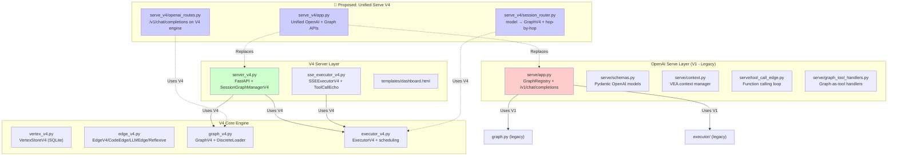

# Vertex-Edge Agent Framework — Comprehensive Review & Refactoring Plan

> Reviewing the framework against the following requirements:
> 1. **OpenAI-compatible API** for responding via chat/completions
> 2. **Session-based request routing** with hop-by-hop edge advancement
> 3. **Agent harness integration** via tool calls for continuous invocation
> 4. **Server-side workflow optimization** via graph design (not client-side)
> 5. **Graph self-evolution** (runtime mutation)
> 6. **Performance benchmarking**
> 7. **Redundancy pruning**
> 8. **Dashboard/console APIs** for graph inspection
> 9. **Graph-editing APIs** for live topology modification

---

## Part I — Review Findings

### 1. OpenAI-Compatible API

| Status | Component | Assessment |
|:---:|:---|:---|
| ✅ | [`serve/app.py`](file:///home/gekkasayu/vertex_edge_agent/framework/serve/app.py) | Full `POST /v1/chat/completions` with Pydantic schemas matching OpenAI v1 spec |
| ✅ | [`serve/schemas.py`](file:///home/gekkasayu/vertex_edge_agent/framework/serve/schemas.py) | `ChatCompletionRequest`, `ChatCompletionResponse`, `ChatCompletionChunk`, SSE `data:` formatting |
| ⚠️ | **Missing** | No `/v1/models` endpoint (required by many OpenAI clients) |
| ⚠️ | **Missing** | Response `tool_calls` field in non-streaming `ChatCompletionChoice` — only `content` is returned |
| ❌ | **Critical gap** | The two servers (`serve/app.py` and `server_v4.py`) are **completely separate applications**. `serve/app.py` uses stateless V1 `Graph` + `Executor`; `server_v4.py` uses stateful V4 `GraphV4` + `ExecutorV4` + `SessionGraphManagerV4`. There is no unified OpenAI-compatible endpoint on the V4 server |

> [!WARNING]
> **The biggest architectural issue**: The OpenAI-compatible `/v1/chat/completions` endpoint (in `serve/app.py`) runs on the legacy V1 engine with **no session state**, **no V4 features**, and **no graph editing**. Meanwhile, the powerful V4 server (`server_v4.py`) has no OpenAI-compatible endpoint — it uses a custom `/api/sse/execute` protocol. These two worlds are completely disconnected.

### 2. Session-Based Request Routing & Hop-by-Hop Advancement

| Status | Component | Assessment |
|:---:|:---|:---|
| ✅ | [`server_v4.py` → `SessionGraphManagerV4`](file:///home/gekkasayu/vertex_edge_agent/framework/server_v4.py#L145-L210) | Full session isolation with per-session `GraphV4` instances, `asyncio.Lock` concurrency, SQLite-backed persistence |
| ✅ | [`sse_executor_v4.py`](file:///home/gekkasayu/vertex_edge_agent/framework/sse_executor_v4.py#L99-L128) | Dynamic session routing: auto-provisions sessions, loads manifests, resolves subgraphs |
| ✅ | [`executor_v4.py`](file:///home/gekkasayu/vertex_edge_agent/framework/executor_v4.py) | Two-sided handshake (`DATA_READY` ↔ `TODO`) enforces hop-by-hop edge advancement |
| ⚠️ | **Gap** | The session routing and hop advancement work within a single request/execution. There is **no multi-turn session continuation** — each `POST /api/sse/execute` creates a fresh execution rather than advancing the graph by one hop and returning |

> [!IMPORTANT]
> For an agent harness to "continuously invoke the same API to make progress," the API needs a **per-hop execution mode**: each call advances exactly one edge (or tier), returns the current state + a tool_call indicating more work is available, and the harness re-calls to advance further. Currently, `POST /api/sse/execute` runs the **entire workflow to completion** in one call.

### 3. Agent Harness Integration via Tool Calls

| Status | Component | Assessment |
|:---:|:---|:---|
| ✅ | [`sse_executor_v4.py` → `ToolCallEcho`](file:///home/gekkasayu/vertex_edge_agent/framework/sse_executor_v4.py#L36-L83) | Formats execution events as OpenAI `tool_calls` with `function.name = "echo"` and `arguments.info = {...}` |
| ✅ | [`serve/tool_call_edge.py` → `ToolCallEdge`](file:///home/gekkasayu/vertex_edge_agent/framework/serve/tool_call_edge.py) | Full OpenAI function-calling loop (LLM ↔ tool execution ↔ LLM) within an edge |
| ⚠️ | **Gap** | `ToolCallEcho` emits `echo(info={...})` — a **read-only diagnostic** tool call. The harness cannot actually call a different function to advance the graph; it's one-way information flow |
| ❌ | **Critical gap** | No `tool_call` → **graph-advancing action** mapping. The harness should receive `tool_calls` like `advance_graph(session_id=..., input=...)` that it can invoke to push the graph forward hop-by-hop. Currently the harness has no actionable tool to call |

### 4. Server-Side Workflow Optimization via Graph Design

| Status | Component | Assessment |
|:---:|:---|:---|
| ✅ | [`graph_v4.py`](file:///home/gekkasayu/vertex_edge_agent/framework/graph_v4.py) | Topological tiering, DAG validation, subgraph splice/insert/add |
| ✅ | [`executor_v4.py`](file:///home/gekkasayu/vertex_edge_agent/framework/executor_v4.py) | Priority-based scheduling `(urgency, -priority, tier, id)`, concurrency groups, fan-in barriers |
| ✅ | [`edge_v4.py` → `ReflexiveEdgeV4`](file:///home/gekkasayu/vertex_edge_agent/framework/edge_v4.py) | Self-healing via reflexive edges with circuit breakers |
| ✅ | Merge strategies | `OVERWRITE`, `JSON_MERGE`, `LIST_APPEND`, `REDUCER_SCRIPT` for fan-in consolidation |

This area is **well-designed**. The graph itself encodes the optimization strategy.

### 5. Graph Self-Evolution (Runtime Mutation)

| Status | Component | Assessment |
|:---:|:---|:---|
| ✅ | [`graph_v4.py` → `replace_vertex`](file:///home/gekkasayu/vertex_edge_agent/framework/graph_v4.py) | Full vertex replacement with edge rewiring |
| ✅ | [`graph_v4.py` → `splice_subgraph`](file:///home/gekkasayu/vertex_edge_agent/framework/graph_v4.py) | Inline subgraph substitution |
| ✅ | [`graph_v4.py` → `reenter_vertex`](file:///home/gekkasayu/vertex_edge_agent/framework/graph_v4.py) | Cyclic re-entry with downstream cascade reset |
| ✅ | [`server_v4.py`](file:///home/gekkasayu/vertex_edge_agent/framework/server_v4.py) | All mutation operations exposed as REST APIs |
| ⚠️ | **Gap** | Self-evolution is **manually triggered** via external API calls. There is no mechanism for the graph to **autonomously evolve** — e.g., an edge that observes performance metrics and automatically splices in a better subgraph, or an edge that prunes itself when its success rate drops below a threshold |

### 6. Performance Benchmarking

| Status | Component | Assessment |
|:---:|:---|:---|
| ✅ | [`ExecutionResultV4`](file:///home/gekkasayu/vertex_edge_agent/framework/executor_v4.py) | Records `execution_time`, `completed_edges`, `vertex_states` |
| ✅ | [`utils/telemetry.py`](file:///home/gekkasayu/vertex_edge_agent/framework/utils/telemetry.py) | `TelemetryTracker`, `UsageMetrics`, token cost calculation |
| ⚠️ | **Gap** | No **per-edge timing** — only total `execution_time` is tracked |
| ❌ | **Missing** | No benchmarking framework: no A/B comparison between graph variants, no historical performance tracking, no regression detection |
| ❌ | **Missing** | No performance metrics dashboard endpoint — `/dashboard` shows topology but not execution history or timing |

### 7. Redundancy Pruning

| Status | Component | Assessment |
|:---:|:---|:---|
| ✅ | [`graph_v4.py` → `is_vertex_active`, `deactivate_vertex`](file:///home/gekkasayu/vertex_edge_agent/framework/graph_v4.py) | Activity flags to bypass inactive branches during execution |
| ✅ | [`VertexStateV4.PRUNING`](file:///home/gekkasayu/vertex_edge_agent/framework/vertex_v4.py) | Dedicated `PRUNING` state in the schema |
| ⚠️ | **Gap** | Pruning is **manual only** — no automated analysis to detect redundant paths, duplicate edges, or dead branches |
| ❌ | **Missing** | No graph analysis tools: no reachability analysis API, no dead-branch detection, no duplicate-edge detection |

### 8. Dashboard / Console APIs

| Status | Component | Assessment |
|:---:|:---|:---|
| ✅ | [`server_v4.py` → `/dashboard`](file:///home/gekkasayu/vertex_edge_agent/framework/server_v4.py#L642-L646) | HTML single-page dashboard |
| ✅ | [`server_v4.py` → `/api/db/*`](file:///home/gekkasayu/vertex_edge_agent/framework/server_v4.py#L652-L693) | DB stats, session listing, vertex inspection, staging query |
| ✅ | [`server_v4.py` → `/api/sessions/*/graph/*`](file:///home/gekkasayu/vertex_edge_agent/framework/server_v4.py#L699-L777) | Graph structure, nodes, relationships, dump |
| ⚠️ | **Gap** | Dashboard is topology-only. No execution history, no timing charts, no performance trends |

### 9. Graph-Editing APIs

| Status | Component | Assessment |
|:---:|:---|:---|
| ✅ | Vertex CRUD | `POST /graph/vertices`, `DELETE /graph/vertices/{name}` |
| ✅ | Edge CRUD | `POST /graph/edges`, `DELETE /graph/edges/{edge_id}` |
| ✅ | Edge reconnect | `PATCH /graph/edges/{edge_id}/reconnect` |
| ✅ | Vertex reentry | `POST /graph/vertices/{name}/reenter` (with in-flight task cancellation) |
| ✅ | Subgraph operations | `splice`, `insert`, `add` — three distinct subgraph integration modes |
| ✅ | DAG validation | `POST /graph/validate` |
| ✅ | Graph dump/export | `GET/POST /graph/dump` |

This area is **very well-implemented**. The graph-editing API suite is comprehensive.

---

## Part II — Gap Summary Matrix

| Requirement | Coverage | Critical Gaps |
|:---|:---:|:---|
| OpenAI-compatible API | 🟡 60% | V4 server has no `/v1/chat/completions`; two disconnected servers |
| Session-based routing | 🟡 70% | No multi-turn hop-by-hop advancement mode |
| Harness tool-call integration | 🟡 50% | `ToolCallEcho` is read-only; no actionable tool for the harness to call back |
| Server-side optimization | 🟢 90% | Well-designed graph-based orchestration |
| Self-evolution | 🟡 60% | APIs exist but evolution is manual, not autonomous |
| Benchmarking | 🔴 20% | Only total execution_time; no per-edge, no history, no comparison |
| Pruning | 🔴 30% | Manual deactivation only; no automated analysis |
| Dashboard / Console | 🟡 70% | Topology-only; no performance visualization |
| Graph-editing APIs | 🟢 95% | Comprehensive suite |

---

## Part III — Concrete Refactoring Plan

### Phase 1: Unified OpenAI-Compatible V4 Server (Critical)

> **Goal**: Merge the V4 engine into an OpenAI-compatible `/v1/chat/completions` endpoint.

#### 1.1 Create `framework/serve_v4/` — Unified OpenAI + V4 Serve Layer

```
framework/serve_v4/
├── __init__.py
├── app.py              # Unified FastAPI app factory
├── openai_routes.py    # /v1/chat/completions, /v1/models
├── graph_routes.py     # All graph editing APIs (from server_v4.py)
├── dashboard_routes.py # Dashboard + DB inspection routes
├── schemas.py          # Extended OpenAI schemas with tool_calls support
└── session_router.py   # Maps model/session → GraphV4 + SessionGraphManagerV4
```

**Key design decisions**:
- The `model` field in chat requests maps to a **graph template** (like `GraphRegistry` does in `serve/app.py`)
- Each request carries an optional `session_id` (via VEA extension field or HTTP header `X-VEA-Session-Id`)
- If `session_id` is provided, the request **resumes** an existing session graph rather than creating a new one
- Graph execution uses `ExecutorV4` + `VertexStoreV4` (V4 engine), not the legacy V1 path

#### 1.2 New `/v1/models` Endpoint

```python
@app.get("/v1/models")
async def list_models():
    return {
        "object": "list",
        "data": [
            {"id": name, "object": "model", "owned_by": "vea"}
            for name in registry.model_names
        ]
    }
```

#### 1.3 Extend `ChatCompletionResponse` with `tool_calls`

The response `choices[].message` must support `tool_calls` for harness integration:

```python
class ChatMessage(BaseModel):
    role: Literal["system", "user", "assistant", "tool"]
    content: Optional[str] = None
    tool_calls: Optional[List[ToolCall]] = None   # ← ADD
    tool_call_id: Optional[str] = None

class ToolCall(BaseModel):
    id: str
    type: Literal["function"] = "function"
    function: FunctionCall

class FunctionCall(BaseModel):
    name: str
    arguments: str  # JSON-encoded
```

---

### Phase 2: Hop-by-Hop Execution Mode for Harness Integration (Critical)

> **Goal**: Each API call advances the graph by one tier (or one edge), returns progress + tool_calls, and the harness re-invokes to continue.

#### 2.1 Add `ExecutorV4.run_one_tier()` Method

```python
async def run_one_tier(self) -> ExecutionResultV4:
    """Execute one topological tier of edges, then return control."""
    eligible = self._get_eligible_edges()
    if not eligible:
        return self._build_result(terminal=True)

    current_tier = eligible[0][2]  # tier of highest-priority edge
    tier_edges = [e for (_, _, t, e) in eligible if t == current_tier]

    tasks = [self._dispatch_edge(e) for e in tier_edges]
    await asyncio.gather(*tasks, return_exceptions=True)

    return self._build_result(terminal=self._is_terminal())
```

#### 2.2 Define Harness Tool: `advance_graph`

The server returns a `tool_call` with `name="advance_graph"` when the graph has more work to do:

```python
# Response when graph is NOT complete:
{
    "choices": [{
        "message": {
            "role": "assistant",
            "content": null,
            "tool_calls": [{
                "id": "call_xxx",
                "type": "function",
                "function": {
                    "name": "advance_graph",
                    "arguments": "{\"session_id\": \"sess_abc\", \"tier_completed\": 0, \"pending_tiers\": 2}"
                }
            }]
        },
        "finish_reason": "tool_calls"
    }]
}

# Response when graph IS complete:
{
    "choices": [{
        "message": {
            "role": "assistant",
            "content": "Final output from end vertex..."
        },
        "finish_reason": "stop"
    }]
}
```

#### 2.3 Tool Call Flow for Harness

```
Harness                           VEA Server
  │                                    │
  ├──POST /v1/chat/completions────────►│  (messages + session_id)
  │                                    ├──Execute tier 0
  │◄──finish_reason: tool_calls────────┤  (advance_graph tool_call)
  │                                    │
  ├──POST /v1/chat/completions────────►│  (tool result + session_id)
  │                                    ├──Execute tier 1
  │◄──finish_reason: tool_calls────────┤  (advance_graph tool_call)
  │                                    │
  ├──POST /v1/chat/completions────────►│  (tool result + session_id)
  │                                    ├──Execute tier 2 (final)
  │◄──finish_reason: stop──────────────┤  (content: final result)
```

#### 2.4 Execution Mode Selection

Add a `vea_execution_mode` extension field to `ChatCompletionRequest`:

```python
class ChatCompletionRequest(BaseModel):
    # ... existing fields ...
    vea_execution_mode: Optional[Literal["full", "per_tier", "per_edge"]] = "full"
    vea_session_id: Optional[str] = None
```

---

### Phase 3: Self-Evolution Engine

> **Goal**: The graph can autonomously modify itself based on runtime performance signals.

#### 3.1 Create `framework/evolution/` Module

```
framework/evolution/
├── __init__.py
├── metrics_collector.py   # Per-edge timing, success/failure rates, token usage
├── evolution_engine.py    # Autonomous graph mutation rules
├── pruning_analyzer.py    # Dead-branch and redundancy detection
└── benchmark_runner.py    # A/B testing between graph variants
```

#### 3.2 `MetricsCollectorV4` — Per-Edge Performance Tracking

Extend `ExecutorV4` to record per-edge execution metrics:

```python
@dataclass
class EdgeMetrics:
    edge_id: str
    execution_count: int = 0
    success_count: int = 0
    failure_count: int = 0
    total_duration_ms: float = 0.0
    avg_duration_ms: float = 0.0
    last_execution: Optional[float] = None
    token_usage: int = 0

class MetricsCollectorV4:
    def __init__(self, store: VertexStoreV4):
        self.store = store
        self._metrics: Dict[str, EdgeMetrics] = {}

    def record_edge_execution(self, edge_id: str, duration_ms: float,
                               success: bool, tokens: int = 0) -> None: ...
    def get_edge_metrics(self, edge_id: str) -> EdgeMetrics: ...
    def get_session_metrics(self, session_id: str) -> Dict[str, EdgeMetrics]: ...
    def get_slow_edges(self, threshold_ms: float) -> List[EdgeMetrics]: ...
    def get_failing_edges(self, threshold_rate: float) -> List[EdgeMetrics]: ...
```

Store metrics in a new SQLite table `edge_metrics`:

```sql
CREATE TABLE IF NOT EXISTS edge_metrics (
    session_id TEXT NOT NULL,
    edge_id TEXT NOT NULL,
    execution_count INTEGER DEFAULT 0,
    success_count INTEGER DEFAULT 0,
    failure_count INTEGER DEFAULT 0,
    total_duration_ms REAL DEFAULT 0.0,
    avg_duration_ms REAL DEFAULT 0.0,
    token_usage INTEGER DEFAULT 0,
    last_execution REAL,
    PRIMARY KEY (session_id, edge_id)
);
```

#### 3.3 `PruningAnalyzerV4` — Automated Graph Analysis

```python
class PruningAnalyzerV4:
    def analyze(self, graph: GraphV4, metrics: MetricsCollectorV4) -> PruningReport:
        """Analyze graph for optimization opportunities."""
        return PruningReport(
            dead_branches=self._find_dead_branches(graph),
            unreachable_vertices=self._find_unreachable(graph),
            duplicate_edges=self._find_duplicate_edges(graph),
            bottleneck_edges=self._find_bottlenecks(graph, metrics),
            suggested_removals=self._suggest_removals(graph, metrics),
        )

    def _find_dead_branches(self, graph: GraphV4) -> List[str]:
        """Vertices not reachable from any START vertex."""
        ...

    def _find_unreachable(self, graph: GraphV4) -> List[str]:
        """Vertices that cannot reach any END vertex."""
        ...

    def _find_bottlenecks(self, graph: GraphV4, metrics: MetricsCollectorV4) -> List[str]:
        """Edges with disproportionately high latency relative to graph total."""
        ...

    def auto_prune(self, session_id: str, graph: GraphV4,
                   manager: SessionGraphManagerV4, dry_run: bool = True) -> Dict:
        """Apply recommended pruning operations."""
        ...
```

#### 3.4 `EvolutionEngineV4` — Autonomous Mutation Rules

```python
class EvolutionRule:
    """Base class for evolution rules."""
    def evaluate(self, graph: GraphV4, metrics: MetricsCollectorV4) -> Optional[Mutation]: ...

class SplitSlowEdge(EvolutionRule):
    """If an edge consistently takes >Xms, split into parallel sub-edges."""

class RemoveFailingBranch(EvolutionRule):
    """If a branch fails >Y%, deactivate it and route to fallback."""

class MergeRedundantPaths(EvolutionRule):
    """If two paths produce identical results, merge them."""

class EvolutionEngineV4:
    def __init__(self, rules: List[EvolutionRule]):
        self.rules = rules

    async def evolve(self, session_id: str, graph: GraphV4,
                     metrics: MetricsCollectorV4,
                     manager: SessionGraphManagerV4) -> List[Mutation]:
        """Evaluate all rules and apply approved mutations."""
        ...
```

#### 3.5 Expose via API

```
POST /api/sessions/{session_id}/graph/analyze      → PruningReport
POST /api/sessions/{session_id}/graph/prune         → Apply pruning (dry_run flag)
POST /api/sessions/{session_id}/graph/evolve        → Run evolution engine
GET  /api/sessions/{session_id}/metrics             → Per-edge metrics
GET  /api/sessions/{session_id}/metrics/bottlenecks → Slow/failing edges
```

---

### Phase 4: Enhanced Benchmarking & Dashboard

#### 4.1 Per-Edge Timing in `ExecutorV4`

Instrument every edge dispatch with `time.monotonic()`:

```python
async def _dispatch_edge(self, edge: EdgeV4) -> EdgeResultV4:
    t0 = time.monotonic()
    try:
        result = await edge.run(...)
        duration_ms = (time.monotonic() - t0) * 1000
        self.metrics_collector.record_edge_execution(
            edge.id, duration_ms, success=result.success,
            tokens=result.metadata.get("tokens", 0)
        )
        return result
    except Exception as e:
        duration_ms = (time.monotonic() - t0) * 1000
        self.metrics_collector.record_edge_execution(
            edge.id, duration_ms, success=False
        )
        raise
```

#### 4.2 Execution History Endpoint

```
GET /api/sessions/{session_id}/history → List of past execution runs with timing
```

Store in a new `execution_history` table:

```sql
CREATE TABLE IF NOT EXISTS execution_history (
    id INTEGER PRIMARY KEY,
    session_id TEXT NOT NULL,
    started_at REAL NOT NULL,
    finished_at REAL,
    success BOOLEAN,
    total_edges INTEGER,
    completed_edges INTEGER,
    total_duration_ms REAL,
    edge_timings TEXT  -- JSON: {"edge_id": duration_ms, ...}
);
```

#### 4.3 Dashboard Enhancements

Extend [`dashboard.html`](file:///home/gekkasayu/vertex_edge_agent/framework/templates/dashboard.html) with:
- **Execution timeline chart** — horizontal bars showing per-edge timing within each tier
- **Performance sparklines** — per-edge success rate and latency trends
- **Graph health indicators** — bottlenecks highlighted in red, inactive in gray
- **Evolution history** — log of autonomous mutations applied

---

### Phase 5: Code Cleanup & Consolidation

#### 5.1 Eliminate V1/V4 Duplication

The codebase currently contains **both** legacy V1 modules and V4 modules:

| V1 (Legacy) | V4 (Current) | Action |
|:---|:---|:---|
| `graph.py` (17KB) | `graph_v4.py` (63KB) | Deprecate V1; mark as legacy-only |
| `edge.py` (24KB) | `edge_v4.py` (43KB) | Deprecate V1 |
| `vertex.py` (22KB) | `vertex_v4.py` (33KB) | Deprecate V1 |
| `executor/` directory | `executor_v4.py` (32KB) | Deprecate V1 |
| `serve/app.py` (V1 engine) | `server_v4.py` (V4 engine) | **Unify** into `serve_v4/` |

#### 5.2 Module Naming Cleanup

Remove `_v4` suffix from filenames once V1 is fully deprecated:

```
graph_v4.py    → graph.py     (after V1 removal)
edge_v4.py     → edge.py
vertex_v4.py   → vertex.py
executor_v4.py → executor.py
server_v4.py   → server.py
```

#### 5.3 Consolidate LLM Edge Variants

Currently there are **5 separate LLM edge files**:
- `chat_llm_edge_v4.py`
- `generate_llm_edge_v4.py`
- `process_llm_edge_v4.py`
- `callable_llm_edge_v4.py`
- `sensenova_edge_v4.py`

All are thin wrappers (each ~2KB) that import from `edge_v4.py`. These should be consolidated into `edge_v4.py` itself as they already exist there as classes — the separate files appear to be redundant re-exports.

---

## Phase Prioritization & Effort Estimate

| Phase | Priority | Effort | Impact |
|:---|:---:|:---:|:---|
| **Phase 1**: Unified OpenAI V4 Server | 🔴 Critical | ~3-4 days | Enables all downstream features |
| **Phase 2**: Hop-by-Hop Execution | 🔴 Critical | ~2-3 days | Core harness integration requirement |
| **Phase 3**: Self-Evolution Engine | 🟡 High | ~4-5 days | Differentiating capability |
| **Phase 4**: Benchmarking & Dashboard | 🟡 High | ~3-4 days | Operational visibility |
| **Phase 5**: Code Cleanup | 🟢 Medium | ~2 days | Maintainability |

> [!TIP]
> **Recommended execution order**: Phase 1 → Phase 2 → Phase 5 (cleanup) → Phase 4 (benchmarking) → Phase 3 (evolution).
> Phases 1 and 2 are prerequisites. Phase 5 should be done early to reduce cognitive overhead before building new features.

---

## Appendix: Detailed File-Level Architecture Map


