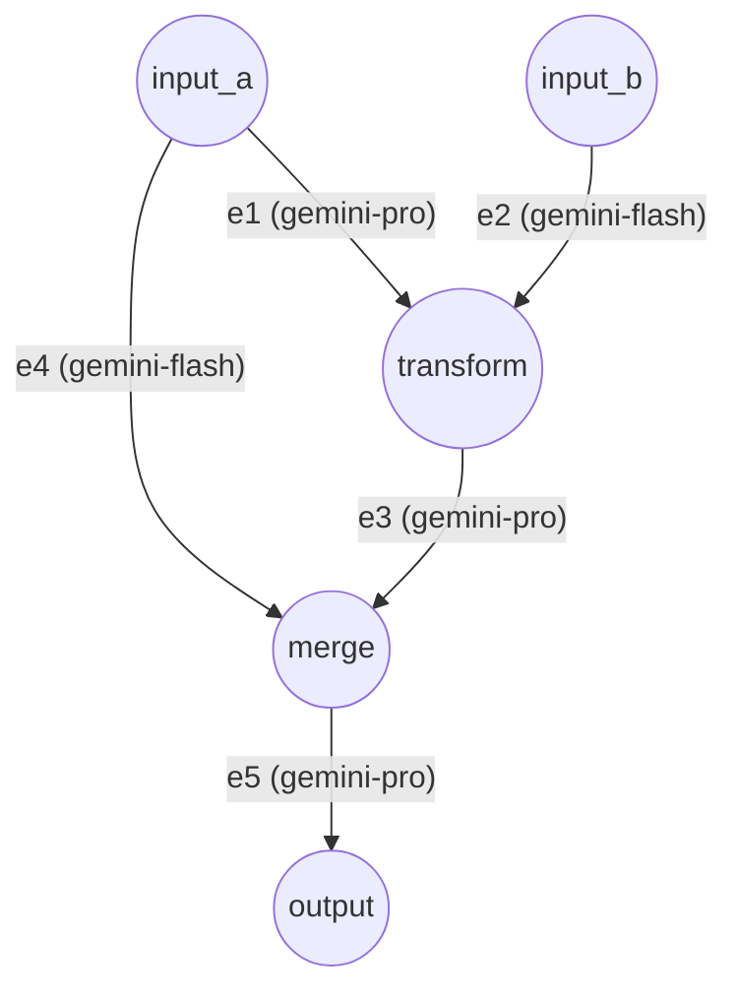

# 复杂图拓扑与钩子示例 (Complex DAG & Hooks)

本示例展示了一个高阶的有向无环图 (DAG)，涵盖了并发扇出 (Fan-out)、扇入/汇聚 (Fan-in)、以及外部扩展脚本的无缝集成。

## 拓扑结构 (Architecture)



## 核心能力展示 (Key Features Showcased)

1. **多数据源 (Multiple Sources)**: `input_a` 和 `input_b` 作为双核驱动，同时并发提供初始数据。
2. **并发扇出 (Fan-out)**: `input_a` 将它的数据同时派发给两条出边 (`e1` 和 `e4`)，展示了数据的完美并行复制与计算。
3. **扇入汇聚/依赖同步 (Fan-in / Synchronization)**: `merge` 节点配置了依赖限制，它必须同时收到来自 `e3` 和 `e4` 的数据。在两条分支全部到达之前，它会安静地停留在 `IDLE` 状态，完美展示了无需锁机制的并发同步 (通过 EdgeSignal 屏障实现)。
4. **外部脚本钩子 (Script Hooks)**:
   - `transform` 节点外挂了 `uppercase_handler.py` 脚本，在接收数据 (on_receive) 时对大写进行拦截和转换。
   - `e3` 边外挂了 `prefix_handler.py` 脚本，演示了在 LLM 处理前后如何清洗和解析数据 (pre_process & post_process)。

## 运行方式 (Execution)

使用统一运行脚本，指向本目录的 `config.json`：

```bash
python examples/run.py examples/complex/config.json
```
