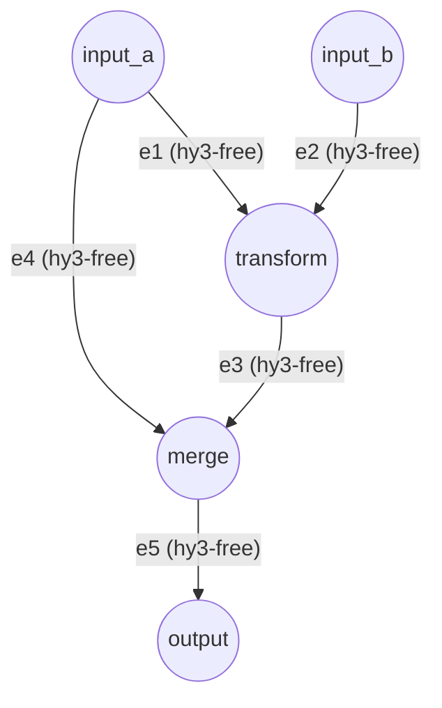

# Complex DAG & Hooks Example

This example demonstrates a high-level Directed Acyclic Graph (DAG) covering concurrent fan-out, fan-in/convergence, and the seamless integration of external extension scripts.

## Architecture



## Key Features Showcased

1. **Multiple Sources**: `input_a` and `input_b` act as dual-cores, concurrently providing initial data.
2. **Concurrent Fan-out**: `input_a` dispatches its data to two outgoing edges (`e1` and `e4`) simultaneously, demonstrating perfect parallel replication and computation of data.
3. **Fan-in / Synchronization**: The `merge` node is configured with dependency constraints; it must receive data from both `e3` and `e4`. Before both branches arrive, it remains quietly in the `IDLE` state, perfectly showcasing lock-free concurrent synchronization (implemented via the EdgeSignal barrier).
4. **Script Hooks**:
   - The `transform` node is attached to the `uppercase_handler.py` script, which intercepts and converts data to uppercase when receiving data (`on_receive`).
   - The `e3` edge is attached to the `prefix_handler.py` script, demonstrating how to clean and parse data before and after LLM processing (`pre_process` & `post_process`).

## Execution

Use the unified execution script pointing to the `config.json` in this directory:

```bash
python examples/run.py examples/complex/config.json
```
