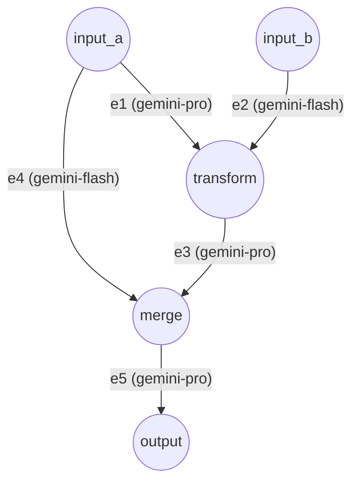

# Complex DAG Example

This example demonstrates a sophisticated Directed Acyclic Graph (DAG) involving concurrent fan-out, fan-in (merging), and external script integration.

## Architecture



## Key Features Showcased

1. **Multiple Sources**: Both `input_a` and `input_b` supply initial data concurrently.
2. **Fan-out**: `input_a` splits its data across two edges (`e1` and `e4`), sending information to different parts of the graph simultaneously.
3. **Fan-in / Wait-state**: The `merge` vertex requires inputs from both `e3` and `e4`. It stays in `IDLE` until both branches finish their execution, demonstrating dependency synchronization.
4. **Script Hooks**: 
   - `transform` uses `uppercase_handler.py` to intercept and manipulate incoming data natively.
   - `e3` uses `prefix_handler.py` to mutate data before and after the PI Agent processes it.

## Execution

Run the unified runner pointing to this directory's `config.json`:

```bash
python examples/run.py examples/complex/config.json
```
