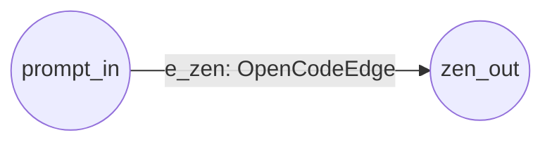

# OpenCode CLI Agent

Launches the local `opencode` CLI (`opencode run`) to process a prompt:



**Everything is declared in the config** — the edge class (via `script`),
the prompt and the model. The edge's script file (`zen_edge.py`) owns its
agent (`OpenCodeAgentRunner`); nothing is injected by the runner and no
fallback default agent is used.

## Run

```bash
python examples/opencode_zen/run.py
```

Requires the `opencode` CLI in your PATH (`opencode run`).

## How the wiring works

`config.json` — edge loaded by `script: file:Class`:

```jsonc
{ "id": "e_zen", "source": "prompt_in", "destination": "zen_out",
  "channel": "text", "concurrency_type": "llm",
  "script": "zen_edge.py:OpenCodeEdge",
  "settings": { "prompt": "You are a concise technical writer.",
                "model": "hy3-free" } }
```

`zen_edge.py` — the edge owns its agent:

```python
from framework.agents.opencode_agent_runner import OpenCodeAgentRunner

class OpenCodeEdge(Edge):
    def __init__(self, *args, **kwargs):
        super().__init__(*args, **kwargs)
        self.agent = OpenCodeAgentRunner()

    async def execute(self, source_vertex, dest_vertex, agents, **kwargs):
        # uses self.agent — never the injected `agents`, no fallback
        ...
```

`run.py` — only loads the graph and runs it (no agent passed):

```python
executor = Executor(graph)
await executor.run()
```

## Related

- `examples/real_pi/` — the `pi` counterpart: `pi_edge.py:PiEdge` delegates
  to the installed `pi` CLI via `PiAgentRunner`.
- `examples/opencode_zen/proxy_demo.py` — transport-level HTTP proxying demo
  for the HTTP agents (a framework feature, independent of the CLI agents).
