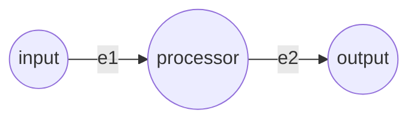

# Simple Pipeline Example

This example demonstrates the most basic 3-node linear pipeline, aiming to show the fundamental execution mechanism of the Vertex-Edge framework.

## Architecture



- **input**: Data source node, injected with initial data during initialization.
- **processor**: Intermediate processing node.
- **output**: Endpoint (Sink) node that receives the final data.
- **e1 & e2**: Standard edges (Edge) that process passing data through a large language model (PI Agent).

## Execution

Use the unified execution script pointing to the `config.json` in this directory:

```bash
python examples/run.py examples/simple/config.json
```

## Flow of Data

1. The `input` node, having no incoming edges, automatically enters the `READY` state upon initialization.
2. The scheduler (Executor) activates outgoing edge `e1` and extracts the string from the data source.
3. The Mock version of PI Agent simulates LLM processing, adding the prefix `[gemini-pro]` to the string.
4. The processing result is written to the `processor` node, and the unified signal delivery mechanism triggers its state to change to `READY`.
5. Outgoing edge `e2` is activated, and the LLM processes it and adds the prefix `[gemini-flash]`.
6. The final data reaches the `output` node, and the entire computation graph enters the settlement state and all become `DONE`.
