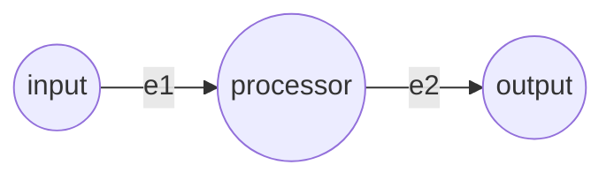

# 基础流水线示例 (Simple Pipeline)

本示例展示了一个最基础的 3 节点线性流水线，旨在演示 Vertex-Edge 框架的最基础运行机制。

## 拓扑结构 (Architecture)



- **input**: 数据源节点，在初始化时被注入了初始数据。
- **processor**: 中间处理节点。
- **output**: 接收最终数据的端点 (Sink) 节点。
- **e1 & e2**: 标准边 (Edge)，通过大模型 (PI Agent) 对流经的数据进行处理。

## 运行方式 (Execution)

使用统一运行脚本，指向本目录的 `config.json`：

```bash
python examples/run.py examples/simple/config.json
```

## 数据流转过程 (Flow of Data)

1. `input` 节点由于没有入边，初始化即自动进入 `READY`（就绪）状态。
2. 调度器 (Executor) 激活出边 `e1`，并从数据源提取字符串。
3. Mock 版的 PI Agent 模拟大模型处理，为字符串添加前缀 `[gemini-pro]`。
4. 处理结果被写入 `processor` 节点，并由统一的信号传递机制触发其状态转为 `READY`。
5. 出边 `e2` 被激活，大模型处理并添加前缀 `[gemini-flash]`。
6. 最终数据送达 `output` 节点，整个计算图进入结算状态并全部变为 `DONE`。
