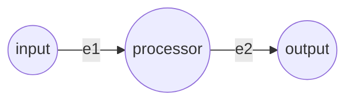

# Simple Pipeline Example

This example demonstrates a basic, linear 3-vertex pipeline. It showcases the fundamental mechanics of the Vertex-Edge Framework.

## Architecture



- **input**: A source vertex initialized with data.
- **processor**: A mid-point vertex.
- **output**: A sink vertex representing the end of the pipeline.
- **e1 & e2**: Standard edges that process data via the PI Agent.

## Execution

Run the unified runner pointing to this directory's `config.json`:

```bash
python examples/run.py examples/simple/config.json
```

## Flow of Data

1. The `input` vertex starts with `READY` state since it has no incoming edges.
2. The executor triggers `e1`, pulling the initial string data.
3. The mock PI Agent simulates processing by prepending `[gemini-pro]`.
4. The result is written to `processor`, which transitions to `READY`.
5. `e2` fires, the agent prepends `[gemini-flash]`.
6. Data arrives at `output` and the graph successfully settles into `DONE`.
