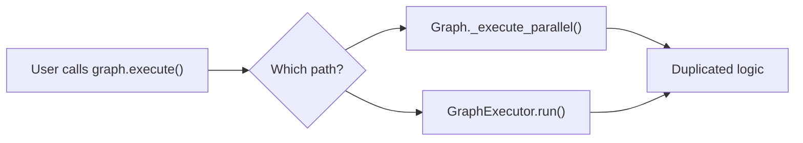

# Vertex-Edge-Agent: Architecture Review & Advice

## Executive Summary

The framework is a well-conceived **DAG-based agentic execution engine** at v0.4.0. The core abstractions (Vertex, Edge, Graph, SubGraph) are solid and the builder APIs are well-designed. However, there are several architectural issues that should be addressed before v1.0 — particularly around security, separation of concerns, and the `hn_ai_report` example sending mixed signals about intended usage patterns.

---

## Part 1: `examples/hn_ai_report` — Specific Advice

### What Works Well

- **Realistic pipeline** — fetch → fan-out → filter → enrich → report → save is a genuinely useful pattern
- **`report_hook.py`** — clean example of extending `Vertex` with a custom class
- **`config.json`** — demonstrates the full declarative config surface (fan-out, data mapping, multiple action types)
- **Generated `report.md`** — proves the pipeline actually works end-to-end

### 🔴 Critical Issues

#### 1. `hn_edges.py` Is Dead Code
[hn_edges.py](file:///home/gekkasayu/vertex_edge_agent/examples/hn_ai_report/hn_edges.py) defines four custom edge classes (`AiFilterEdge`, `EnrichEdge`, `ReportEdge`, `FanOutEdge`) that **duplicate** the inline code logic in [config.json](file:///home/gekkasayu/vertex_edge_agent/examples/hn_ai_report/config.json). The config doesn't reference these classes. This creates confusion about which approach is canonical:

> **Recommendation:** Pick one pattern and commit to it. Either:
> - **(A)** Use the custom edge classes and reference them from config (showcases the class extension model)
> - **(B)** Remove `hn_edges.py` entirely and keep the inline approach (showcases declarative config)
>
> Option **(A)** is better for a demo, since it shows off the framework's extensibility while being more maintainable.

#### 2. Inline Python in JSON Is Unmaintainable
The `config.json` embeds Python code as JSON strings with `\n` escapes:
```json
"action_code": "items = context.get('hn_items', [])\nai_keywords = ['ai', 'llm', ...]\nfiltered = []\nfor item in items:\n    ..."
```

This is:
- Impossible to syntax-highlight, lint, or debug
- Easy to break with a misplaced escape character
- A poor showcase for new users evaluating the framework

> **Recommendation:** Support a `"action_file": "path/to/script.py"` pattern alongside `"action_code"`. This keeps config declarative while making the code maintainable. The example should use external files.

#### 3. No Error Handling for Network Calls
`hn_fetch` and `hn_items` make HTTP requests with no error handling. If the HN API is down or rate-limits, the pipeline crashes.

> **Recommendation:** Add at least:
> - A retry config on the fetch vertices (the framework supports it, but the example doesn't use it meaningfully)
> - A fallback or graceful degradation path (e.g., an `ERROR` edge to a "report unavailable" vertex)
> - This would also showcase the `ERROR` edge type, which is currently a stub

### 🟡 Improvements

| Area | Current | Suggested |
|------|---------|-----------|
| **Keywords** | Hardcoded list in inline code | Move to `config.json` params or a separate `keywords.txt` file |
| **Fan-out concurrency** | `max_concurrency: 5` with no explanation | Add a comment or README note explaining why 5 (HN API rate limit?) |
| **`demo.py`** | Minimal, no argument parsing | Add `--dry-run` (validate only), `--verbose` (show execution trace), `--output` (custom output path) |
| **Tests** | None for this example | Add at least a smoke test with mocked HTTP responses |
| **README** | Only in examples root | Add a dedicated `README.md` for this example explaining the pipeline, how to run it, and expected output |

---

## Part 2: Framework Architecture — Advice

### 🏗️ Structural Issues

#### 1. Dual Execution Paths — `Graph` vs `Executor`

Both [graph.py](file:///home/gekkasayu/vertex_edge_agent/framework/graph.py) and [executor/executor.py](file:///home/gekkasayu/vertex_edge_agent/framework/executor/executor.py) contain execution logic. `Graph.execute()` has its own parallel/sequential/race implementations, while `GraphExecutor` is a separate class doing the same thing with an event system.



> **Recommendation:** Make `Graph` a pure data container (vertices + edges + config). Move ALL execution logic to `GraphExecutor`. The graph should be _defined_, not _run_:
> ```python
> graph = Graph.from_config(config)
> executor = GraphExecutor(graph)
> result = await executor.run(context)
> ```

#### 2. Monolithic `Vertex` Class (450+ lines)

[vertex.py](file:///home/gekkasayu/vertex_edge_agent/framework/vertex.py) handles 5 different action types internally (`httpx`, `code`, `llm`, `shell`, `custom`). This violates the Open/Closed principle — adding a new action type requires modifying the Vertex class.

> **Recommendation:** Use a **Strategy pattern** with registered action handlers:
> ```python
> class ActionHandler(Protocol):
>     async def execute(self, config: dict, context: dict) -> Any: ...
>
> class HttpxHandler(ActionHandler): ...
> class CodeHandler(ActionHandler): ...
>
> # Registry
> vertex.register_handler("httpx", HttpxHandler())
> ```

#### 3. Context as Plain `dict`

The execution context is an untyped `dict` passed between all vertices. This leads to:
- Key collisions between vertices
- No discoverability of available data
- Runtime `KeyError` instead of static type errors

> **Recommendation:** Introduce a typed `Context` class:
> ```python
> class Context:
>     def __init__(self):
>         self._store: dict[str, Any] = {}
>         self._schema: dict[str, type] = {}
>     
>     def set(self, key: str, value: Any, schema: type = Any) -> None: ...
>     def get(self, key: str, expected_type: type[T] = Any) -> T: ...
>     def namespace(self, vertex_name: str) -> "ContextView": ...
> ```

### 🔒 Security Issues

#### 4. `exec()` / `eval()` Throughout

| Location | Usage | Risk |
|----------|-------|------|
| `vertex.py` `_handle_code()` | `exec()` for inline code actions | Arbitrary code execution |
| `edge.py` `_eval_condition()` | `eval()` for condition strings | Code injection |
| `edge.py` `_apply_transform()` | `exec()`/`eval()` for transform code | Code injection |

> **Recommendation (short-term):** Add an `allow_exec` flag (default `False`) that must be explicitly enabled. Log a warning when code execution is used.
>
> **Recommendation (long-term):** Replace `eval()`/`exec()` with:
> - A restricted expression evaluator (e.g., `asteval` or a custom AST walker)
> - For conditions: a simple DSL (`"source.score > 10 AND source.type == 'story'"`)
> - For transforms: only allow registered Python callables, not inline strings

### 🟡 Design Improvements

#### 5. Incomplete Edge Types

`FEEDBACK` and `ERROR` edge types are defined in the enum but have minimal/stub implementations.

> **Recommendation:**
> - **`ERROR` edges:** Should fire when a source vertex fails, routing to an error-handler vertex. This enables graceful degradation patterns.
> - **`FEEDBACK` edges:** Should enable cyclic flows (vertex A → B → A) with a max iteration count. This is critical for self-correction and iterative refinement patterns.
> - The `self_correction` example likely works around this limitation — check and fix.

#### 6. No Observability

No structured logging, metrics, or distributed tracing.

> **Recommendation:** Add at minimum:
> - **Structured logging** with vertex/edge context (use `structlog` or stdlib `logging` with JSON formatter)
> - **Execution trace** — a serializable record of what ran, in what order, with timing:
>   ```python
>   @dataclass
>   class ExecutionTrace:
>       vertex_name: str
>       started_at: datetime
>       completed_at: datetime
>       state: VertexState
>       inputs: dict
>       outputs: dict
>       error: Optional[str]
>   ```
> - **Mermaid visualization of execution** — the framework already has `visualize()` for the graph structure; extend it to show execution status (green for success, red for failure, gray for skipped)

#### 7. `SubGraph` Isolation Is Shallow

[subgraph.py](file:///home/gekkasayu/vertex_edge_agent/framework/subgraph.py)'s `ISOLATED` mode does a shallow copy of context — nested mutable objects are still shared between parent and child.

> **Recommendation:** Use `copy.deepcopy()` for `ISOLATED` mode, and add a `SANDBOXED` mode that provides a completely independent context with explicit input/output declarations.

#### 8. HTTP Client Not Reused

`Vertex._handle_httpx()` creates a new `httpx.AsyncClient` per request. For fan-out vertices making 30+ requests, this means 30+ TCP connections with no pooling.

> **Recommendation:** Create the client once per graph execution and pass it via context, or use a client pool:
> ```python
> async with httpx.AsyncClient() as client:
>     context["_http_client"] = client
>     await graph.execute(context)
> ```

### 📊 Missing Tests

| Component | Has Tests? | Priority |
|-----------|-----------|----------|
| Core Vertex | ✅ | — |
| Core Edge | ✅ | — |
| Core Graph | ✅ | — |
| SubGraph | ✅ | — |
| Builders | ✅ | — |
| `LLMVertex` | ❌ | High — mock the API |
| `ToolVertex` | ❌ | High |
| `HumanVertex` | ❌ | Medium |
| `GraphExecutor` | ❌ | High — this is the execution engine |
| Edge ERROR/FEEDBACK types | ❌ | Medium |
| `hn_ai_report` example | ❌ | Low (but good for regression) |
| Config validation | ❌ | High — invalid configs should fail fast |

---

## Part 3: Confirmed Bugs

These are concrete bugs found during the review that should be fixed immediately:

### 🐛 Bug 1: `GraphBuilder.vertex()` ignores custom scripts

In [builder.py:L52](file:///home/gekkasayu/vertex_edge_agent/framework/builders/builder.py#L52), vertex scripts are stored under the key `"pipeline"`:
```python
if script:
    vc["pipeline"] = script  # ← Wrong key
```
But `Graph.from_dict()` looks for `vc.get("script")`. This means **custom vertex scripts added via `GraphBuilder` are silently ignored**.

**Fix:** Change line 52 to `vc["script"] = script`.

### 🐛 Bug 2: Edge prompt accumulates feedback across loop iterations

In [edge.py:L255](file:///home/gekkasayu/vertex_edge_agent/framework/edge.py#L255), retry feedback mutates `self.prompt` in-place:
```python
self.prompt = f"{self.prompt}\n\n[SYSTEM FEEDBACK: ...]"
```
In cyclic graphs with `max_iterations > 1`, previous iteration feedback permanently pollutes the prompt. After 5 iterations with 2 retries each, the prompt could contain 10 stacked feedback strings.

**Fix:** Store the original prompt as `self._base_prompt` in `__init__` and compute `active_prompt` per execution:
```python
active_prompt = self._base_prompt
# In retry loop:
active_prompt = f"{active_prompt}\n\n[SYSTEM FEEDBACK: ...]"
```

### 🐛 Bug 3: README references non-existent method

The README mentions `Graph.from_json_file()`, but the actual method is `Graph.from_json()`.

---

## Part 4: Prioritized Action Plan

### Phase 1: Bug Fixes & Hygiene (1-2 days)
1. **Fix `GraphBuilder.vertex()` script key** (`"pipeline"` → `"script"`)
2. **Fix edge prompt accumulation** in retry/loop scenarios
3. **Fix README** method name reference
4. **Clean up `hn_ai_report`**: The config uses edge scripts (`hn_edges.py:ClassName`) properly — update the example's README and add it to [examples/README.md](file:///home/gekkasayu/vertex_edge_agent/examples/README.md) (which currently omits it along with 6 other examples)

### Phase 2: Example Quality (2-3 days)
5. **Add error handling** to `hn_ai_report` — use `ERROR` edges for network failure fallbacks
6. **Fix `ReportVertex` race condition** — file writes without locking during fan-in
7. **Replace fragile regex parsing** in `hn_edges.py` — `re.search(r'\[.*\]', ...)` is greedy and can capture invalid JSON
8. **Replace silent exception swallowing** — `except Exception: return []` should log warnings
9. **Use `html.unescape()`** instead of manual `.replace("&quot;", '"')` in comment fetching

### Phase 3: Framework Improvements (1-2 weeks)
10. **Edge prompt isolation** — keep `_base_prompt` clean across retry and loop iterations
11. **SubGraph output heuristic** — `collect_inner_outputs()` guesses data shape based on channel count; make this explicit
12. **Documentation audit** — align `examples/README.md` with actual example directories (9 documented, 16 exist)
13. **Consider connection pooling** — edges creating `httpx.AsyncClient` per request miss connection reuse

---

> [!TIP]
> The framework is **significantly more mature** than a surface reading suggests. It already has: a proper actor/signal model, 5-stage edge pipelines, HITL checkpointing with `SQLiteStateStore`, bounded cycle support, Pydantic schema validation, telemetry tracking, and comprehensive test coverage. The main areas needing attention are **the 3 bugs above**, **example quality/documentation**, and **the prompt accumulation issue in loops** which could bite users in production self-correction workflows.

> [!IMPORTANT]
> **Fix the example first.** It's the first thing new users see. The `hn_ai_report` pipeline is genuinely impressive — it demonstrates fan-out, custom edges, custom vertices, LLM integration, and real API calls — but documentation gaps and the bugs above undermine confidence in the framework.
