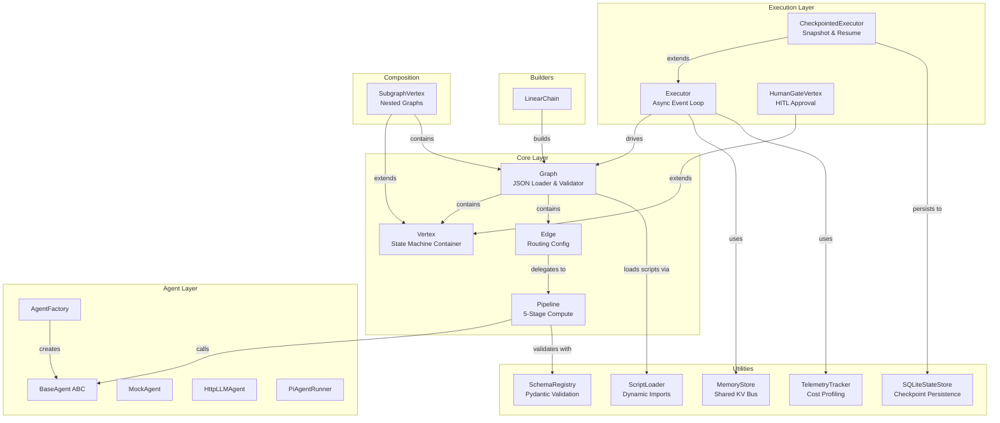
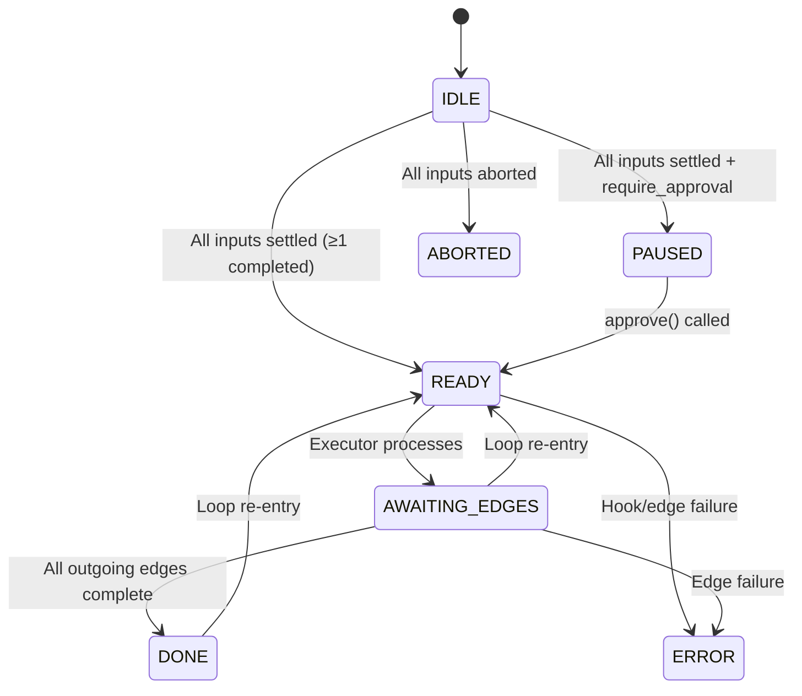

# 🏗️ Vertex-Edge Agent Framework — Architecture Review

> **Scope**: Full code review of `framework/` (~2,100 LOC across 17 source files)
> **Tests**: 195/195 passing ✓ | **Examples**: 13 runnable demos | **Maturity**: v3.0 (per ROADMAP)

---

## 1. Architecture Overview



### Design Philosophy

The framework follows an **Actor / Message-Passing** model where all Vertex↔Edge communication flows through a unified `receive_signal(edge_id, signal, payload, channel)` pipe using three `EdgeSignal` variants: `COMPLETED`, `ABORTED`, `FAILED`. This is a clean, elegant design.

### Data Flow: The 5-Stage Edge Pipeline

```
Source Vertex → [Guard] → [Pre-Process] → [Compute/LLM] → [Post-Process] → Destination Vertex
                  │                                                              │
                  └── ABORTED signal ──────────────────────────────────────────→ │
```

### Vertex Lifecycle State Machine



---

## 2. Strengths ✅

### 2.1 Excellent Separation of Concerns
The `Edge` ↔ `Pipeline` split is textbook SRP. Edge owns routing config; Pipeline owns the 5-stage execution. This makes the pipeline stateless and testable in isolation.

### 2.2 Robust Cycle Support
The bounded loop system (`max_iterations` on back-edges, `loop_incoming_edges` on vertices) is well-engineered. The DFS-based cycle detection in [`Graph.validate()`](file:///home/gekkasayu/vertex_edge_agent/framework/graph.py#L173-L230) correctly identifies back-edges and enforces that every cycle is guarded. The executor handles re-entry from both `DONE` and `AWAITING_EDGES` states, covering the concurrent case.

### 2.3 Comprehensive Checkpoint/Resume
[`CheckpointedExecutor`](file:///home/gekkasayu/vertex_edge_agent/framework/executor/checkpoint.py#L126-L356) is production-quality: it snapshots after every vertex settlement, handles `AWAITING_EDGES` → `READY` on resume, recalculates readiness for `IDLE` vertices, and properly respects pre-approved vertices.

### 2.4 Event Streaming Architecture
The non-blocking `executor.stream()` pattern using an `asyncio.Queue` with a `None` sentinel is clean and composable. Events are structured (`GraphEvent` dataclass) and subgraph events bubble up with namespaced IDs.

### 2.5 Strong Test Coverage
195 tests covering state machines, pipelines, loops, checkpoints, HITL, retries, streaming, subgraphs, memory, telemetry, race mode, schema validation, and all three agent implementations. This is excellent for a framework of this size.

### 2.6 Extensibility Model
The dual hook system (subclass methods → pipeline module functions) gives users two ways to customize behavior without modifying framework internals. The `ScriptLoader` + JSON config approach is practical for non-developer users.

---

## 3. Bugs & Issues 🐛

### 3.1 🔴 CRITICAL: `HttpLLMAgent` Retries Fatal HTTP Errors

**File**: [http_llm_agent.py](file:///home/gekkasayu/vertex_edge_agent/framework/agents/http_llm_agent.py#L47-L67)

The tenacity `@retry` decorator retries on `httpx.HTTPStatusError`, but **all** HTTP errors (including 400, 401, 403, 404) raise `HTTPStatusError` via `raise_for_status()`. This means authentication failures and malformed requests are retried `max_retries` times with exponential backoff instead of failing immediately.

Your own test suite [documents this bug](file:///home/gekkasayu/vertex_edge_agent/tests/test_agents.py):

```python
# test_agents.py line ~195
"""BUG: 400 should fail immediately but actually retries."""
```

**Fix**:
```python
# In _make_request(), before raise_for_status():
if response.status_code >= 400 and response.status_code not in (429, 500, 502, 503, 504):
    raise ValueError(f"Non-retryable HTTP {response.status_code}: {response.text}")
# ValueError is NOT in retry_if_exception_type, so it won't be retried.
```

### 3.2 🟡 MEDIUM: `HumanGateVertex.__repr__` Has Duplicate Return

**File**: [checkpoint.py L118-119](file:///home/gekkasayu/vertex_edge_agent/framework/executor/checkpoint.py#L118-L119)

```python
def __repr__(self):
    status = "approved" if self._approved else (...)
    return f"HumanGateVertex(...)"
    return f"HumanGateVertex(...)"  # ← dead code, duplicate line
```

### 3.3 🟡 MEDIUM: `HttpLLMAgent` Never Closes Its `httpx.AsyncClient`

**File**: [http_llm_agent.py](file:///home/gekkasayu/vertex_edge_agent/framework/agents/http_llm_agent.py#L15-L18)

The `AsyncClient` is created in `__init__` but `close()` is never called by the framework. Neither `Edge`, `Pipeline`, nor `Executor` invoke agent cleanup. In long-running processes, this leaks connections and file descriptors.

**Fix**: Make `HttpLLMAgent` an async context manager, or add an `on_shutdown` hook to `Executor`.

### 3.4 🟡 MEDIUM: Pipeline Calls `get_agent()` Redundantly

**File**: [pipeline.py L49](file:///home/gekkasayu/vertex_edge_agent/framework/pipeline.py#L49)

```python
class Pipeline:
    def __init__(self, ..., agent=None, ...):
        from .agents import get_agent
        self.agent = get_agent(agent)  # agent is ALREADY resolved by Edge.__init__
```

When `Edge.execute()` creates a `Pipeline`, it passes `self.agent` which was already resolved by `get_agent()` in `Edge.__init__`. The Pipeline's `get_agent()` call is redundant (though harmless since `get_agent` returns `BaseAgent` instances unchanged).

### 3.5 🟢 LOW: Unused Imports Across Agent Files

[`mock_agent.py`](file:///home/gekkasayu/vertex_edge_agent/framework/agents/mock_agent.py#L1-L5), [`http_llm_agent.py`](file:///home/gekkasayu/vertex_edge_agent/framework/agents/http_llm_agent.py#L1-L4), and [`pi_agent_runner.py`](file:///home/gekkasayu/vertex_edge_agent/framework/agents/pi_agent_runner.py#L1-L4) all import `ABC`, `abstractmethod`, `json`, `Union` despite not using them. These were likely copy-pasted from `base_agent.py`.

### 3.6 🟢 LOW: `SchemaMismatchError` Is Declared But Never Raised

**File**: [schema.py L36-38](file:///home/gekkasayu/vertex_edge_agent/framework/utils/schema.py#L36-L38)

The graph validation in `graph.py` raises generic `ValueError` for schema mismatches, not `SchemaMismatchError`. The custom exception class exists but is unused.

### 3.7 🟢 LOW: `SQLiteStateStore` Connection Leak Risk

**File**: [store.py L93-96](file:///home/gekkasayu/vertex_edge_agent/framework/utils/store.py#L93-L96)

For non-memory databases, `_connect()` creates a new `sqlite3.connect()` on every call without closing. While SQLite's context manager (`with self._connect() as conn:`) handles transactions, the connection objects themselves accumulate.

---

## 4. Architecture Advice 📐

### 4.1 Decouple `Vertex._data_store` from the Async Lock

Currently, `Vertex` uses a single `asyncio.Lock` for all data access. In graphs with high-fanin vertices receiving many concurrent signals, this creates a serialization bottleneck.

**Recommendation**: Consider a `ReadWriteLock` pattern or per-channel locks for high-throughput scenarios. For most use cases the current lock is fine, but document the limitation.

### 4.2 Add a Formal Error Propagation Strategy

Currently, error handling is mixed:
- `Pipeline.run()` raises exceptions for guard failures (`AbortPipeline`) and compute errors
- `Edge.execute()` catches these and sends `ABORTED`/`FAILED` signals
- `Executor._process_vertex()` catches subgraph errors and hook errors
- But `Executor._fire_edge()` re-raises after signaling, which means `asyncio.gather(return_exceptions=True)` catches them *after* the signal was already sent

This works but makes reasoning about error flows difficult. Consider a unified `ExecutionError` hierarchy:

```
ExecutionError
├── GuardAbortError        (edge guard failed — expected, clean abort)
├── HookError              (pre/post process or on_ready failed)
├── ComputeError           (agent/LLM call failed)
├── ValidationError        (schema mismatch)
└── SubgraphError          (inner graph failed)
```

### 4.3 Make `Pipeline` Truly Stateless

`Pipeline` is *almost* stateless but it calls `get_agent()` in its constructor, which can trigger file I/O (loading scripts). Consider making Pipeline a pure data object and resolving agents earlier (in Graph loading or Edge init — which already happens).

### 4.4 Add Vertex/Edge Lifecycle Hooks to Executor

The executor currently monkey-patches `on_cancel_edges` onto vertices at runtime:

```python
# base.py L191
for v in self.graph.vertices.values():
    v.on_cancel_edges = cancel_edges_callback
```

This is fragile. Consider a formal callback/event system:

```python
class Executor:
    def __init__(self, ..., hooks: Optional[ExecutorHooks] = None):
        ...

class ExecutorHooks:
    async def on_vertex_ready(self, vertex): ...
    async def on_edge_started(self, edge): ...
    async def on_edge_completed(self, edge, result): ...
    async def on_cancel_edges(self, edge_ids): ...
```

### 4.5 Consider Adding Graph Serialization (Not Just Loading)

`Graph.from_json()` and `Graph.from_dict()` exist for loading, but there's no `Graph.to_dict()` or `Graph.to_json()`. This limits:
- Dynamic graph modification and re-serialization
- Graph diffing between checkpoint snapshots
- Programmatic graph introspection tools

### 4.6 Improve the Builder Pattern

`LinearChain.build()` is useful but limited. Consider a fluent builder API:

```python
g = (GraphBuilder()
     .vertex("input", initial_data=[{"channel": "text", "value": "hello"}])
     .vertex("process")
     .vertex("output")
     .edge("input", "process", prompt="Summarize", model="gemini-pro")
     .edge("process", "output", prompt="Format")
     .build())
```

This would make programmatic graph construction much more ergonomic than either raw dicts or JSON files, especially for the `dynamic_topology` use case.

### 4.7 Add Timeouts Per-Edge, Not Just Per-Graph

The executor has a global `timeout` but individual edges can't have per-edge timeouts. An LLM edge calling a slow model shouldn't timeout the entire graph; it should timeout individually and send a `FAILED` signal.

```jsonc
{
  "id": "e_slow_analysis",
  "source": "A",
  "destination": "B",
  "settings": {
    "timeout": 60  // per-edge timeout in seconds
  }
}
```

### 4.8 Strengthen the Agent Abstraction

`BaseAgent.process()` is minimal (just `data, prompt, model, settings → Any`). Consider:

1. **Streaming support**: `async def stream_process(...)` yielding partial results
2. **Token counting**: Return `(result, usage_metrics)` instead of `Any`, so telemetry doesn't have to *estimate* tokens
3. **Structured output**: Support for JSON mode / function calling natively
4. **Context manager**: `async with agent:` for lifecycle management (solves the `HttpLLMAgent` leak)

### 4.9 Distributed Execution Path

Per your ROADMAP, distributed execution is the next milestone. I'd advise:

1. **Extract `EdgeTask` as a serializable unit of work** — currently edge execution is tightly coupled to `asyncio.Task` within a single process
2. **Make `GraphEvent` serializable** — it already is (dataclass with primitives), so ✓
3. **Make `MemoryStore` pluggable** — swap the in-memory dict for Redis/Valkey
4. **Make `SQLiteStateStore` pluggable** — extract an abstract `StateStore` interface, then add PostgreSQL/Redis implementations

---

## 5. Code Quality Observations

| Area | Grade | Notes |
|:---|:---:|:---|
| **Naming** | A | Consistent, descriptive. `Vertex`, `Edge`, `Pipeline`, `Graph` are intuitive |
| **Logging** | A | Every state transition, signal, hook call is logged with context |
| **Docstrings** | A- | Core classes well-documented; some utility functions lack them |
| **Type Hints** | B+ | Present on public APIs; some internal methods miss return types |
| **Error Messages** | A | Validation errors include edge IDs, vertex IDs, and context |
| **Test Quality** | A | Tests document bugs, cover edge cases, use proper fixtures |
| **Import Hygiene** | B- | Unused imports, circular import workarounds (`from .agents import ...` inside methods) |
| **Packaging** | C | `pyproject.toml` only has pytest config; no `[project]` metadata, no `setup.cfg`, not installable via `pip install` |

---

## 6. Action Items Status (All Resolved ✅)

| Priority | Item | Status | Resolved In |
|:---:|:---|:---:|:---:|
| 🔴 P0 | Fix `HttpLLMAgent` fatal error retry bug | ✅ Completed | `a2758d4` |
| 🔴 P0 | Add `HttpLLMAgent` resource cleanup (`close()`, async context manager) | ✅ Completed | `a2758d4` |
| 🟡 P1 | Remove duplicate `__repr__` return in `HumanGateVertex` | ✅ Completed | `a2758d4` |
| 🟡 P1 | Clean unused imports across agent files | ✅ Completed | `a2758d4` |
| 🟡 P1 | Make package installable (`pyproject.toml` with `[project]` metadata) | ✅ Completed | `1793caa` |
| 🟡 P1 | Add `Graph.to_dict()` / `Graph.to_json()` serialization | ✅ Completed | `1793caa` |
| 🟡 P1 | Use `SchemaMismatchError` instead of generic `ValueError` | ✅ Completed | `1793caa` |
| 🔵 P2 | Add per-edge timeout support (`settings={"timeout": ...}`) | ✅ Completed | `1793caa` |
| 🔵 P2 | Implement fluent `GraphBuilder` API | ✅ Completed | `1793caa` |
| 🔵 P2 | Extract abstract `BaseStateStore` interface | ✅ Completed | `1793caa` |
| 🔵 P2 | Enrich `BaseAgent` with streaming (`stream_process`) & context manager | ✅ Completed | `2ce9a05` |
| ⚪ P3 | Formal `ExecutorHooks` callback system | ✅ Completed | `2ce9a05` |
| ⚪ P3 | Connection lifecycle management for `SQLiteStateStore` | ✅ Completed | `2ce9a05` |
| ⚪ P3 | Unified error hierarchy (`FrameworkError`, `ExecutionError`, etc.) | ✅ Completed | `2ce9a05` |

---

## 7. Verdict

This is a **well-architected, well-tested framework** with a clean mental model (vertices as state containers, edges as compute pipelines, executor as async scheduler). The design decisions — unified signal passing, stateless pipelines, bounded cycle support, checkpoint/resume, subgraph nesting — are sound and show thoughtful engineering.

The main risks are:
1. **The `HttpLLMAgent` retry bug** will silently waste API credits and time in production
2. **Resource leaks** from unclosed HTTP clients will surface in long-running server deployments
3. **Packaging** needs work before this can be distributed as a library

The codebase is ready for real-world use with the P0 fixes applied. The P1/P2 items will mature it toward the enterprise-grade positioning described in the README.
